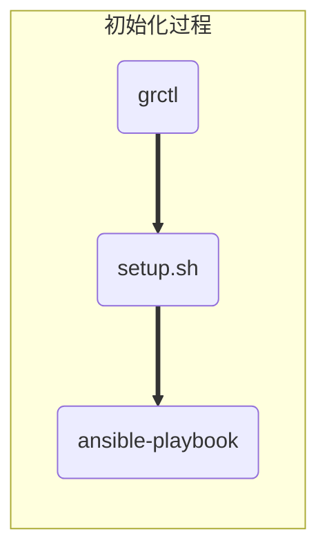
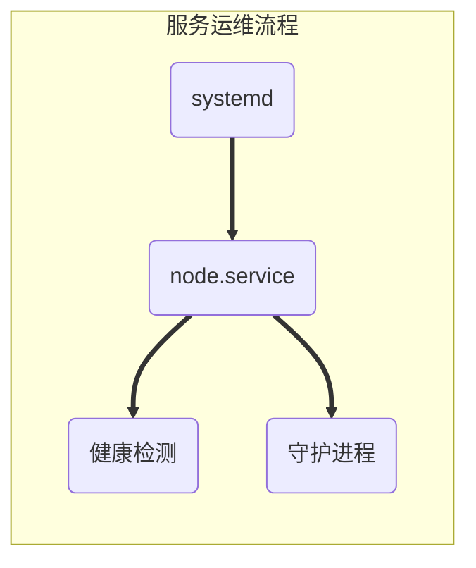

本文将解读 Rainbond 集群的安装和运维的原理，使用户基本了解 Rainbond 的安装机制和运维重点，便于用户搭建大型 Rainbond 集群。

## 1.Rainbond 集群节点概述

### 1.1 节点分类

| 属性    | 类型     | 说明                                                                                                                            |
| ------- | -------- | ------------------------------------------------------------------------------------------------------------------------------- |
| manage  | 管理节点 | 集结平台自身组件，提供应用构建、调度、管理等功能，提供数据中心基础服务与 API 接口，充当控制集群的角色。                         |
| gateway | 网关节点 | 集群内应用被外网访问的流量入口和负载均衡器，提供 HTTP, HTTPs 路由, TCP/UDP 服务, 负载均衡器, 高级路由(A/B 测试, 灰度发布)等功能 |
| compute | 计算节点 | 提供应用运行的计算资源，N 个计算节点组成计算资源池供给管理节点灵活调度。
| storage | 存储节点 | Rainbond集群需要为管理节点与计算节点的 /grdata 目录配置共享存储 | 

### 1.2 节点说明


一个完整的 Rainbond 集群中必须包含以下属性的节点，所有属性可以部署在同一个节点上组成单节点的Rainbond 集群。也可以为不同的服务器分配不同的属性来实现节点间功能的分离。安装 Rainbond 之前需要根据企业自身需求合理的规划计算资源。

- 节点规划

| 节点属性 | 节点介绍 |
| :----: | :--- |
|  管理节点      | 基于etcd的特性，部署数量从1开始，按奇数递增（即可以部署 1、3、5···台），高可用集群至少3台。 | 
| 网关节点      | 网关节点特指具备Rainbond应用访问负载均衡组件rbd-gateway的节点，默认部署于首个管理节点，可根据需要单独部署。部署数量参照管理节点，并配置VIP或SLB保证高可用。 | 
| 计算节点      | 计算节点提供计算负载，节点越多，集群计算容量越大，因此计算节点的规划取决于集群需要运行的应用数量，随时可以增加或下线节点。高可用集群至少2 台。 | 
| 存储节点      | 特指在选择GlusterFS作为集群共享存储解决方案时部署的存储节点。高可用集群至少2台，并根据节点数量选择复制集数量 | 
| 外部数据库（高可用方案选择）        | 推荐双主+VIP的高可用方案 |

> 为什么在高可用安装中要使用外部数据库

Rainbond默认提供 rbd-db 组件作为平台数据库使用。这个组件只会安装在首个管理节点，其他管理节点扩容后，并不会同时扩容该组件。这导致管理节点集群对于首个管理节点依然具有强依赖的特性，并不能称其实现了真正的高可用。首个管理节点宕机，就会直接导致管理集群失效。为了避免这一点，在高可用集群中把平台数据库部署在集群之外。这样就实现了所有管理节点之间身份等价，无论哪台宕机，集群管理功能不会受到影响。

在对于不同的节点安装，Rainbond安装脚本都提供了良好的支持，对于 Mysql 数据库，我们建议用户独立安装 Mysql 数据库并提供给 Rainbond 安装脚本。
                                 

### 1.3 节点部署主要服务组件概述

| 角色       | 组件                                             | 说明                                                                         |
| ---------- | ------------------------------------------------ | ---------------------------------------------------------------------------- |
| manage   | docker                    | 应用容器引擎  |
|           |rbd-dns    | 提供本地 dns 服务，服务于集群内应用的 DNS 解析。 |                                                                              |
|            | etcd                                             | 管理节点 etcd                                                                |
|            | kube-controller-manager                          | Kubernetes 管理组件之一, Pod 编排器                                          |
|            | rbd-webcli                                       | 提供应用 web 方式进入容器命令行的服务                                        |
|            | nfs_server                                       | 远程存储挂载                                                                 |
|            | rbd-hub                                          | 基于 Docker Registry 封装，提供 Docker 镜像存储服务，服务于数据中心内部      |
|            | kube-scheduler                                   | Kubernetes 管理组件之一，Pod 调度器                                          |                                                         |
|            | rbd-mq                                           | 消息队列服务                                                                 |
|            | calico                                           | 集群 SDN 服务，为应用提供网络支持                                            |
|            | rbd-chaos                                        | 应用构建服务，提供源码，Docker 镜像等方式持续构建应用。                      |
|            | rbd-worker                                       | 应用运行控制器                                                               |
|            | kube-apiserver                                   | Kubernetes 管理组件之一, 提供 API 服务                                       |
|            | rbd-eventlog                                     | Rainbond 事件处理与日志汇聚服务                                              |
|            | rbd-monitor                                      | Rainbond 监控管理服务，基于 Prometheus 封装                                  |
|            | rbd-api                                          | Rainbond API 服务，数据中心控制层面的入口。                                  |
|            | rbd-db                                           | Rainbond 数据库服务，支持 MySQL，Tidb 与 CockroachDB                         |
|            | rbd-app-ui                                       | 应用控制台 web 服务                                                          |
|            | rbd-repo                                         | 源码构建仓库服务，基于 Artifactory OSS 封装                                  |
|            | node                                             | Rainbond 集群和节点控制器服务                                                |
| compute | docker       | 应用容器引擎                                    
|            |etcd-proxy | 计算节点 etcd-proxy                              |                                                                              
|            | rbd-dns                                          | Rainbond 内部 dns 服务，与管理节点 DNS 服务共同对当前节点的应用提供 DNS 解析 |
|            | kubelet                                          | Kubernetes 计算负载节点组件                                                  |                                                               |
|            | calico                                           | 集群 SDN 服务，为应用提供网络支持                                            |
|            | node                                             | Rainbond 节点控制器，提供服务守护、自动运维、日志收集、服务发现等服务。      |
| gateway   | docker                                           | 应用容器引擎                                                                 |
|            | calico                                           | 集群 SDN 服务，为应用提供网络支持                                            |
|            | rbd-dns                                          | Rainbond 内部 dns 服务，可作为集群 dns 服务使用                              |
|            | rbd-gateway                                      |                                                                              

## 2. 安装原理说明

[Rainbond-Ansible](https://github.com/goodrain/rainbond-ansible.git) 项目是 Rainbond 子项目之一，提供 Rainbond 集群便捷的安装支持，采用 Ansible 自动化部署框架实现。其具有安装简单、工作原理简单、模块化、生态完善等特点。

> 早期我们采用了[SaltStack](https://docs.saltstack.cn/) 实现，其工作模式复杂，不透明的节点通信机制。Rainbond 安装过程受限于 SaltStack 的稳定性，因此我们从 5.0 版本后对安装脚本进行了重构。

### 2.1 安装脚本结构

```
.
├── callback_plugins                  # 任务失败时打印帮助消息回调插件
│   └── help.py                       # 回调插件示例
├── hack                              # 部署本地资源文件目录
│   ├── chinaos                       # 操作系统的安装包源
│   │   ├── CentOS-Base.repo          # CentOS的源
│   │   ├── centos-release            # CentOS的全局配置
│   │   ├── sources.list              # Ubuntu的源
│   │   ├── ubuntu-lsb-release        # Ubuntu的版本配置
│   │   └── ubuntu-release            # Ubuntu的全局配置
│   ├── docker                        # Docker部署资源文件目录
│   │   ├── get-docker.sh             # 快速部署Docker脚本
│   │   └── rainspray.list            # 快速部署Docker的Ubuntu源
│   ├── files                         # 好雨工具包
│   │   ├── bin                       # grctl的二进制文件
│   │   ├── health                    # 健康监测脚本
│   │   ├── ssh                       # ssh配置脚本
│   │   └── ssl                       # 好雨加密证书
│   ├── manifests                     # 应用配置文件
│   │   ├── dashboard                 # 仪表盘-配置
│   │   ├── efk                       # efk-配置
│   │   ├── es-cluster                # es集群-配置
│   │   ├── heapster                  # heapster-配置
│   │   ├── ingress                   # ingress-配置
│   │   ├── jenkins                   # jenkins-配置
│   │   ├── metrics-server            # metrics-配置
│   │   ├── prometheus                # prometheus-配置
│   │   └── storage                   # storage-配置
│   ├── step                          # Ansible安装步骤剧本
│   │   ├── 00.prepare.yml            # 安装前检测
│   │   ├── 01.docker.yml             # docker-配置
│   │   ├── 02.image.yml              # image-配置
│   │   ├── 10.etcd.yml               # etcd-配置
│   │   ├── 11.kube-master.yml        # kube-master-配置
│   │   ├── 12.kube-worker.yml        # kube-worker-配置
│   │   ├── 13.network.yml            # network-配置
│   │   ├── 20.db.yml                 # database-配置
│   │   ├── 21.storage.yml            # storage-配置
│   │   ├── 22.lb.yml                 # lb-配置
│   │   ├── 23.node.yml               # node-配置
│   │   └── 90.setup.yml              # setup-配置
│   ├── thirdparty                    # 第三方服务对接
│   │   ├── addmaster.yml             # 增加master-role
│   │   ├── addnode.yml               # 增加node-role
│   │   └── setup.yaml                # 配置安装
│   ├── tools                         # 工具包目录
│   │   ├── get_images.sh             # 拉取docker镜像
│   │   ├── update-domain.sh          # 更换域名
│   │   └── yc-ssh-key-copy.sh        # 批量部署服务器ssh-key
│   ├── upgrade                       # 升级配置目录
│   │   └── upgrade.yml               # 升级配置文件
│   ├── vagrant                       # vagrant服务配置目录
│   │   ├── README.md                 # 说明文件
│   │   ├── Vagrantfile               # ruby获取系统信息
│   │   ├── install.sh                # 安装文件
│   │   └── setup.sh                  # 配置文件
│   └── windows                       # windows节点配置目录
│       ├── cni                       # 配置文件目录
│       ├── scripts                   # 脚本目录
│       │   ├── helper.psm1           # 帮助信息脚本
│       │   ├── hns.psm1              # hns配置脚本
│       │   ├── start-flannel.        # 开启flannel脚本
│       │   ├── start-kubelet.        # 开始kubelet脚本
│       │   └── start-node.ps1        # 开始node服务脚本
│       ├── README.md                 # 说明文件
│       ├── daemon.json               # 域名配置
│       ├── net-conf.json             # 网络配置
│       └── win.yaml                  # Windows配置
├── inventory                         # Ansible剧本执行主机
│   ├── hosts.all                     # 主机模版
│   └── hosts.master                  # 主机模版
├── log                               # 日志文件目录
├── offline                           # 离线安装配置文件目录
│   ├── image                         # 离线包制作脚本目录
│   │   ├── download.sh               # 缓存docker离线镜像脚本
│   │   ├── image.txt                 # rainbond镜像列表
│   │   ├── load.sh                   # 加载离线缓存镜像包脚本
│   │   └── offimage.sh               # 压缩理想缓存镜像包脚本
│   └── pkgs                          # 离线包存储目录
│       ├── Dockerfile.centos         # 构建离线CentOS镜像
│       ├── Makefile                  # 构建离线CentOS镜像
│       ├── README.md                 # 说明文档
│       ├── download.centos           # 创建本地CentOS源
│       └── rbd.repo                  # Centos源
├── scripts                           # 部署脚本存放目录
│   ├── installer                     # 安装脚本目录
│   │   ├── default.sh                # 默认网络配置脚本
│   │   ├── functions.sh              # 安装的示例库脚本
│   │   └── global.sh.example         # 全局变量示例脚本
│   ├── op                            # 网络配置目录
│   │   ├── README.md                 # 说明文件
│   │   ├── lb.sh                     # 配置lb服务脚本
│   │   └── network.sh                # 配置网络脚本
│   ├── upgrade                       # 升级脚本目录
│   │   └── upgrade.sh                # 升级脚本文件
│   ├── yaml                          # 网络配置剧本目录
│   │   ├── init_network.yaml         # 初始化网络剧本
│   │   └── reset_network.yaml        # 重置网络剧本
│   └── node.sh                       # 用于管理节点脚本
├── test                              # 测试剧本语法脚本目录
│   ├── hosts.ini                     # 主机配置信息
│   ├── k8s-master.role.1.j2          # k8s-master配置信息
│   ├── k8s-worker.role.1.j2          # k8s-worker配置信息
│   ├── kubelet.sh.1.j2               # kubelet配置信息
│   └── test.sh                       # 检测Ansible剧本语法脚本
├── roles                             # Ansible部署规则配置文件目录
│   ├── bootstrap                     # bootstrap服务规则配置
│   ├── db                            # database服务规则配置
│   ├── docker                        # docker服务规则配置
│   ├── etcd                          # etcd服务规则配置
│   ├── k8s                           # k8s服务规则配置
│   ├── lb                            # lb服务规则配置
│   ├── monitor                       # monitor服务规则配置
│   ├── network_plugin                # network_plugin服务规则配置
│   ├── node                          # node服务规则配置
│   ├── prepare                       # prepare服务规则配置
│   ├── rainvar                       # rainvar服务规则配置
│   ├── storage                       # storage服务规则配置
│   ├── thirdparty                    # thirdparty服务规则配置
│   └── upgrade                       # upgrade服务规则配置
├── docs                              # 说明文档文件夹
├── CHANGELOG.md                      # 版本迭代说明
├── Dockerfile                        # 创建rainbond-ansible的Ubuntu镜像源
├── LICENSE                           # 开发协议
├── Makefile                          # 语法检测配置
├── README.md                         # 说明文件
├── addmaster.yml                     # 增加master节点剧本
├── addnode.yml                       # 增加node节点剧本
├── ansible.cfg                       # Ansible程序配置优化
├── lb.yml                            # 增加lb节点剧本
├── setup.sh                          # 主安装脚本入口
├── setup.yml                         # Ansible本地安装剧本
├── upgrade.yml                       # Ansible升级剧本
└── version                           # 安装包版本
```

### 2.2 ansible-playbook 各角色剧本

| 角色    | 剧本                   | 说明                                                                            |
| ------- | ---------------------- | ------------------------------------------------------------------------------- |
| manage  | rainvar                | 初始化私有数据中心的一些默认配置(数据库、端口、安装路径、安装版本等)            |
|         | bootstrap              | 对本节点的内核进行优化(tcp_tw_recycle、core.somaxconn、syncookies、file-max 等) |
|         | prepare                | 对本节点安装条件进行检查(系统版本、CPU、内存、磁盘、内核等)                     |
|         | storage/nfs/client     | 以 nfs 方式挂载本节点的存储卷                                                   |
|         | storage/nas            | 以 nas 方式挂载本节点的存储卷                                                   |
|         | storage/gfs            | 以 gfs 方式挂载本节点的存储卷                                                   |
|         | docker/install         | 在本节点上安装 Docker 服务                                                      |
|         | k8s/manage             | 在本节点上安装 k8s 服务的管理端                                                 |
|         | etcd/manage            | 在本节点上安装 etcd 服务的管理端                                                |
|         | gateway                | 在本节点上安装负载均衡组件                                                      |
|         | monitor                | 在本节点上安装监控组件                                                          |
|         | network_plugin/calico  | 切换 docker 网络为 calico                                                       |
|         | network_plugin/flannel | 切换 docker 网络为 flannel                                                      |
|         | node/exm               | 安装基础依赖包(python-pip、ansible)                                             |
|         | node/core              | 在本节点安装 node 核心组件                                                      |
| gateway | rainvar                | 初始化私有数据中心的一些默认配置(数据库、端口、安装路径、安装版本等)            |
|         | bootstrap              | 对本节点的内核进行优化(tcp_tw_recycle、core.somaxconn、syncookies、file-max 等) |
|         | prepare                | 对本节点安装条件进行检查(系统版本、CPU、内存、磁盘、内核等)                     |
|         | storage/nfs/client     | 以 nfs 方式挂载本节点的存储卷                                                   |
|         | storage/nas            | 以 nas 方式挂载本节点的存储卷                                                   |
|         | storage/gfs            | 以 gfs 方式挂载本节点的存储卷                                                   |
|         | docker/install         | 在本节点上安装 Docker 服务                                                      |
|         | network_plugin/calico  | 切换 docker 网络为 calico                                                       |
|         | network_plugin/flannel | 切换 docker 网络为 flannel                                                      |
|         | gateway                | 在本节点上安装负载均衡组件                                                      |
|         | node/exlb              | 在本节点安装 node 负载组件                                                      |
| compute | rainvar                | 初始化私有数据中心的一些默认配置(数据库、端口、安装路径、安装版本等)            |
|         | bootstrap              | 对本节点的内核进行优化(tcp_tw_recycle、core.somaxconn、syncookies、file-max 等) |
|         | prepare                | 对本节点安装条件进行检查(系统版本、CPU、内存、磁盘、内核等)                     |
|         | storage/nfs/client     | 以 nfs 方式挂载本节点的存储卷                                                   |
|         | storage/nas            | 以 nas 方式挂载本节点的存储卷                                                   |
|         | storage/gfs            | 以 gfs 方式挂载本节点的存储卷                                                   |
|         | docker/install         | 在本节点上安装 Docker 服务                                                      |
|         | k8s/compute            | 在本节点上安装 k8s 服务的客户端                                                 |
|         | etcd/compute           | 在本节点上安装 etcd 服务的客户端                                                |
|         | network_plugin/calico  | 切换 docker 网络为 calico                                                       |
|         | network_plugin/flannel | 切换 docker 网络为 flannel                                                      |
|         | gateway                | 在本节点上安装负载均衡组件                                                      |
|         | node/core              | 在本节点安装 node 核心组件                                                      |

### 2.3 安装脚本部署流程

#### 2.3.1 集群初始化

集群初始化包括三个重要步骤，安装脚本获取、安装环境构建和第一个节点的安装。

```
./grctl init 各种参数
```

- 安装脚本获取

  grctl init 命令从 github 仓库获取指定版本的 ansible 代码，如果离线安装没有此步骤。

- 安装环境构建

  grctl init 命令根据用户指定的参数和默认值生成 ansible global.sh 全局配置文件。

  - 配置文件: /opt/rainbond/rainbond-ansible/scripts/installer/global.sh
  - 主要配置：
    - INSTALL_TYPE # 安装类型(离线/联网)
    - DEPLOY_TYPE # 节点类型
    - DOMAIN # 域名
    - VERSION # 版本
    - STORAGE # 存储类型
    - STORAGE_ARGS # 挂载参数
    - NETWORK_TYPE # 网络类型
    - ROLE # 第一个节点角色(默认 manage、gateway、compute)

  这里的参数主要是指定 Rainbond 集群在存储、网络、安装模式等关键参数。

- 第一个节点安装

  单一节点的安装根据传入 role 角色属性,传递属性给主安装脚本`setup.sh`

  主安装脚本在进行本地节点系统优化之后调用 ansible-playbook 使用`setup.yml`剧本进行第一个节点部署

  剧本主要根据 master 主机组的 role 进行配置装机(系统优化、组件部署)

#### 2.3.2 compute、gateway 节点扩容安装

1. 传入需要安装的 role 角色属性(compute,gateway),传递给主安装脚本`setup.sh`
2. 主安装脚本在进行远程节点系统优化之后调用 ansible-playbook 使用角色对应的剧本进行部署
   - manage 角色属性调用 `addmaster.yml`
   - compute 角色属性调用 `addnode.yml`
   - gateway 角色属性调用 `gateway.yml`
3. 剧本主要根据主机组所使用的 role 进行配置装机(系统优化、组件部署)

## 3. 集群安装流程



### 3.1 grctl init 初始化过程

`grctl init` 命令首先获取安装包，然后根据传入的参数以键值对的方式转换为 shell 脚本变量，以全局变量的方式对后续操作进行参数的传递，后续步骤读取全局变量，达到安装过程中对可变因素的掌控。

> 在未来的版本中，grctl 命令行进一步控制 ansible 的主机列表，准确的为 ansible 提供集群主机序列。

### 3.2 shell 初始化过程

grctl 命令完成参数配置后调用安装脚本`/opt/rainbond/rainbond-ansible/setup.sh` 进行第一个节点初始化。

脚本首先会对操作系统进行优化。这里是安装过程使用网络的主要点，在线安装模式下，操作系统的更新和配置，安装包的下载通过网络进行。离线安装模式下使用事先准备的本地安装源对操作系统进行基础环境安装，然后使用事先下载好的安装包。后续的节点安装过程将不再使用网络。

最后会调取 ansible-play 使用`setup.yml`剧本进行初始化安装。

### 3.3 ansible-playbook 初始化过程

ansible-playbook 使用`setup.yml`进行初始化，首先会找到当前主机所在的主机组，之后根据 role 的设定到不同的组件文件夹中根据 pre_task -> roles -> tasks -> post-tasks 的顺序依次执行文件夹下面的`main.yml`达到组件安装的作用

### 3.4 其他角色节点扩容安装

1. `grctl node add --iip <计算节点内网ip> --root-pass <计算节点root密码> --role gateway,compute`指定新增节点的`主机名、内网地址、连接密码、角色` , grctl 命令行首先将节点数据加入集群元数据。通过`grctl node list`命令即可查询节点状态。

2. 使用`grctl node install host-uuid`命令安装节点，grclt 从 API 中读取相应的主机信息传递给`node.sh`脚本进行节点的安装。

3. `node.sh`在`script/node.sh`中，主要获取以下几个参数:

   - node_role # 新增节点的角色
   - node_hostname # 新增节点的主机名
   - node_ip # 新增节点的网络地址
   - login_type # 新增节点的登陆方式
   - login_key # 新增节点的连接密码
   - node_uuid # 新增节点的 uuid

4. `node.sh`脚本首先会判断`node_role`中传递的角色属性，循环角色属性判断`inventory/hosts`中相应的主机组中是否存在对应的主机，没有根据不同的角色属性加入到相应的主机组中进行装机，在维护`inventory/hosts`之后会进行连接检测通过`login_type、login_key、node_uuid、node_ip、node_hostname`参数进行主机连接检测、通过之后会调用`ansible-playbook -i inventory/hosts -e $node_role role.yml`进行不同角色的装机:

   - -i 指定装机主机

   - -e 将`grctl`传递给`setup.sh`的`node_role`参数传递给`ansible-playbook`生成对应的`node组件角色配置文件`

   - role.yml 不同角色对应不同的 yml 配置文件
     - addmaster.yml # master role
     - addnode.yml # compute role
     - gateway.yml # gateway role

   > 在 5.1.6 版本中 hosts 文件的维护将移交到 grctl 命令行工具中，根据集群节点状态实时生成。

## 4. 节点服务运维

Rainbond 集群安装的所有组件有两种运行方式： node 组件和 docker 组件是直接二进制运行，其他组件全部采用容器化运行。两种运行方式都是直接采用 systemd 守护进程进行守护。因此能够安装 Rainbond 的操作系统必须具有 systemd。

在集群自动化运维的需求下，我们需要对节点（特别是计算节点）进行实时全面的健康检查，以确认节点是否可用。这个工作由 node 服务进行，它会根据`/opt/rainbond/conf`目录下配置对当前节点的配置检查项进行监控，如果出现故障汇报到集群管理端，如果是计算节点则会由集群管理端决策是否暂时禁止调度或下线该节点。



### 4.1 systemd 的配置文件生成(node.service)

- 在集群初始化完成之后 ansible 会在`/etc/systemd/system/node.service`目录下生成`node.service`的配置文件，`node`服务在`systemd`中以守护进程方式启动运行。

- node 服务启动后将读取`/opt/rainbond/conf`目录下的配置生成每一个需要启动服务的 systemd 配置文件并调用 systemctl 工具启动服务。

  配置文件分为需求启动服务和只是健康检查项目，比如以下配置：

  ```
  - name: rbd-mq
    endpoints:
    - name: MQ_ENDPOINTS
      protocol: http
      port: 6301
    health:
      name: rbd-mq
      model: http
      address: 127.0.0.1:6301/health
      max_errors_num: 3
      time_interval: 5
    after:
      - docker
    type: simple
    pre_start: docker rm rbd-mq
    start: >-
      docker run --name rbd-mq
      --network host
      -i goodrain.me/rbd-mq:V5.1-dev
      --log-level=debug --etcd-endpoints=${ETCD_ENDPOINTS} --hostIP=192.168.195.1
    stop: docker stop rbd-mq
    restart_policy: always
    restart_sec: 10
  ```

  该文件配置了 rbd-mq 服务的启动方式、健康检查方式和服务注册信息。

### 4.2 node 组件的健康检测机制

每一个安装服务的健康检查配置见文档： [详细配置](/docs/user-operations/monitor/monitor-alter-items/)

若某项检查项目标识为不健康状态，当前节点将被标识为不健康状态。

- 对于不健康的节点 Rainbond 提供两级自动处理机制：
  - 检测到异常的服务一段时间依然未恢复（取决于配置的时间段）将自动重启服务。
  - 若计算节点被标注为不健康，节点控制器将会自动将其禁止应用调度直到节点恢复健康。
- 配置文件: `/opt/rainbond/conf/health.yaml`
  - name # 需要检测的服务名称
  - model # 以什么方式检测(tcp/http/cmd)
  - address # 被检测服务的地址
  - max_errors_num # 最大错误次数
  - time_interval # 每次检测次数
- 目前检测方式有 3 种
  - cmd # 使用脚本或者命令行
  - tcp # 使用 ip:port 模式
  - http # 使用 http 协议检测

### 4.3 集群故障查询和处理

根据整个集群节点的健康检查机制，用户在管理节点通过`grctl cluster` 命令即可查询整个集群的故障点，或使用监控报警系统及时发现集群故障。当集群某个节点出现问题时首先定位故障的服务，并查看其运行日志处理故障。如果有未完善的健康检测项目，用户可以通过上诉节点健康检测配置方式自定义检测项目。

## 5. 常见安装问题解决思路

- 端口被占用无法安装

> Rainbond 是一个完整的 PaaS 平台解决方案，所以强烈建议使用干净的物理机或虚拟机安装 Rainbond。 Rainbond 网关节点直接承接应用访问流量，因此其默认占用 80\443 等关键端口。另外 Rainbond 安装 Ansible 默认使用的 SSH 端口是 22，严格运维时需要设置。

- 数据库安装初始化失败

> Rainbond 5.1.5 及之前版本默认安装的 mysql 数据库版本是 mariadb 10，其所需的内存资源是较大的。如果你的机器资源有限很大可能导致安装失败。后续的版本中我们将默认安装的数据库版本升级到 Mysql 5.7 系列。

- 高可用安装怎么做

> 本文主要描述了整个安装原理，因此你阅读本文应该可以总结出 Rainbond 高可用安装的关键，我们近期也会再次更新高可用安装操作指南。

- Rainbond 能否安装在 Mac 或 Windows 系统

> Rainbond 计算节点可以支持 Windows 操作系统来运行 Windows 应用，目前 Windows 的支持是企业版功能之一，因此开源安装脚本暂不支持 Windows 节点的快速安装。Mac 操作系统不适合安装 Rainbond。开发者可以将部分组件运行在 Mac 下运行开发。

- 遇到其他安装问题怎么办？

> 移步 [<https://github.com/goodrain/rainbond-ansible/issues>](https://github.com/goodrain/rainbond-ansible/issues) 查找或提交你的问题。

本文作者： Rainbond 开发者：魏美龙
