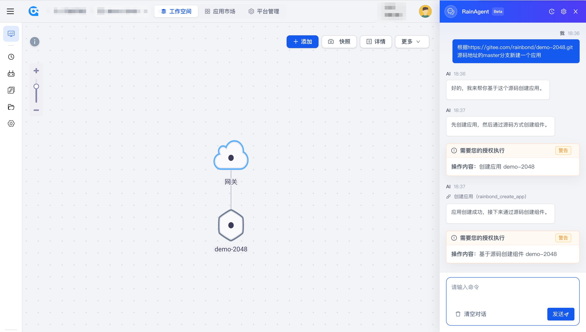
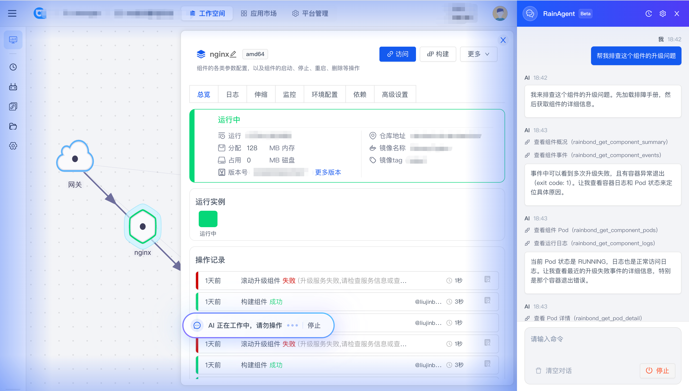
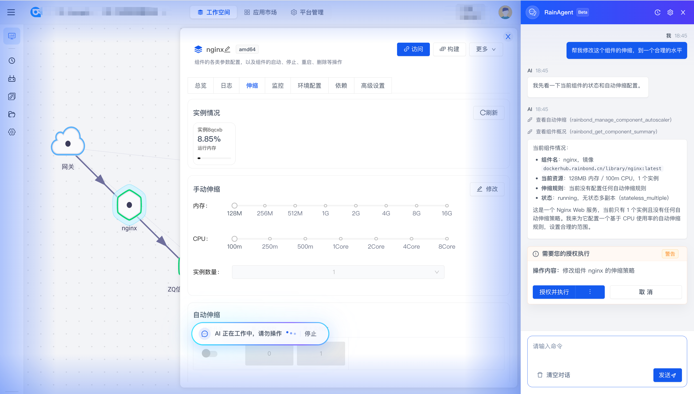
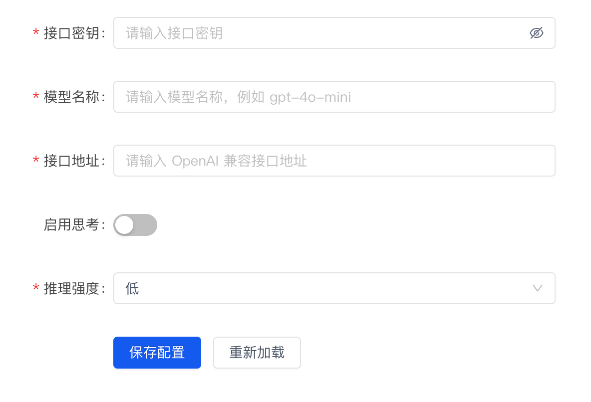
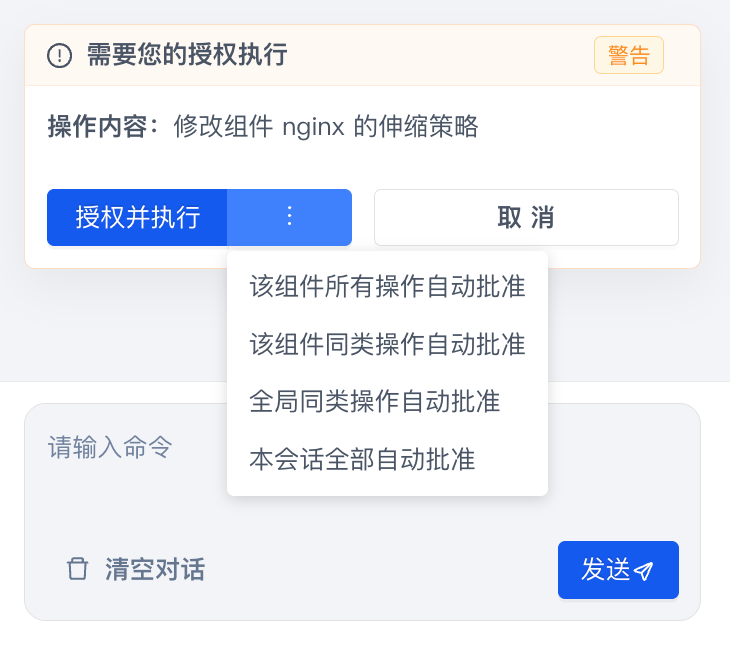

import VideoDocCallout from '@site/src/components/Docs/VideoDocCallout';

# RainAgent (Rainbond AI 助手)

## 概述

RainAgent 是 Rainbond 平台内置的 AI 助手插件，面向应用部署，排错和运维场景，提供自然语言驱动的平台操作体验。用户可以通过对话描述目标，例如“帮我检查当前应用状态”“查看组件日志”“帮我部署这个项目”，RainAgent 会结合当前页面上下文、用户权限和 Rainbond MCP 工具，完成信息查询、问题分析和必要的运维操作。

在开源版 Rainbond 中，RainAgent 仅开放给首个注册的企业管理员使用。企业版开放完整使用范围，让平台用户能够通过自然语言完成平台查询、排障分析、配置管理和交付验证等操作。

<VideoDocCallout
  title="RainAgent 安装使用视频教程"
  description="打开视频详情页，按照页面中的关键步骤完成 AI 助手安装、模型配置、部署和排错。"
  href="/videos/rainagent-install-use"
  cover="/img/video/rainagent-install-use-cover.jpg"
  coverAlt="RainAgent 安装使用视频封面"
/>

## 功能对比

RainAgent 在开源版和企业版中的核心能力一致，主要差异是使用范围：

| 功能差异 | 开源版 | 企业版 |
| :--- | :--- | :--- |
| **使用范围** | 仅首个注册的企业管理员可使用。 | 企业内用户均可使用 RainAgent，具体可查询和可操作范围受平台权限控制。 |

## 核心能力

### 自然语言平台操作

RainAgent 可以结合当前企业、团队、应用和组件上下文理解用户意图，通过对话完成平台查询、问题分析和后续操作。

* **上下文识别**：在不同页面打开 AI 助手时，自动结合当前企业、团队、应用、组件等上下文。
* **多轮追问**：支持先查询状态，再继续查看日志、事件、配置或执行下一步操作。
* **结构化呈现**：将工具调用、状态结果、审批信息和执行结果整理成更易读的对话内容。

### 应用与组件排障

RainAgent 可以读取应用、组件、实例、日志和事件信息，辅助定位启动失败、访问异常、实例不健康等常见问题。

* **状态检查**：查看应用、组件和实例的运行状态。
* **日志分析**：读取组件日志，辅助判断启动失败、异常退出、依赖不可用等问题。
* **事件排查**：结合平台事件和运行状态，分析构建、部署、调度、启动阶段的异常。

### 部署与交付辅助

RainAgent 可以辅助创建应用或组件，触发构建、部署等交付动作，并帮助用户检查最终运行状态和访问结果。

* **创建引导**：根据镜像、源码、软件包、YAML 或 Compose 等输入辅助创建应用或组件。
* **参数补齐**：根据当前团队、集群、应用上下文补齐必要参数。
* **交付验证**：部署完成后检查组件实例、访问地址和运行状态。

### 配置管理与变更执行

RainAgent 支持查看和调整组件环境变量、端口、存储、依赖、资源规格和健康检查等常见配置。涉及变更时会进入审批确认流程。

* **组件配置**：查看或修改环境变量、端口、存储、依赖、探针和资源规格。
* **生命周期操作**：对组件执行启动、停止、重启、构建、部署等操作。
* **风险确认**：对会影响运行状态的操作展示审批卡片，确认后再执行。

### 审批与安全控制

RainAgent 继承 Rainbond 当前用户权限。对于变更类操作，会展示审批卡片，由用户确认后再执行；普通风险操作可设置本会话自动批准策略，高风险操作仅可逐次批准。

## 主要使用场景

### 应用部署

应用部署场景聚焦应用或组件的创建、部署和交付验证。建议提示词说明来源类型、目标应用或组件，以及需要 RainAgent 帮你确认的结果。

| 场景 | 示例提示词 |
| :--- | :--- |
| 镜像部署 | 帮我用 `nginx:latest` 创建一个组件，并确认需要配置哪些端口。 |
| 源码部署 | 帮我部署这个源码项目，按当前团队和应用上下文补齐参数。 |
| 部署执行 | 帮我重新部署当前组件，执行前说明会触发哪些操作。 |
| 交付验证 | 帮我验证当前应用是否已经部署完成，并检查访问地址是否可用。 |

### 组件排障

组件排障场景聚焦异常定位，适合在目标应用或组件页面打开 **AI助手** 后使用。建议提示词说明异常现象、组件名称和希望查看的信息范围。

| 场景 | 示例提示词 |
| :--- | :--- |
| 启动失败 | 帮我排查这个组件为什么没有正常运行。 |
| 日志分析 | 查看 frontend 组件最近 100 行日志，并帮我判断是否有异常。 |
| 事件分析 | 帮我看一下当前组件最近的事件，分析是否和启动失败有关。 |
| 实例异常 | 帮我检查当前组件的实例状态，看看是否有重启或不健康的实例。 |
| 访问异常 | 当前组件访问不通，帮我检查端口、网关访问和组件状态。 |
| 下一步建议 | 根据刚才的日志和事件，告诉我下一步应该先检查什么。 |

### 运维范畴

运维范畴聚焦组件层级的日常操作和配置管理。建议提示词明确组件名称、要执行的动作，以及是否需要在执行前先说明影响范围。

| 场景 | 示例提示词 |
| :--- | :--- |
| 组件状态 | 帮我检查当前组件的运行状态和实例数量。 |
| 重启组件 | 帮我重启当前组件，执行前先说明会影响哪些实例。 |
| 启停组件 | 帮我停止 frontend 组件，确认前请先展示操作对象。 |
| 环境变量 | 帮我查看当前组件的环境变量配置。 |
| 端口配置 | 帮我检查当前组件的端口配置和访问方式。 |
| 健康检查 | 帮我查看当前组件的健康检查配置，并判断是否合理。 |

## 使用指南

### 安装插件

Rainbond 平台右上角的 **AI助手** 按钮为常驻入口。未安装 RainAgent 插件时，点击按钮不会直接进入对话，而是提示安装插件。

1. 使用企业管理员账号登录平台。
2. 点击右上角 **AI助手**。
3. 如果当前企业未安装插件，系统会提示“AI助手插件未安装”。
4. 点击 **去安装**，进入企业扩展中心。
5. 找到 RainAgent 相关插件并完成安装。

非企业管理员点击未安装的 AI 助手时，系统会提示联系企业管理员安装。

### 配置 AI 助手

插件安装完成后，还需要配置模型参数。进入 **平台管理 -> 平台设置 -> AI助手设置**，填写并保存以下配置：

| 配置项 | 说明 |
| :--- | :--- |
| 模型服务地址 | 对应 `OPENAI_BASE_URL`，必须以 `http://` 或 `https://` 开头。 |
| 模型名称 | 对应 `OPENAI_MODEL`，用于指定 RainAgent 调用的模型。 |
| 访问密钥 | 对应 `OPENAI_API_KEY`，保存后会加密存储并在界面中脱敏展示。 |
| 思考模式 | 对应 `LLM_THINKING_ENABLED`，按模型能力选择是否开启。 |
| 推理强度 | 对应 `LLM_REASONING_EFFORT`，可选择 `low`、`medium` 或 `high`。 |

配置保存后，即可通过右上角 **AI助手** 打开 RainAgent。

### 审批权限开启与管理

RainAgent 对变更类操作提供审批确认能力，不需要单独安装额外组件。用户在对话中发起启动、停止、重启、删除、配置修改等操作时，系统会按风险等级展示审批卡片。

1. 点击 **授权并执行** 后，RainAgent 才会继续执行该操作。
2. 点击 **取消** 可拒绝本次操作。
3. 普通风险操作可在审批按钮旁的 "···" 选择自动批准策略，例如该资源所有操作自动批准、同类操作自动批准或本会话全部自动批准。
4. 点击对话框顶部的设置按钮，可以查看、移除或清空当前会话的自动批准策略。

自动批准策略仅在本次浏览器会话内生效，关闭浏览器后失效。高风险操作不会匹配自动批准策略，必须逐次确认。

### 上下文清理与压缩

RainAgent 会保留当前会话上下文，便于连续追问。切换到完全不同的任务、应用或组件时，建议先清理旧上下文，避免历史对话影响新的判断。

1. 在 AI 助手底部点击 **清空对话**。
2. 确认后，当前会话的消息和操作记录会被删除。
3. 清空后重新从当前页面发起问题，例如“帮我检查当前组件状态”。

当对话较长时，RainAgent 会自动压缩历史上下文以节省 token。压缩过程中界面会提示“正在压缩对话历史以节省 token...”，用户通常无需手动处理；如果压缩失败，系统会使用原始历史继续对话。

## 注意事项

* RainAgent 的可用范围受平台授权范围和用户权限影响。
* **AI助手** 按钮为平台常驻入口，插件未安装时会提示安装，插件安装后仍需完成参数配置。
* 开源版默认仅首个注册的企业管理员可使用 RainAgent。
* 企业版用户可使用 RainAgent，但实际可查询和可操作资源仍以 Rainbond 权限体系为准。
* 删除、停止等高风险操作会触发确认流程，请在确认前仔细核对目标资源。
* 自动批准策略只在当前浏览器会话内生效，高风险操作仍需逐次确认。
* 切换到新的应用、组件或排障目标时，建议先清空对话再重新提问。
* RainAgent 依赖平台 MCP 工具与后端服务，若出现连接异常，请联系平台管理员检查插件和 MCP 服务状态。
