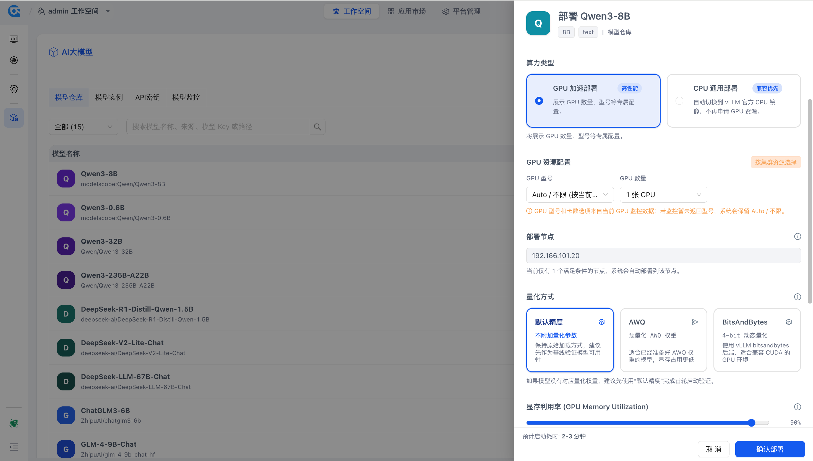
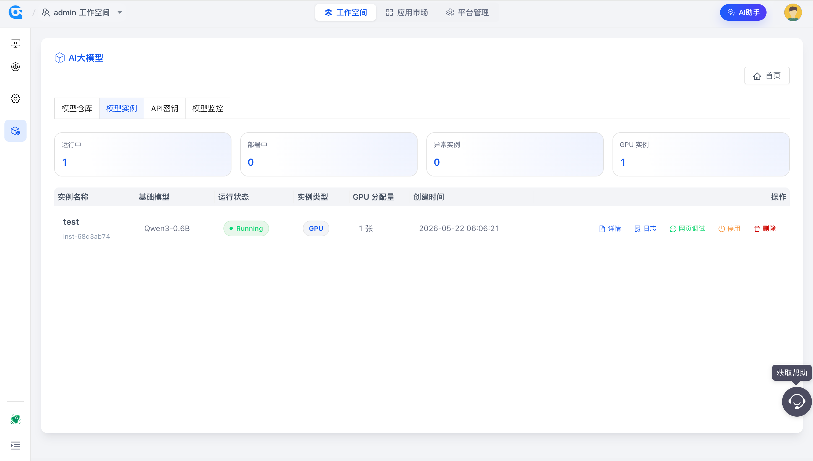
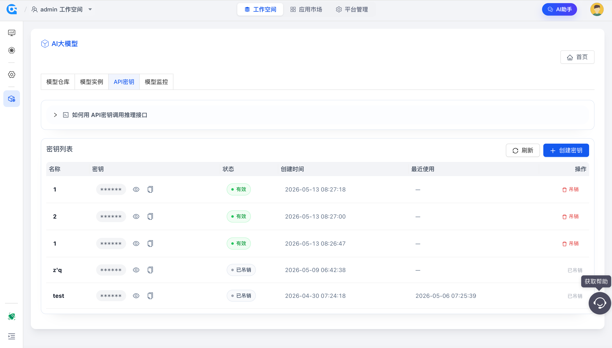
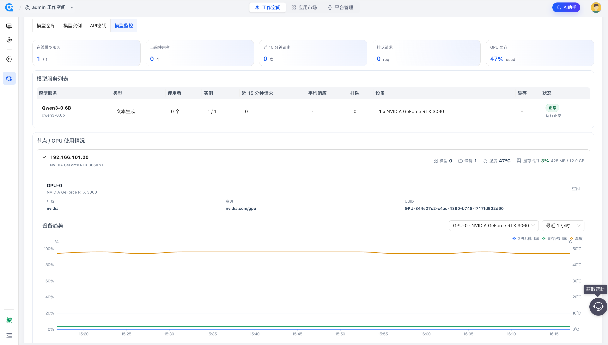

# Rainbond 大模型

## 概述

Rainbond 大模型面向企业和团队的大模型私有化部署场景，帮助用户在自己的平台环境中准备模型、启动推理服务、开放 API 调用，并持续观察模型运行状态。

用户可以把模型文件部署为可访问的在线推理服务，也可以通过 OpenAI 兼容接口接入业务系统。模型运行在用户自己的集群和资源环境中，适合对数据安全、资源可控和内部服务交付有要求的场景。

当前版本重点支持模型部署、模型实例管理、API 密钥管理、OpenAI 兼容调用和模型监控。

## 核心能力

### 模型部署

模型部署用于把模型文件安装到平台环境中，并启动为在线推理服务。

入口：

- 工作空间 -> AI大模型 -> 模型仓库

支持内容：

- 支持从内置模型、ModelScope、HTTP 地址、上传文件和本地路径等方式准备模型
- 支持选择推理引擎、CPU 或 GPU 模式、GPU 型号与数量、目标节点和环境变量
- 对于 vLLM 文本模型，支持配置量化方式、显存利用率、最大上下文长度和额外启动参数

### 模型实例管理

模型实例管理用于管理已经部署出来的模型实例，便于持续观察、运维和验证服务状态。

入口：

- 工作空间 -> AI大模型 -> 模型实例

支持内容：

- 查看实例状态、启动或停止实例、删除不再使用的实例
- 查看实例运行详情和日志
- 运行中的实例支持在线调试，可直接在页面中发起对话验证模型响应
- 实例异常时，可结合运行详情和日志判断是模型加载、启动参数、资源不足还是服务响应异常

### API 密钥与 OpenAI 兼容调用

模型 API 管理用于让外部应用访问已经运行的模型服务。

入口：

- 工作空间 -> AI大模型 -> API密钥

支持内容：

- 创建、查看、复制和吊销 API 密钥
- 提供 OpenAI 兼容接入示例，包括 base URL、curl 示例和 Python OpenAI SDK 示例
- 外部调用时，通过有效 API 密钥访问运行中的模型服务

### 模型监控

模型监控用于观察模型服务和 GPU 资源运行情况，帮助用户判断服务是否健康。

入口：

- 工作空间 -> AI大模型 -> 模型监控

支持内容：

- 查看在线服务、健康服务、运行实例、请求数、失败数和平均响应时间
- 按模型查看实例数量、调用情况、设备概览和状态原因
- 查看 GPU 总览、节点汇总、设备列表、单卡趋势和实例占用关系
- 当队列、单卡绑定或显存归因等指标不可用时，页面会展示原因

## 主要使用场景

### 模型私有化部署

该场景聚焦模型准备、推理服务启动和首次可用性验证。

适合场景：

- 在企业内部环境部署开源模型
- 基于 GPU 资源启动高性能推理服务
- 使用 CPU 模式完成轻量验证
- 验证模型是否能够正常启动和响应

### 模型服务运维

该场景聚焦已部署模型实例的状态管理和在线调试。

适合场景：

- 查看模型实例状态
- 排查模型启动失败
- 结合日志和运行详情定位异常
- 直接在页面中对模型进行在线调试

### 外部系统接入

该场景聚焦通过 API 密钥开放模型服务，并让业务系统以 OpenAI 兼容方式接入。

适合场景：

- 为内部应用生成 API 密钥
- 使用 OpenAI SDK 接入模型服务
- 使用 curl 快速验证推理接口
- 对接已有 OpenAI 兼容调用链路

### 模型与 GPU 监控

该场景聚焦运行态服务健康度和 GPU 资源使用情况。

适合场景：

- 观察服务请求量和平均响应时间
- 判断模型实例是否健康
- 查看 GPU 使用率、显存占用和温度
- 分析实例与 GPU 设备的占用关系

## 使用指南

### 启用插件

1. 进入 **平台管理 -> 插件中心**，找到「AI大模型」插件安装并启用。
2. 启用后，**工作空间** 左侧导航栏会出现「**AI大模型**」入口。

### 部署模型

1. 进入 **工作空间 -> AI大模型 -> 模型仓库**，选择要部署的模型。
2. 如果模型状态为 **未下载**，先通过内置模型、ModelScope、HTTP 地址、上传文件或本地路径完成模型准备。
3. 模型状态变为 **已下载** 后，点击 **部署**，进入部署配置。
4. 选择推理引擎和算力类型。文本大模型通常选择 vLLM；GPU 部署需要选择 GPU 型号、数量和节点，CPU 部署不会申请 GPU 资源。
5. 按需调整 vLLM 参数，例如量化方式、显存利用率、最大上下文长度和额外启动参数。参数不确定时，建议先使用默认配置完成首次验证。
6. 提交部署后，在 **模型实例** 中查看实例状态、运行详情和日志。
7. 实例运行后，可使用在线调试验证模型是否能够正常响应。

### 管理模型实例

1. 进入 **工作空间 -> AI大模型 -> 模型实例**。
2. 查看实例状态、节点、运行详情和日志。
3. 按需执行启动、停止、删除和在线调试。

### 管理 API 密钥

1. 进入 **工作空间 -> AI大模型 -> API密钥**。
2. 创建 API 密钥。
3. 使用页面提供的 OpenAI 兼容示例接入模型服务。

### 查看模型监控

1. 进入 **工作空间 -> AI大模型 -> 模型监控**。
2. 查看服务概览、服务明细和 GPU 资源指标。
3. 根据实例状态、调用记录和 GPU 指标判断服务是否健康。

## 注意事项

- 当前 GPU 资源识别和分配以 NVIDIA GPU 资源为主。
- 模型下载、上传和部署依赖平台运行环境、共享存储和网络访问能力。
- API 推理调用需要有效 API 密钥，模型列表接口除外。
- OpenAI 兼容接口会按请求中的模型名称查找运行中的实例。
- 页面调试对话不需要 API 密钥，但只适用于运行中的实例。
- 删除团队模型前，需要先删除仍在使用该模型的实例。
- 监控数据是否完整取决于 GPU 指标、运行时指标和采集组件快照是否可用。
