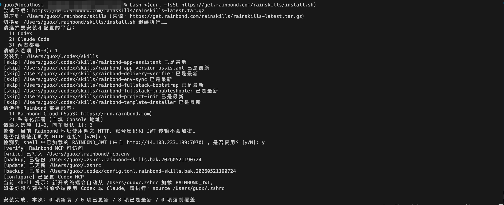

# RainSkills（Rainbond  AI 工作流技能）

## 概述

RainSkills 是一组面向 Rainbond 平台的开源 AI 工作流技能，用于增强 Codex、Claude Code 等 AI 编程助手在 Rainbond 场景下的部署，排障和运维能力。安装后，用户可以用自然语言描述目标，例如“帮我把当前项目部署到 Rainbond”“排查这个应用为什么没有运行起来”“给当前应用创建一个快照”，AI 助手会结合本地项目文件、Rainbond MCP 工具和当前平台状态，完成上下文识别、部署编排、运行排障、交付验证和版本操作。

## 核心能力

### 项目接入与部署

RainSkills 可以识别本地项目结构，生成或复用 `rainbond.app.json`、`.rainbond/local.json`，并建立本地项目与 Rainbond 应用的绑定关系。部署时支持镜像、源码、软件包和应用模板，并辅助补齐端口、依赖、连接变量和必要的存储配置。对于前后端、数据库、缓存等多组件应用，也会尽量保持组件关系清晰，减少手工梳理拓扑的成本。

### 运行排障与修复

当应用无法正常运行时，RainSkills 会读取组件状态、Pod 诊断、事件、构建日志和运行日志，定位构建、部署或运行阶段的问题。它可以区分源码构建失败、镜像拉取失败、依赖缺失、环境变量不匹配、服务启动异常等常见原因。对于低风险平台侧问题可辅助修复；涉及代码、镜像或集群容量时会停止并给出建议。

### 交付验收

部署完成后，RainSkills 会检查组件、Pod、事件、访问配置和存储状态，判断应用是否真正运行收敛，而不只是确认资源已经创建。对于有访问入口的应用，会识别最终访问地址，并在全栈场景下同时关注页面路径和 API 路径。最终会给出已交付、需要人工验证、部分交付或阻塞等结论。

### 版本与发布

RainSkills 支持 Rainbond 应用版本中心操作，包括查看版本概览、创建快照、发布到本地组件库或云市场，以及查看发布草稿和发布事件。应用交付完成后，可以将当前运行状态沉淀为可复用、可回滚的版本资产。需要恢复历史状态时，可辅助查看快照和回滚记录，并通过版本中心流程执行回滚或创建新应用。

## 使用指南

### 前置条件

使用 RainSkills 前，需要具备以下条件：

* 已安装 Codex、Claude Code，或其他支持本地 skill 与 MCP 的 AI 工具
* 本机可执行 `bash`、`curl`、`tar`、`python3`
* 已有可登录的 Rainbond 账号
* 本机能够访问目标 Rainbond Console 地址

### 快速安装

推荐使用一行命令安装：

```bash
bash <(curl -fsSL https://get.rainbond.com/rainskills/install.sh)
```

安装脚本会自动完成以下动作：

* 下载 RainSkills
* 选择安装到 Codex、Claude Code，或同时安装到两个工具
* 引导浏览器登录 Rainbond 并授权
* 保存 Rainbond JWT 到 `~/.rainbond/mcp.env`
* 配置 Codex / Claude Code 的 Rainbond MCP
* 将环境变量加载逻辑写入当前 shell 的 rc 文件
* 验证 Rainbond MCP 是否可用

安装完成后，请重启 Codex 或 Claude Code，确保新安装的 skill 和 MCP 配置生效。

### 选择 Rainbond 部署形态

安装脚本支持 Rainbond Cloud 和私有化 Rainbond。

Rainbond Cloud：

```bash
bash <(curl -fsSL https://get.rainbond.com/rainskills/install.sh) all --saas
```

私有化 Rainbond：

```bash
bash <(curl -fsSL https://get.rainbond.com/rainskills/install.sh) all --self-hosted --rainbond-url <url>
```

如果只是安装到单个平台，也可以执行：

```bash
./install.sh codex
./install.sh claude
./install.sh all
```



### 刷新登录状态

如果 Rainbond MCP 返回 401、403、`unauthorized` 或 `token expired`，通常是 JWT 已过期。此时不需要重新安装，也不要手工修改 `~/.rainbond/mcp.env`，执行刷新命令即可：

```bash
bash <(curl -fsSL https://get.rainbond.com/rainskills/install.sh) refresh
```

如果本机已经保留安装目录，也可以执行：

```bash
bash ~/.rainbond/skills/install.sh refresh
```

刷新成功后必须重启 Codex 或 Claude Code，因为 MCP 客户端通常在进程启动时读取环境变量，运行中的客户端不会自动拿到新的 JWT。

## 常用提示词示例

### 部署与初始化

```text
帮我把当前项目部署到 Rainbond。
```

```text
如果这个项目还没有初始化，就先接入 Rainbond，然后继续部署。
```

```text
用这个 Git 仓库创建一个 Rainbond 应用。
```

### 排障与修复

```text
帮我看看当前应用为什么没有正常运行。
```

```text
检查 api 组件的构建日志，看看失败原因。
```

```text
这个前端页面能打开，但接口不通，帮我排查一下。
```

### 交付验收

```text
帮我验证这个应用是否已经交付成功。
```

```text
找一下这个应用最终应该访问哪个地址。
```

### 版本与发布

```text
给当前应用创建一个快照。
```

```text
把这个快照发布到本地组件库。
```

```text
把当前应用回滚到上一个快照。
```

## 注意事项

* RainSkills 是开源技能集，不区分企业版和开源版能力。
* 安装脚本负责 skill 复制、MCP 注册、浏览器登录和 JWT 保存，不建议手工复制目录或手工改 MCP 配置。
* 安装或刷新 JWT 后，需要重启 Codex 或 Claude Code。
* `.rainbond/env.preview.json` 和 `.rainbond/env.prod.json` 只保存非敏感环境覆盖，不应保存密码、Token、证书或私钥。
* RainSkills 会优先读取当前项目目录下的 `rainbond.app.json` 和 `.rainbond/local.json`，不会扫描其他仓库来猜测绑定关系。
* 删除应用、删除组件、切换交付模式、修改业务代码等高风险动作不会被静默执行，需要用户明确确认或人工接手。
* 如果问题已经定位到业务代码、构建脚本或平台容量限制，RainSkills 会停止继续尝试，并给出明确的后续处理建议。
