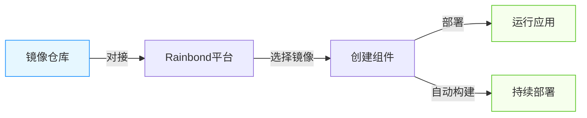

本文档详细介绍了如何在 Rainbond 平台对接已有镜像仓库，并基于镜像仓库中的镜像快速创建和部署。

## 镜像仓库对接概述

Rainbond 支持对接标准的容器镜像仓库，主要包括两种类型：
- **Docker Registry**：开源的 Docker 官方镜像仓库
- **Harbor**：企业级的容器镜像仓库，提供更丰富的权限管理和安全特性

通过对接镜像仓库，您可以享受以下优势：
- 直接使用已有的镜像资源，无需重复构建
- 便捷的镜像版本选择和更新
- 统一的镜像管理，适合多环境部署

## 对接镜像仓库

### 支持的镜像仓库类型

Rainbond 目前支持对接以下类型的镜像仓库：
- Docker Registry (私有部署)（包含Docker Hub）
- Harbor
- 其他兼容 Docker Registry API 的镜像仓库

### 对接步骤

1. **进入镜像仓库配置页面**
   - 登录 Rainbond 平台
   - 选择目标团队
   - 点击 **个人中心** -> **镜像仓库** -> **添加镜像仓库**

2. **填写镜像仓库信息**
   - **选择镜像仓库类型**：Docker Registry 或 Harbor
   - **仓库名称**：自定义镜像仓库名称
   - **镜像仓库地址**：例如 `https://registry.example.com` 或 `registry.hub.docker.com`
   - **用户名**：镜像仓库账号
   - **密码**：对应账号密码
   
3. **保存配置**

:::caution 注意
如果对接的是自建的私有镜像仓库，请确保：
1. 仓库已正确配置 HTTPS（强烈推荐）或已在 Rainbond 节点配置信任该仓库
2. Rainbond 集群节点能够网络访问该镜像仓库
:::

## 基于镜像仓库创建应用

对接完镜像仓库后，您可以基于仓库中的镜像快速创建应用组件。

### 创建步骤

1. **创建新应用**
   - 进入目标团队主页
   - 点击 **新增** -> **基于镜像创建组件**
   
2. **选择镜像来源**
   - 选择 **从已连接的镜像仓库选择**
   - 从下拉列表中选择已对接的镜像仓库
   
3. **选择并配置镜像**
   - 浏览并选择需要的镜像
   - 指定镜像标签（tag）
   - 设置组件名称和所属应用
   - 根据需要调整高级选项（如内存限制、环境变量等）
   
4. **创建组件**
   - 点击 **确认** 创建组件
   - Rainbond 将自动拉取镜像并启动组件

## 配置镜像仓库自动构建

对接镜像仓库后，可以开启镜像仓库自动构建，当镜像仓库有镜像更新时，会自动触发组件构建和部署。目前仅支持 Docker Registry 镜像仓库。

1. 开启镜像仓库 Webhook 自动构建，**组件 -> 构建源 -> 开启自动构建**。

2. 配置 Tag 触发自动修改策略，**组件 -> 构建源 -> 自动构建策略**。

默认情况下 Webhook 更新事件的镜像名称和 Tag 必须与组件当前构建源的镜像名称和 Tag 配置一致才能触发构建和部署。配置了 Tag 触发策略以后，根据配置的正则表达式，如果接收到的 push 事件的镜像 tag 能够正确匹配正则表达式，则认为此次更新事件有效，根据更新的 Tag 信息来升级当前组件的构建源信息并进行自动构建。

比如设置 Tag 策略为： `v5.*` 当 Tag 为 `v5.1` `v5.2` `v5.9`等都将被允许。

### 配置 DockerHub 镜像仓库

进入 DockerHub 仓库 -> Webhooks

| New Webhook  | 说明                            |
| ------------ | ------------------------------- |
| Webhook name | 自定义                          |
| Webhook URL  | 复制 Rainbond 中的 Webhook 地址 |

