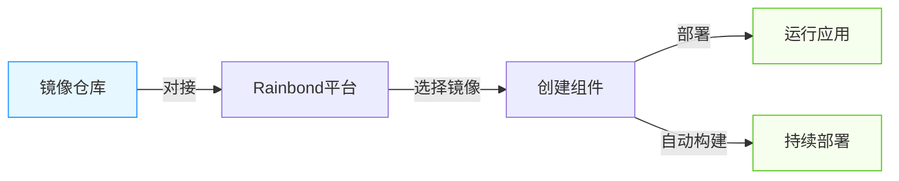

本文档详细介绍了如何在 Rainbond 平台对接已有镜像仓库，并基于镜像仓库中的镜像快速创建和部署。

```mermaid
flowchart LR
    A[镜像仓库] -->|对接| B[Rainbond平台]
    B -->|选择镜像| C[创建组件]
    C -->|部署| D[运行应用]
    C -->|自动构建| E[持续部署]
    
    style A fill:#e6f7ff,stroke:#1890ff
    style D fill:#f6ffed,stroke:#52c41a
    style E fill:#f6ffed,stroke:#52c41a
```

## 镜像仓库对接概述

Rainbond 支持对接标准容器镜像仓库，也支持对接主流云厂商镜像仓库。对接完成后，用户可以在创建镜像组件时直接选择仓库、命名空间、镜像和 Tag，减少手动复制镜像地址和维护拉取凭据的成本。

通过对接镜像仓库，您可以享受以下优势：
- 直接使用已有的镜像资源，无需重复构建
- 便捷的镜像版本选择和更新
- 统一的镜像管理，适合多环境部署
- 统一维护私有镜像拉取凭据，避免每次部署重复填写

## 对接镜像仓库

### 支持的镜像仓库类型

Rainbond 目前支持对接以下类型的镜像仓库：
- Docker Registry（私有部署，包含 Docker Hub）
- Harbor
- 阿里云容器镜像服务 ACR
- 腾讯云容器镜像服务 TCR
- 华为云容器镜像服务 SWR
- 火山引擎容器镜像仓库 CR
- 其他兼容 Docker Registry API 的镜像仓库

### 个人镜像仓库

个人镜像仓库适合普通用户维护自己的镜像仓库凭据。配置后，当前用户在创建镜像组件时可以直接使用这些仓库。

1. **进入镜像仓库配置页面**
   - 登录 Rainbond 平台
   - 选择目标团队
   - 点击 **个人中心** -> **镜像仓库** -> **添加镜像仓库**

2. **填写镜像仓库信息**
   - **选择镜像仓库类型**：Docker Registry、Harbor 或云厂商镜像仓库
   - **仓库名称**：自定义镜像仓库名称
   - **镜像仓库地址**：例如 `https://registry.example.com` 或 `registry.hub.docker.com`
   - **Access Key**：云厂商 API 访问凭据，用于查询命名空间、仓库和镜像信息。Docker Registry 和 Harbor 类型无需填写
   - **Access Secret**：云厂商 API Secret，与 Access Key 配套使用。Docker Registry 和 Harbor 类型无需填写
   - **用户名**：镜像仓库登录用户名，用于 Registry 认证、查询镜像 Tag 和部署时拉取镜像
   - **密码**：镜像仓库登录密码或访问令牌，用于 Registry 认证和创建镜像拉取凭据
   
3. **保存配置**

### 全局镜像仓库

全局镜像仓库适合由平台管理员统一维护企业内公共镜像仓库。配置后，团队用户在创建镜像组件时可以复用这些仓库，不需要每个用户单独添加一份相同配置。

配置入口：

1. 进入 **平台管理 -> 设置 -> 全局镜像仓库**。
2. 点击 **添加镜像仓库**。
3. 按照与个人镜像仓库一致的字段填写仓库类型、仓库地址、云厂商 Access Key、Access Secret、镜像仓库用户名和密码。
4. 保存配置。

个人镜像仓库和全局镜像仓库的字段含义一致，区别在于作用范围：

| 配置方式 | 配置入口 | 适用场景 |
| --- | --- | --- |
| 个人镜像仓库 | **个人中心 -> 镜像仓库** | 用户维护自己的私有仓库凭据 |
| 全局镜像仓库 | **平台管理 -> 设置 -> 全局镜像仓库** | 平台管理员维护企业公共仓库 |

:::caution 注意
如果对接的是自建的私有镜像仓库，请确保：
1. 仓库已正确配置 HTTPS（强烈推荐）或已在 Rainbond 节点配置信任该仓库
2. Rainbond 集群节点能够网络访问该镜像仓库
3. 不要在文档、聊天记录或工单中粘贴真实 Access Key、Access Secret、镜像仓库密码等敏感信息
:::

## 基于镜像仓库创建应用

对接完镜像仓库后，您可以基于仓库中的镜像快速创建应用组件。

### 创建步骤

1. **创建新应用**
   - 进入目标团队主页
   - 点击 **新增** -> **基于镜像创建组件**
   
2. **选择镜像来源**
   - 选择 **从已连接的镜像仓库选择**
   - 从下拉列表中选择已对接的镜像仓库
   
3. **选择并配置镜像**
   - 浏览并选择需要的镜像
   - 指定镜像标签（tag）
   - 设置组件名称和所属应用
   - 根据需要调整高级选项（如内存限制、环境变量等）
   
4. **创建组件**
   - 点击 **确认** 创建组件
   - Rainbond 将自动拉取镜像并启动组件

## 配置镜像仓库自动构建

对接镜像仓库后，可以开启镜像仓库自动构建。当镜像仓库有镜像更新时，镜像仓库通过 Webhook 通知 Rainbond，Rainbond 会自动触发组件构建和部署。当前支持 Docker Registry、Docker Hub 和 Harbor 等镜像仓库 Webhook。

1. 开启镜像仓库 Webhook 自动构建，**组件 -> 构建源 -> 开启自动构建**。

2. 配置 Tag 触发自动修改策略，**组件 -> 构建源 -> 自动构建策略**。

默认情况下 Webhook 更新事件的镜像名称和 Tag 必须与组件当前构建源的镜像名称和 Tag 配置一致才能触发构建和部署。配置了 Tag 触发策略以后，根据配置的正则表达式，如果接收到的 push 事件的镜像 tag 能够正确匹配正则表达式，则认为此次更新事件有效，根据更新的 Tag 信息来升级当前组件的构建源信息并进行自动构建。

比如设置 Tag 策略为： `v5.*` 当 Tag 为 `v5.1` `v5.2` `v5.9`等都将被允许。

### 配置 DockerHub 镜像仓库

进入 DockerHub 仓库 -> Webhooks

| New Webhook  | 说明                            |
| ------------ | ------------------------------- |
| Webhook name | 自定义                          |
| Webhook URL  | 复制 Rainbond 中的 Webhook 地址 |

### 配置 Harbor 镜像仓库

Harbor 支持在项目或仓库中配置 Webhook。配置完成后，推送新镜像 Tag 时可以触发 Rainbond 自动构建。

1. 在 Rainbond 组件内进入 **构建源 -> 开启自动构建**，复制 Webhook 地址。
2. 登录 Harbor，进入目标项目。
3. 进入 **Webhooks**，新增 Webhook。
4. Webhook 类型选择 HTTP，事件选择镜像推送事件（如 Push Artifact）。
5. URL 填写 Rainbond 中复制的 Webhook 地址。
6. 保存后向 Harbor 推送一个新镜像 Tag，回到 Rainbond 组件的构建记录中确认是否触发构建。

:::tip
默认情况下，Webhook 事件中的镜像名称和 Tag 需要与组件当前构建源一致。若希望通过 `v1.*`、`release-*` 等规则触发不同 Tag 的自动部署，请在 Rainbond 的自动构建策略中配置 Tag 匹配规则。
:::
