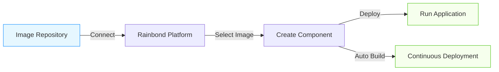

This document details how to connect an existing image repository on the Rainbond platform and quickly create and deploy based on images in the repository.

## Overview of Image Repository Connection

Rainbond supports connecting to standard container image repositories, mainly including two types:

- **Docker Registry**: Open-source Docker official image repository
- **Harbor**: Enterprise-level container image repository, providing richer permission management and security features

By connecting to an image repository, you can enjoy the following advantages:

- Directly use existing image resources without repeated construction
- Convenient image version selection and update
- Unified image management, suitable for multi-environment deployment

## Connect Image Repository

### Supported Image Repository Types

Rainbond currently supports connecting to the following types of image repositories:

- Docker Registry (Private Deployment) (including Docker Hub)
- Harbor
- Other image repositories compatible with Docker Registry API

### Connection Steps

1. **Enter the Image Repository Configuration Page**
   - Log in to the Rainbond platform
   - Select the target team
   - Click **Personal Center** -> **Image Repository** -> **Add Image Repository**

2. **Fill in Image Repository Information**
   - **Select Image Repository Type**: Docker Registry or Harbor
   - **Repository Name**: Custom image repository name
   - **Image Repository Address**: For example `https://registry.example.com` or `registry.hub.docker.com`
   - **Username**: Image repository account
   - **Password**: Corresponding account password

3. **Save Configuration**

:::caution Note
If connecting to a self-built private image repository, please ensure:

1. The repository has been correctly configured with HTTPS (strongly recommended) or has been configured to trust the repository on the Rainbond node
2. Rainbond cluster nodes can access the image repository over the network
   :::

## Create Application Based on Image Repository

After connecting to the image repository, you can quickly create application components based on the images in the repository.

### Creation Steps

1. **Create New Application**
   - Enter the target team homepage
   - Click **Add** -> **Create Component Based on Image**
2. **Select Image Source**
   - Select **From Connected Image Repository**
   - Select the connected image repository from the dropdown list
3. **Select and Configure Image**
   - Browse and select the required image
   - Specify image tag (tag)
   - Set component name and belonging application
   - Adjust advanced options as needed (such as memory limit, environment variables, etc.)
4. **Create Component**
   - Click **Confirm** to create the component
   - Rainbond will automatically pull the image and start the component

## Configure Image Repository Auto Build

After connecting to the image repository, you can enable the image repository auto build. When the image repository has image updates, it will automatically trigger component build and deployment.Currently, only Docker Registry image repositories are supported.

1. Enable image repository Webhook auto build, **Component -> Build Source -> Enable Auto Build**.

2. Configure Tag trigger auto modification strategy, **Component -> Build Source -> Auto Build Strategy**.

By default, the image name and Tag of the Webhook update event must match the image name and Tag configuration of the component's current build source to trigger build and deployment.After configuring the Tag trigger strategy, according to the configured regular expression, if the image tag of the received push event can correctly match the regular expression, the update event is considered valid, and the current component's build source information is upgraded based on the updated Tag information for auto build.

For example, set the Tag strategy as: `v5.*` When the Tag is `v5.1` `v5.2` `v5.9`, etc., it will be allowed.

### Configure DockerHub Image Repository

Enter DockerHub repository -> Webhooks

| New Webhook  | illustrate                           |
| ------------ | ------------------------------------ |
| Webhook name | Custom                               |
| Webhook URL  | Copy the Webhook address in Rainbond |

