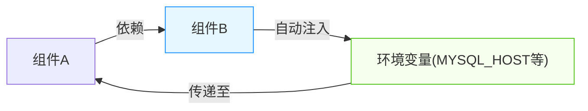

## 概述

组件间通信变量注入是 Rainbond 平台的核心特性之一，它通过自动注入环境变量实现组件间的解耦通信。本文详细介绍这一机制的工作原理、配置方法及最佳实践。



## 通信变量原理

### 什么是通信变量？

通信变量是指组件为其依赖方提供的连接信息，例如：
- 数据库的连接地址、端口、用户名和密码
- API服务的认证信息和访问地址
- 消息队列的连接参数

这些变量使得组件间可以在不硬编码连接信息的情况下实现灵活通信。

### 解耦设计的价值

标准化的设计场景中，业务代码依赖的服务**类型**不变，但具体依赖的服务**实例**可以灵活替换：

- 开发环境可使用轻量级数据库
- 测试环境可使用模拟服务
- 生产环境使用高可用集群

通过环境变量注入机制，实现了这种灵活替换而无需修改代码。

## 实践示例

### 代码中使用环境变量

以Spring Boot应用为例，配置数据库连接：

```yaml
spring:
  datasource:
    url: jdbc:mysql://${MYSQL_HOST:127.0.0.1}:${MYSQL_PORT:3306}/${MYSQL_DATABASE:test}
    username: ${MYSQL_USER:root}
    password: ${MYSQL_PASSWORD:password}
```

:::tip
注意示例中`${VAR:default}`语法，它提供了默认值，便于本地开发测试。
:::

### 配置和使用通信变量

**前提条件**：
- 已创建两个组件A和B

#### 1. 配置端口别名

1. 进入组件B的管理页面
2. 选择【端口】选项卡
3. 找到需要暴露的端口（如MySQL的3306端口）
4. 点击【端口设置】→【使用别名】
5. 设置别名为`DB`
6. 保存设置

:::info
设置别名后，系统会自动生成`DB_HOST`和`DB_PORT`两个变量
:::

#### 2. 配置连接信息变量

1. 进入组件B的管理页面
2. 选择【依赖】选项卡，切换到【连接信息】标签
3. 点击【添加变量】，配置其他必要的连接变量：
   - `DB_USER`: 数据库用户名
   - `DB_PASSWORD`: 数据库密码
   - `DB_DATABASE`: 数据库名称
4. 点击【确认】保存变量

#### 3. 建立组件依赖关系

1. 在应用视图的拓扑图中，拖拽连线从组件A指向组件B
2. 确认建立依赖关系
3. 更新或重启组件A使配置生效

#### 4. 验证环境变量注入

1. 进入组件A的管理页面
2. 选择【环境】选项卡
3. 查看是否已注入`DB_HOST`、`DB_PORT`等环境变量

## 高级应用

### 变量作用域

通信变量具有两个作用域：

| 作用域 | 描述 |
|-------|------|
| 当前组件 | 变量作为普通环境变量在定义它的组件中生效 |
| 依赖组件 | 变量自动注入到依赖当前组件的所有组件中 |

### 变量覆盖规则

当多个来源定义了同名变量时，优先级从高到低为：

1. 组件自身定义的环境变量
2. 依赖注入的连接信息变量
3. 代码中定义的默认值

## 常见问题

### 连接信息与普通环境变量的区别

**相同点**：
- 对于组件自身，两者都会作为环境变量在运行环境中生效

**不同点**：
- 连接信息会被注入到依赖当前组件的其他组件中（相当于"公开"的环境变量）
- 普通环境变量仅在组件自身环境中生效

### 何时应该定义连接信息？

建议在以下情况定义连接信息：

- 组件提供服务给其他组件使用时
- 组件需要标准化连接方式时
- 希望实现组件可替换性时

### 变量未正确注入的排查

如果发现变量未被正确注入，请检查：

1. 依赖关系是否正确建立
2. 组件是否在变量设置后重新部署
3. 变量名称是否与预期一致
4. 是否有同名环境变量覆盖了连接信息

