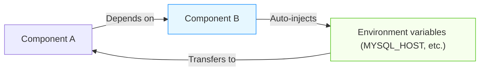

## Overview

Inter-component communication variable injection is one of the core features of the Rainbond platform, which achieves decoupled communication between components through automatic injection of environment variables.This article details the working principle, configuration methods, and best practices of this mechanism.



## Communication variable principle

### What is a communication variable?

Communication variables refer to the connection information provided by a component for its dependents, such as:

- Database connection address, port, username, and password
- API service authentication information and access address
- Message queue connection parameters

These variables enable flexible communication between components without hard-coding connection information.

### The value of decoupled design

In standardized design scenarios, the **type** of service that the business code depends on remains unchanged, but the specific dependent service **instance** can be flexibly replaced:

- Development environment can use lightweight databases
- Test environment can use mock services
- Production environment uses high-availability clusters

Through the environment variable injection mechanism, this flexible replacement is achieved without modifying the code.

## Practical example

### Using environment variables in code

Taking a Spring Boot application as an example, configure the database connection:

```yaml
spring:
  datasource:
    url: jdbc:mysql://${MYSQL_HOST:127.0.0.1}:${MYSQL_PORT:3306}/${MYSQL_DATABASE:test}
    username: ${MYSQL_USER:root}
    password: ${MYSQL_PASSWORD:password}
```

:::tip
Note the `${VAR:default}` syntax in the example, which provides default values for local development and testing.
:::

### Configure and use communication variables

**Prerequisites**:

- Two components A and B have been created

#### 1. Configure port alias

1. Enter the management page of component B
2. Select the [Ports] tab
3. Find the port that needs to be exposed (such as MySQL's 3306 port)
4. Click [Port Settings] → [Use Alias]
5. Set the alias to `DB`
6. Save the settings

:::info
After setting the alias, the system will automatically generate two variables `DB_HOST` and `DB_PORT`
:::

#### 2. Configure connection information variables

1. Enter the management page of component B
2. Select the [Dependencies] tab, switch to the [Connection Information] tab
3. Click [Add Variable], configure other necessary connection variables:
  - `DB_USER`: Database username
  - `DB_PASSWORD`: Database password
  - `DB_DATABASE`: Database name
4. Click [Confirm] to save the variables

#### 3) Build dependencies between components

1. In the application view's topology diagram, drag a line from component A to component B
2. Confirm to build dependencies
3. Update or restart component A to make the configuration take effect

#### 4) Verify environment variable injection

1. Enter the management page of component A
2. Select the [Environment] tab
3. Check if environment variables such as `DB_HOST`, `DB_PORT` have been injected

## Advanced application

### Variable scope

Communication variables have two scopes:

| Scope               | Description                                                                                   |
| ------------------- | --------------------------------------------------------------------------------------------- |
| Current component   | Variables take effect as ordinary environment variables in the component that defines them    |
| Dependent component | Variables are automatically injected into all components that depend on the current component |

### Variable override rules

When multiple sources define variables with the same name, the priority from high to low is:

1. Environment variables defined by the component itself
2. Dependency-injected connection information variables
3. Default values defined in the code

## Common problem

### The difference between connection information and ordinary environment variables

**Same points**:

- For the component itself, both will take effect as environment variables in the runtime environment

**Different points**:

- Connection information will be injected into other components that depend on the current component (equivalent to "public" environment variables)
- Ordinary environment variables only take effect in the component's own environment

### When should connection information be defined?

It is recommended to define connection information in the following situations:

- When a component provides services to other components
- When a component needs standardized connection methods
- When you want to achieve component replaceability

### Troubleshooting for variables not being correctly injected

If you find that variables are not being correctly injected, please check:

1. Are the dependencies correctly established
2. Is the component redeployed after variable settings
3. Does the variable name match the expected one
4. Is there an environment variable with the same name overwriting the connection information

