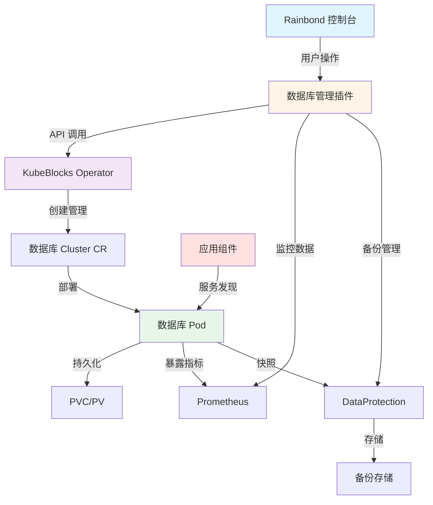

在现代应用开发中，数据库是不可或缺的基础设施组件。Rainbond 通过深度集成 [KubeBlocks](https://kubeblocks.io)，为用户提供了简单、强大的云原生数据库管理能力，让您可以像部署应用一样轻松地部署和管理各类数据库。

## 什么是 KubeBlocks

KubeBlocks 是一个开源的云原生数据基础设施管理系统，专为 Kubernetes 设计，帮助用户在云原生环境中轻松部署和管理各种数据库和中间件集群，包括：

- **关系型数据库**: MySQL、PostgreSQL、MariaDB
- **NoSQL 数据库**: Redis、MongoDB、Elasticsearch
- **消息队列**: Kafka、RabbitMQ、Pulsar
- **时序数据库**: InfluxDB

KubeBlocks 提供了数据库集群的全生命周期管理能力，包括部署、扩缩容、备份恢复、监控告警、版本升级等。

## Rainbond 的插件化集成

Rainbond 并不是简单地将 KubeBlocks 包装起来，而是通过**插件化的方式**进行了深度集成，为用户提供了更简单、更直观的数据库管理体验。您无需深入了解 Kubernetes 和 KubeBlocks 的复杂概念，即可通过 Rainbond 控制台快速部署和管理各种数据库集群。

### 集成优势

相比直接使用 KubeBlocks 或其他数据库管理工具，Rainbond 的集成方案具有以下优势：

| 特性 | Rainbond + KubeBlocks | 直接使用 KubeBlocks | 传统部署方式 |
|------|----------------------|-------------------|------------|
| **操作方式** | 图形化界面，表单操作 | 编写 YAML 配置文件 | 命令行或手动配置 |
| **学习成本** | 低，无需 K8s 知识 | 中等，需要了解 CR 概念 | 高，需要数据库专业知识 |
| **统一管理** | 应用和数据库统一管理 | 独立管理 | 独立管理 |
| **服务发现** | 自动服务注册和发现 | 需要手动配置 Service | 需要手动配置 |

### 核心能力

通过 Rainbond + KubeBlocks 的组合，您可以获得：

1. **图形化管理**
   - 通过 Web 界面创建和管理数据库集群
   - 可视化查看数据库状态、性能指标、拓扑结构
   - 一键执行扩缩容、备份恢复等运维操作

2. **统一体验**
   - 数据库管理与应用管理使用相同的界面和操作方式
   - 在团队视图中统一查看应用和数据库资源
   - 使用 Rainbond 的团队和角色体系管理数据库访问权限

3. **自动化运维**
   - 自动处理数据库的高可用配置（主从复制、集群模式等）
   - 自动执行定期备份和快照
   - 自动监控数据库性能和健康状态
   - 自动处理节点故障和数据恢复

4. **应用集成**
   - 数据库服务自动注册到 Rainbond 服务网格
   - 应用可以通过服务名直接访问数据库
   - 数据库连接信息自动注入到应用环境变量
   - 支持服务依赖关系的可视化管理

## 支持的数据库类型

Rainbond 通过 KubeBlocks 集成支持多种主流数据库和中间件：

### 关系型数据库

- **MySQL**: 5.7、8.0、8.4，支持主从复制和 MGR 高可用模式
- **PostgreSQL**: 12-16 版本，支持主从流复制和 Patroni 高可用

### NoSQL 数据库

- **Redis**: 7.0、7.2，支持哨兵模式和集群模式

### 消息队列

- **RabbitMQ**: 3.11-3.13，支持镜像队列和 Quorum 队列

:::info
目前仅支持上述数据库类型。更多类型后续将陆续加入
:::

## 集成架构

下图展示了 Rainbond 与 KubeBlocks 的集成架构：

### 工作流程

1. **用户操作**: 在 Rainbond 控制台通过图形化界面创建或管理数据库
2. **插件处理**: Rainbond 数据库管理插件将用户操作转换为 KubeBlocks API 调用
3. **集群创建**: KubeBlocks Operator 根据请求创建数据库集群（Cluster CR）
4. **资源编排**: KubeBlocks 自动创建 StatefulSet、Service、ConfigMap 等 Kubernetes 资源
5. **数据库运行**: 数据库 Pod 启动并提供服务，自动处理高可用、监控、备份等
6. **状态同步**: 数据库状态实时同步回 Rainbond 控制台，用户可以随时查看

## 快速开始

### 第一步: 安装 KubeBlocks

在使用数据库功能之前，需要先安装 KubeBlocks。详细步骤请参考：

- [KubeBlocks 集成安装](./install.md)

### 第二步: 创建数据库

安装完成后，您可以根据需要创建不同类型的数据库：

- [部署 MySQL 数据库](./mysql.md)
- [部署 PostgreSQL 数据库](./postgresql.md)
- [部署 Redis 缓存](./redis.md)
- [部署 RabbitMQ 消息队列](./rabbitmq.md)

### 第三步: 连接应用到数据库

在 Rainbond 中，应用连接数据库非常简单：

1. 在应用的依赖配置中添加数据库服务
2. 数据库连接信息会自动注入到应用的环境变量中
3. 应用通过服务名（如 `mysql-cluster`）即可访问数据库

## 常见问题

### Rainbond 数据库管理与直接使用 KubeBlocks 有什么区别？

Rainbond 在 KubeBlocks 的基础上提供了：

- **更简单的操作**: 图形化界面，无需编写 YAML
- **统一管理**: 应用和数据库在同一平台管理
- **更好的集成**: 自动服务发现、环境变量注入等
- **权限管理**: 利用 Rainbond 的团队和角色体系

### 数据库数据存储在哪里？安全吗？

- 数据库数据存储在 Kubernetes 持久卷（PV）中
- 使用的是您集群配置的存储类（StorageClass）
- 数据持久性由底层存储系统保证（如 Ceph、Longhorn、云存储等）
- 建议配置自动备份，将备份存储到可靠的对象存储中