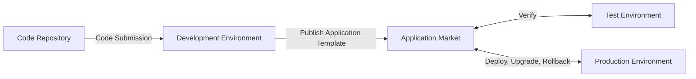

## Overview

Rainbond application template continuous delivery is an efficient software delivery method that allows development, testing, and operations teams to quickly complete environment deployment and version iteration through a unified application template.

## Application Template Continuous Delivery Process

### Process Description

1. **Code Submission and Automated Testing**:
   - Developers submit code to the source code repository
   - Trigger automatic build and automated testing in the development environment
   - When the test fails, feedback is given to the developers for repair

2. **Version Release and Test Environment Deployment**:
   - After the feature development is completed, publish the application to the application market as version `1.0`
   - Testers install the `1.0` version from the application market to the test environment with one click
   - Developers continue to iterate in the development environment, testers perform functional testing

3. **Version Iteration and Update**:
   - According to the test feedback, developers fix the problem and release version `2.0`
   - Testers upgrade to the new version in the test environment with one click and continue testing
   - Iterate in cycles until the version quality meets the requirements

4. **Production Environment Delivery**:
   - When the version (such as `3.0`) passes the test, mark it as `Release` status in the application market
   - The production environment directly deploys the released stable version from the application market

## Operation Steps

### Preconditions

- Completed [Rainbond Quick Installation](../../../quick-start/quick-install.mdx)
- Multiple teams/projects have been created (such as development environment, test environment, production environment)
- Have the corresponding operation permissions

### Deploy Development Environment

**Deploy Business Components**

1. Enter the development team view → create a new application.
2. Select build from source → source code.
   - Customize the application name.
   - Repository address: `https://gitee.com/rainbond/java-maven-demo.git`.
   - Branch: `dev`.

### Create Application Template

1. **Enter Application Release Page**
   - Enter `Application Release → Publish to Local Component Library`
   - At this time, you will enter the template setting page

2. **Set Template Information**
   - Create a new application template, named **Backend Management System**
   - Select **Enterprise** for the release scope
   - Set the version number to **1.0**
   - Fill in application description, category and other information
   - You can choose to upload the application icon to enhance recognition

3. **Confirm Release**
   - Click **Submit**, the system will synchronize all component images to the local repository

   - After synchronization is completed, click **Confirm Release** to complete the release process

   - After release, check the release result in `Platform Management → Application Market → Local Component Library`
   > **Note**: Only enterprise administrators can see the **Platform Management** button.The image synchronization process may take a few minutes, please wait patiently.

### Deploy Test Environment

1. **Create Test Environment**
   - Create a new team named **Test Environment** (skip if already exists)
   - Create an application in this team, named **Backend Management System**

2. **Install Application from Application Market**
   - In the application page, click `Add Component → Local Component Library`
   - Select the newly released **Backend Management System** template
   - Select version **1.0**, click install
   - Wait for the application deployment to complete, check if the function is normal

3. **Perform Testing and Iteration**
   - Testers perform functional testing in the test environment
   - Feedback the found problems to the developers
   - After the developers fix the problems, release a new version (such as **2.0**) in the development environment

4. **Application Upgrade**
   - Testers select the application in the test environment, click **Upgrade**
   - View version differences (**2.0**vs**1.0**)
   - Confirm the upgrade, the system will automatically complete the application update
   - Continue testing after the upgrade until a version (such as **3.0**) passes the complete test

5. **Mark Stable Version**
   - After the **3.0** version passes all tests
   - Administrator goes to `Platform Management → App Market → Local Component Library → Backend Management System`
   - Find the **3.0** version, click **Set as Release Status**
   - This marks the version as a high-quality, deliverable stable version

### IV. Deploy Production Environment

1. **View Available Release Versions**
   - Users with production environment deployment permissions enter `Platform Management → App Market → Local Component Library`
   - Check the version status of the **Backend Management System**, confirm **3.0** is marked as **Release**

2. **Deploy to Production Environment**
   - Click the **Install** button on the right side of the **Backend Management System** template
   - Select the **Production Environment** team
   - Select the application name and version (**3.0**) to install
   - Click confirm to complete the production environment deployment with one click

3. **Subsequent Version Updates**
   - When there are new features or fixes, developers release a new version (e.g., **3.1**)
   - After the new version is verified in the test environment
   - Operations personnel select **Upgrade** in the production environment application
   - After confirming the upgrade information, complete the smooth update of the production environment

## Best Practices and Common Problems

### Best Practices

- **Version Naming Convention**: It is recommended to use semantic version numbers (e.g., 1.0.0) to facilitate understanding the degree of version changes
- **Template Description Improvement**: Add detailed functional descriptions and version change records when releasing templates
- **Phased Testing**: Important versions are first verified in the pre-release environment before upgrading the production environment
- **Preserve Rollback Path**: Back up critical data before upgrading the production environment to ensure rollback is possible if necessary

### Common Problems

1. **Q: What to do if the application template fails to publish?**\
   A: Check the network environment, image repository status, confirm all components are running normally, then retry publishing.

2. **Q: Service interruption during upgrade?**\
   A: Check the configuration changes of the new version to ensure compatibility of environment variables, configuration files, etc.It is recommended to perform upgrades during off-peak hours.

3. **Q: How to roll back to a previous version?**\
   A: On the application upgrade page, select the previous stable version to perform the rollback operation.

4. **Q: How to avoid version conflicts in multi-person collaboration?**\
   A: Establish a clear version release process, designate a person responsible for application releases to avoid simultaneous releases of different versions.

## Reference

- [Rainbond Application Template Parameter Description](../app-model-parameters.md)
- [Rainbond Application Upgrade Attribute Change Rules](../upgrade-app.md)

