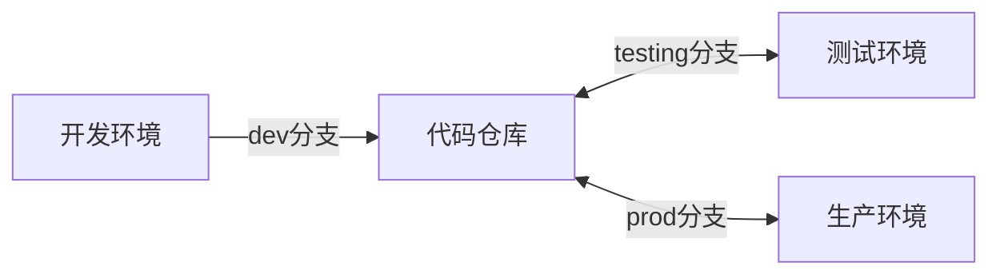

## 什么是源码持续交付？

源码持续交付是Rainbond平台的核心功能，它让您可以轻松地将代码从开发环境顺畅部署到测试环境和生产环境，无需复杂的DevOps工具链配置。

## Rainbond如何简化您的持续交付流程？

通过Rainbond，您可以：

- **一键构建**：直接从Git仓库拉取源码并自动构建应用
- **跨团队复制**：只需点击一下，即可将整个应用从一个环境复制到另一个环境
- **零学习成本**：无需编写复杂的CI/CD配置文件
- **环境一致性**：确保各环境配置一致，减少"我这能跑"的问题

## 简单三步实现持续交付

### 1. 开发环境：快速迭代

- 开发人员提交代码到`dev`分支
- Rainbond自动构建并部署应用
- 开发人员可以立即查看更改效果

### 2. 测试环境：一键复制

- 代码合并到`testing`分支后
- 在Rainbond控制台点击**快速复制**，选择测试团队
- 测试人员进行功能测试，发现问题后反馈给开发人员

### 3. 生产环境：安全上线

- 测试通过后，代码合并到`prod`分支
- 再次使用**快速复制**功能，将应用部署到生产环境
- 轻松实现安全、可控的上线流程

## 准备工作

在开始源码持续交付前，您需要准备：

- 已安装 [Rainbond](#) 平台
- 创建三个团队：开发团队、测试团队和生产团队
- 准备好的代码仓库，包含三个分支：`dev`、`testing`和`prod`

## 详细操作步骤

### 第一阶段：开发环境部署

**创建应用和组件**  

1. 进入开发团队视图 ➡️ 创建新应用。
2. 选择从源码构建 ➡️ 源码。
    - 自定义应用名称。
    - 仓库地址：`https://gitee.com/rainbond/java-maven-demo.git`。
    - 分支：`dev`。

**等待构建完成**

### 第二阶段：测试环境部署

**代码分支合并**
- 开发完成功能后，在Git仓库创建合并请求
- 将`dev`分支代码合并到`testing`分支

**环境复制**
- 在开发团队的目标应用内，点击应用上方的**快速复制**按钮
- 在弹出窗口中选择**测试团队**作为目标团队，并修改分支版本为`testing`
- 点击**确定**执行复制

**测试与迭代**
- 测试人员在测试环境进行功能测试，如发现问题，开发人员在`dev`分支修复，并合并到`testing`分支
- 测试环境迭代：
  1. 进入测试团队的目标应用内
  2. 点击**列表**
  3. 选择需要构建的组件（或全选），点击**批量操作** → **构建**

:::caution 注意
测试环境应保持与生产环境配置一致，包括资源限制、副本数量等，以确保测试结果有效。
:::

### 第三阶段：生产环境部署

**代码审核与合并**
- 测试通过后，在Git仓库创建`testing`到`prod`的合并请求
- 由技术负责人进行代码审核
- 审核通过后合并到`prod`分支

**生产环境部署**
- 在测试团队的目标应用内，点击应用上方的**快速复制**按钮
- 在弹出窗口中选择**生产团队**作为目标团队，并修改分支版本为`prod`
- 点击**确定**执行复制

**上线检查**
- 测试生产环境部署结果

:::warning
生产环境部署前应制定回滚预案。如需回滚，可在组件管理的**构建历史**中选择稳定版本进行回滚。
:::

## 最佳实践

### 分支策略

- **dev分支**：日常开发使用，可频繁提交
- **testing分支**：功能相对稳定，用于测试验证
- **prod分支**：生产就绪代码，严格控制合并权限

### 环境隔离

- 使用Rainbond的团队功能隔离不同环境
- 为不同环境配置不同的资源配额
- 生产环境应使用更严格的访问控制

### 自动化提升

- 配置自动化测试，确保代码质量
- 使用[应用模板持续交付](./ram.md)标准化环境配置

## 常见问题

### 如何处理数据库变更？

建议使用数据库迁移工具（如Flyway、Liquibase）管理数据库版本，确保环境间数据结构一致。
