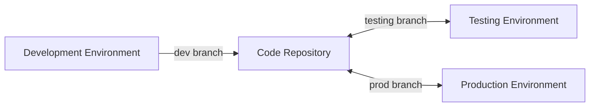

## What is source code continuous delivery?

Source code continuous delivery is a core feature of the Rainbond platform, allowing you to easily deploy code from the development environment to the testing and production environments without the need for complex DevOps toolchain configuration.

## How does Rainbond simplify your continuous delivery process?

With Rainbond, you can:

- **One-click build**: Pull source code directly from the Git repository and automatically build the application
- **Cross-team replication**: With just one click, replicate the entire application from one environment to another
- **Zero learning curve**: No need to write complex CI/CD configuration files
- **Environment consistency**: Ensure consistent configuration across environments to reduce the "it works on my machine" problem

## Three simple steps to achieve continuous delivery

### 1. Development Environment: Rapid Iteration

- Developers submit code to the `dev` branch
- Rainbond automatically builds and deploys the application
- Developers can immediately see the effects of changes

### 2. Testing Environment: One-click Replication

- After merging the code into the `testing` branch
- Click **Quick Replicate** in the Rainbond console and select the test team
- Testers perform functional tests and provide feedback to developers if issues are found

### 3. Production Environment: Safe Deployment

- After passing the tests, merge the code into the `prod` branch
- Use the **Quick Replicate** feature again to deploy the application to the production environment
- Easily achieve a safe and controllable deployment process

## Preparation

Before starting source code continuous delivery, you need to prepare:

- Installed [Rainbond](#) platform
- Create three teams: development team, test team, and production team
- Prepared code repository, containing three branches: `dev`, `testing`, and `prod`

## Detailed Operation Steps

### Phase One: Development Environment Deployment

**Create Application and Components**

1. Enter the development team view ➡️ Create a new application.
2. Select build from source code ➡️ Source code.
  - Customize the application name.
  - Repository address: `https://gitee.com/rainbond/java-maven-demo.git`.
  - Branch: `dev`.

**Wait for the build to complete**

### Phase Two: Testing Environment Deployment

**Code Branch Merge**

- After completing the development of features, create a merge request in the Git repository
- Merge the `dev` branch code into the `testing` branch

**Environment Replication**

- Within the target application in the development team, click the **Quick Replicate** button above the application
- In the pop-up window, select **Test Team** as the target team and modify the branch version to `testing`
- Click **OK** to execute the replication

**Testing and Iteration**

- Testers perform functional tests in the testing environment. If issues are found, developers fix them in the `dev` branch and merge them into the `testing` branch
- Testing environment iteration:
  1. Enter the target application within the test team
  2. Click **List**
  3. Select the components to build (or select all), click **Batch Operations** → **Build**

:::caution Note
The testing environment should maintain the same configuration as the production environment, including resource limits, number of replicas, etc., to ensure the validity of test results.
:::

### Phase Three: Production Environment Deployment

**Code Review and Merge**

- After passing the tests, create a merge request from `testing` to `prod` in the Git repository
- Code review by the technical lead
- After approval, merge into the `prod` branch

**Production Environment Deployment**

- Within the target application in the test team, click the **Quick Replicate** button above the application
- In the pop-up window, select **Production Team** as the target team and modify the branch version to `prod`
- Click **OK** to execute the replication

**Deployment Check**

- Test the production environment deployment results

:::warning
A rollback plan should be prepared before deploying to the production environment.If a rollback is needed, select a stable version in the **Build History** of component management for rollback.
:::

## Best Practices

### Branch Strategy

- **dev branch**: Used for daily development, frequent submissions allowed
- **testing branch**: Relatively stable features, used for test verification
- **prod branch**: Production-ready code, strictly control merge permissions

### Environment Isolation

- Use Rainbond's team feature to isolate different environments
- Configure different resource quotas for different environments
- Production environments should use stricter access controls

### Automation enhancement

- Configure automated testing to ensure code quality
- Use [application template continuous delivery](./ram.md) to standardize environment configuration

## common problem

### How to handle database changes?

It is recommended to use database migration tools (such as Flyway, Liquibase) to manage database versions and ensure data structure consistency across environments.
