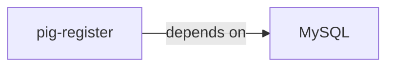
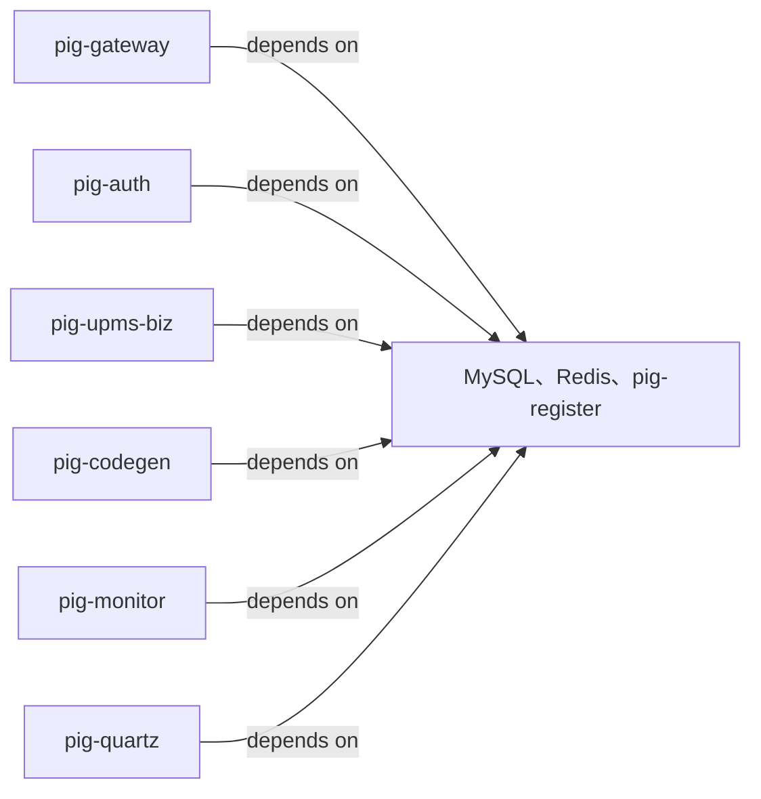

This article will guide you on how to deploy the complete [Spring Cloud Pig](https://gitee.com/log4j/pig) microservices application on the Rainbond platform with one click.Through this tutorial, you will experience Rainbond's powerful microservices governance capabilities and convenient deployment process.

In this tutorial, we will deploy a complete Spring Cloud Pig application, including:

1. Infrastructure: MySQL database, Redis cache
2. Backend services: 7 Spring Cloud microservices components
3. Frontend interface: Vue-based management interface

## Prerequisites

- Installed [Rainbond Quick Installation](../../quick-start/quick-install.mdx) platform
- Minimum resource requirements: `4C 16G 100G`

## Deployment Steps

This tutorial is based on the [Spring Cloud Pig jdk17](https://gitee.com/rainbond/pig/tree/v3.8.2) branch for deployment.

### Deploy MySQL Database

> Create MySQL component via source code

**1.1 Go to the target team → New application → Build from source → Source code**

- Component name: Custom (e.g., mysql)
- Component English name: Custom
- Repository address: `https://gitee.com/rainbond/pig.git`
- Subdirectory path: `db`
- Code branch: `v3.8.2`

**1.2 Configure MySQL Component Type**

- Change the component deployment type to **Stateful Service (Statefulset type)**
- Next

**1.3 Configure Component Port**

- Click the default 3306 port, modify the port alias to `MYSQL`
- Ensure the **Internal Service** switch for this port is turned on

**1.4 Configure Component Environment Variables**

- Add environment variable:
  - Variable name: `MYSQL_ROOT_PASSWORD`
  - Variable value: `root`
- Add environment variable:
  - Variable name: `MYSQL_ROOT_HOST`
  - Variable value: `%`

**1.5 Configure Component Storage**

- Click the **Storage** tab
- Add storage volume:
  - Storage volume name: `mysql-data`
  - Mount path: `/var/lib/mysql`
  - Storage volume type: Local storage

**1.6 Build Component**

- Wait for the component to complete building and change to **Running** status

**1.7 Verify MySQL Component**

- Enter Web Terminal

```bash
mysql -uroot -proot # Connect to MySQL database
show databases; # View database list
use pig; # Switch to pig database
show tables; # View table list
select * from sys_user; # View user table data
exit; # Exit MySQL client
```

### Deploy Redis

**2.1 Install Redis from the App Store**

1. Go to the target team → Add component → Install from app store → Open source app store
2. Enter `Redis` in the search box to install version `5.0.7`

**2.2 Confirm Redis Component Status**

After installation, confirm that the Redis component is running normally:

1. Check if the Redis component status is **Running**
2. Go to component details page → Web Terminal, connect to Redis client

```bash
$ redis-cli -h ${REDIS_HOST} -p ${REDIS_PORT}
gr72321b:6379> set test test
OK
```

### Deploy Pig Backend Services

**3.1 Create Pig Backend Service Component via Source Code**

Create Pig backend component via source code, fill in the following information:

- Component name: Custom
- Component English name: Custom
- Repository address: `https://gitee.com/rainbond/pig.git`
- Code branch: `v3.8.2`

**3.2 Configure Multi-module Build**

The system will automatically detect multiple microservice modules. On the multi-module build page:

1. Select the following modules and create:
  - pig-register (Nacos Registry)
  - pig-gateway (Gateway Service)
  - pig-auth (Authentication Service)
  - pig-upms/pig-upms-biz (User Permission Management)
  - pig-visual/pig-codegen (Code Generator)
  - pig-visual/pig-monitor (Monitoring Service)
  - pig-visual/pig-quartz (Scheduled Tasks)

:::warning Note
After creating the above modules, you need to modify the build source information. Before clicking the `Confirm Build` button, cancel the `Build and Start` option, otherwise it will automatically build
:::

**3.3 Modify Build Source JDK Version**

For each component, modify the build source JDK version to `17`:

- Go to component details page → Build source → Source build parameter settings
- Change JDK version to `17`
- Confirm changes

**3.4 Configure microservice ports and aliases**

Configure the correct port for each microservice component:

1. Enter the **port** settings for each component
2. Delete the default generated port
3. Add the dedicated port required for each component, set the port alias, and open the internal port service:

| Component    | Port             | Port alias                               |
| ------------ | ---------------- | ---------------------------------------- |
| pig-register | 8848, 9848, 9849 | 8848 port alias: `NACOS` |
| pig-gateway  | 9999             | Port alias: `GATEWAY`    |
| pig-auth     | 3000             | -                                        |
| pig-upms-biz | 4000             | -                                        |
| pig-codegen  | 5002             | -                                        |
| pig-monitor  | 5001             | -                                        |
| pig-quartz   | 5007             | -                                        |

**3.5 Build component dependencies**

Use Rainbond's visual orchestration feature to establish dependencies between components:

1. Enter the application view → switch to **orchestration mode**
2. As shown below, drag and connect each component to establish dependencies:

- Configure the `pig-register` component to depend on the `MySQL` component



- Configure all microservice components to depend on `MySQL`, `Redis`, `pig-register` components



:::tip Tip
Through Rainbond's dependency settings, [environment variables are automatically injected](../app-ops/dependon.md) into dependent services, greatly simplifying configuration management between microservices.
:::

**3.6 Build components**

- Enter the application view → list → select all microservice components, click the **batch build** button
- After the build is successful, enter the component details page, click the **start** button to start the component

### 4. Deploy Pig-UI frontend

**4.1 Create frontend components**

Create frontend components through source code, fill in the following information:

- Component name: custom (e.g.: pig-ui)
- Component English name: custom
- Repository address: `https://gitee.com/rainbond/pig-ui.git`
- Code branch: `v3.8.2`

**4.2 Configure build method**

- Code language: `NodeJSStatic`
- Package manager: `npm`
- Packaging directory: `dist`

**4.3 Configure Node version**

- Configure Node version to `18.16.0`

**4.4 Add configuration file**

- Add configuration file
  - Configuration file name: custom (e.g.: nginx-config)
  - Configuration file path: `/app/nginx/conf.d/web.conf`
  - Configuration file content:

```bash
server {
    listen 5000;

        gzip on;
        gzip_static on; # Requires http_gzip_static_module module
        gzip_min_length 1k;
        gzip_comp_level 4;
        gzip_proxied any;
        gzip_types text/plain text/xml text/css;
        gzip_vary on;
        gzip_disable "MSIE [1-6]\.(?!._SV1)";
    
        # Default directory for frontend packaged dist
        root /app/www;
    
        # Pay attention to maintaining new microservices, gateway routing prefix
        location ^~/api/ {
          proxy_pass http://${GATEWAY_HOST}:9999/; #Note the / suffix
          proxy_connect_timeout 60s;
          proxy_read_timeout 120s;
          proxy_send_timeout 120s;
          proxy_set_header X-Real-IP $remote_addr;
          proxy_set_header X-Forwarded-For $proxy_add_x_forwarded_for;
          proxy_set_header X-Forwarded-Proto http;
          proxy_http_version 1.1;
          proxy_set_header Upgrade $http_upgrade;
          proxy_set_header Connection "upgrade";
          proxy_set_header Host $http_host;
          proxy_set_header from "";
        }
    
        # Block all sensitive paths, no need to modify the code
        location ~_ ^/(actuator|swagger-ui|v3/api-docs|swagger-resources|webjars|doc.html) {
          return 403; # Forbidden
        }
    }
```

**4.5 Confirm build components**

**4.6 Configure dependencies**

1. Enter the component application view → switch to **orchestration mode**
  - Connect the `pig-ui` component to the `pig-gateway` component to establish dependencies
2. Update the `pig-ui` component to complete the deployment

### 5) Access and verification

**Get access address**

1. Enter the `pig-ui` component details page
2. Find the access address for external services in the port information
3. Click the access address or copy and open it in the browser


## Final deployment effect

After successful deployment, you will get a complete microservice application, as shown in the following figure:


## Common problem troubleshooting

### Q1: Front-end access to back-end service error?

Check the proxy configuration in the Nginx configuration file to ensure that the gateway address and port are correct.

### Q2: Database connection failed?

Check the database configuration in Nacos to ensure that the MySQL component has been started normally and the dependencies have been correctly established.
