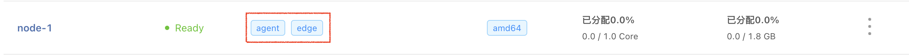
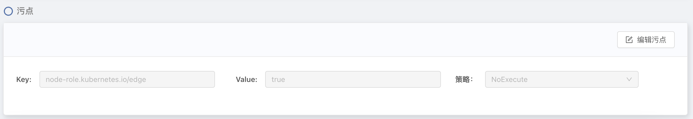
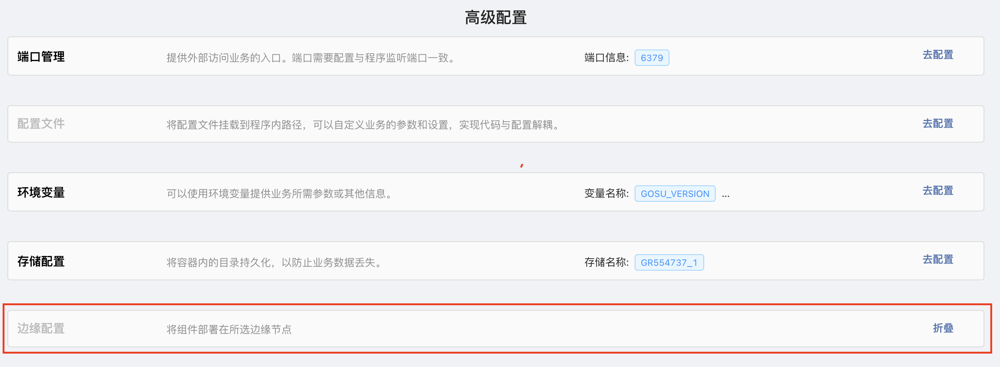

## 概述

Rainbond 云原生应用管理平台擅长基于统一控制台进行应用的生命周期管理，以及将复杂业务系统抽象之后进行一键化的交付。该方案致力于让 Rainbond 在边缘计算场景中工作，提供一体化的解决方案。需要结合 Rainbond 自身既有的能力，解决边缘场景的便捷搭建、边缘应用部署与管理问题。

## 说明

该文档仅演示 v1.13.1 版本的 kubeEdge 安装和使用流程。如需安装其他版本，需要注意 [Kubernetes 兼容性](https://github.com/kubeedge/kubeedge#kubernetes-compatibility)。

## 前提

- 准备一台新的服务器作为边缘节点，节点上安装好 docker。
- 云端开放端口：10000-10004。

## 操作流程

### 安装 KubeEdge

用 keadm 工具安装，其他安装方式参考[ kubeEdge 官方网站](https://release-1-13.docs.kubeedge.io/docs/category/setup)。

#### 1.云端下载 keadm

```bash
wget https://github.com/kubeedge/kubeedge/releases/download/v1.13.1/keadm-v1.13.1-linux-amd64.tar.gz
tar -zxvf keadm-v1.13.1-linux-amd64.tar.gz
cp keadm-v1.13.1-linux-amd64/keadm/keadm /usr/local/bin/keadm
```

#### 2.云端初始化

```bash
keadm init --advertise-address={暴露给边缘节点的IP} \
--profile version=v1.13.1 \
--kube-config={kubeconfig存放的位置，默认为/root/.kube/config} \
--set cloudCore.modules.dynamicController.enable=true
```

#### 3.初始化成功

```bash
Kubernetes version verification passed, KubeEdge installation will start...
CLOUDCORE started
=========CHART DETAILS=======
NAME: cloudcore
LAST DEPLOYED: Wed Oct 26 11:10:04 2022
NAMESPACE: kubeedge
STATUS: deployed
REVISION: 1
```

#### 4.查看云端部署结果

```bash
# kubectl get all -n kubeedge
NAME                             READY   STATUS    RESTARTS   AGE
pod/cloudcore-56b8454784-ngmm8   1/1     Running   0          46s

NAME                TYPE        CLUSTER-IP    EXTERNAL-IP   PORT(S)                                             AGE
service/cloudcore   ClusterIP   10.96.96.56   <none>        10000/TCP,10001/TCP,10002/TCP,10003/TCP,10004/TCP   46s

NAME                        READY   UP-TO-DATE   AVAILABLE   AGE
deployment.apps/cloudcore   1/1     1            1           46s

NAME                                   DESIRED   CURRENT   READY   AGE
replicaset.apps/cloudcore-56b8454784   1         1         1       46s
```

#### 5.边缘节点安装 keadm

```bash
wget https://github.com/kubeedge/kubeedge/releases/download/v1.13.1/keadm-v1.13.1-linux-amd64.tar.gz
tar -zxvf keadm-v1.13.1-linux-amd64.tar.gz
cp keadm-v1.13.1-linux-amd64/keadm/keadm /usr/local/bin/keadm
```

#### 6.云端获取 token

```bash
kubectl get secret -n kubeedge tokensecret -o=jsonpath='{.data.tokendata}' | base64 -d
```

#### 7.边缘节点加入集群

```bash
keadm join \
--cloudcore-ipport="暴露给边缘节点的IP":10000 \
--edgenode-name="边缘节点名称" \
--cgroupdriver=systemd \
--runtimetype=docker \
--kubeedge-version=v1.13.1 \
--token="云端token"
```

#### 8.查看边缘节点 edgecore

```bash
# systemctl status edgecore
● edgecore.service
   Loaded: loaded (/etc/systemd/system/edgecore.service; enabled; vendor preset: enabled)
   Active: active (running) since Wed 2022-10-26 11:26:59 CST; 6s ago
 Main PID: 2745865 (edgecore)
    Tasks: 13 (limit: 4915)
   CGroup: /system.slice/edgecore.service
           └─2745865 /usr/local/bin/edgecore
```

#### 9.开启对边缘节点的 Kubectl logs/exec 功能

参考[ kubeEdge 官方网站](https://kubeedge.io/docs/advanced/debug/)。


:::note 

如果云端 cloudcore 以 pod 形式运行，通过以下方式去修改 cloudcore.yaml：

```bash
kubectl edit cm cloudcore -n kubeedge 
```

注意如果是基于主机安装k8s，那么 certgen.sh 中 K8SCA_FILE 和 K8SCA_KEY_FILE 处需要修改为：

```bash
readonly K8SCA_FILE=${K8SCA_FILE:-/etc/kubernetes/ssl/kube-ca.pem}
readonly K8SCA_KEY_FILE=${K8SCA_KEY_FILE:-/etc/kubernetes/ssl/kube-ca-key.pem}
```
:::

### 配置 EdgeMesh

#### 1.驱逐边缘节点上的 CNI 网络插件

例如 flannel：

```yaml
# kubectl edit daemonset.apps/kube-flannel -n kube-system  
affinity:    
  nodeAffinity:                                                                    
    requiredDuringSchedulingIgnoredDuringExecution:                                
      nodeSelectorTerms:                                                           
      - matchExpressions:  
        - key: node-role.kubernetes.io/agent                                                                      
          operator: DoesNotExist  
```
#### 2.安装EdgeMesh

 参考[ EdgeMesh 官方网站](https://edgemesh.netlify.app/zh/)。

### Rainbond 平台配置

#### 1.查看边缘节点

在 `集群`--->`节点列表` 处查看已经接入的边缘节点



#### 2.新增污点

为防止非边缘业务调度至边缘节点，需要给边缘节点新增污点，点击**编辑污点**按钮，添加污点 `node-role.kubernetes.io/edge=true:NoSchedule`



### 修改组件配置

#### 1.给 service/rbd-etcd 配置 ClusterIP

```yaml
# kubectl delete svc rbd-etcd -n rbd-system    
# kubectl apply -f rbd-etcd-svc.yaml 
apiVersion: v1
kind: Service
metadata:
  name: rbd-etcd
  namespace: rbd-system
spec:
  ports:
    - name: client
      port: 2379
      protocol: TCP
      targetPort: 2379
    - name: server
      port: 2380
      protocol: TCP
      targetPort: 2380
  selector:
    belongTo: rainbond-operator
    creator: Rainbond
    etcd_node: rbd-etcd
    name: rbd-etcd
```
#### 2.部署边缘端 rbd-node-edge

1.完成[边缘 Kube-API 端点配置](https://edgemesh.netlify.app/zh/guide/edge-kube-api.html)。

2.拷贝一份 kubeconfig（默认路径为 `/root/.kube/config` ），并修改 server 为`server: http://127.0.0.1:10550`。

3.创建 secret

```bash
# ./kubeconf 为拷贝的 kubeconfig 的路径
kubectl create secret generic kubeconf --from-file=./kubeconf  -n rbd-system
```
4.修改 service/rbd-eventlog

```bash
# kubectl edit svc rbd-eventlog -n rbd-system
ports:
- name: grpc
  port: 6366
  protocol: TCP
  targetPort: 6366
```

5.新建 rbd-node-edge.yaml

<details>
  <summary> rbd-node-edge.yaml 示例 </summary>
  <div>

```yaml
---
apiVersion: apps/v1
kind: DaemonSet
metadata:
  labels:
    name: rbd-node-edge
  name: rbd-node-edge
  namespace: rbd-system
spec:
  revisionHistoryLimit: 10
  selector:
    matchLabels:
      name: rbd-node-edge
  template:
    metadata:
      labels:
        name: rbd-node-edge
      name: rbd-node-edge
    spec:
      containers:
        - args:
            - --etcd=http://rbd-etcd:2379
            - --hostIP=$(POD_IP)
            - --run-mode master
            - --noderule manage,compute
            - --nodeid=$(NODE_NAME)
            - --image-repo-host=goodrain.me
            - --hostsfile=/newetc/hosts
            - --rbd-ns=rbd-system
            - --container-runtime=docker
            # 指定 kubeconf
            - --kube-conf=/var/rbd-node/kubeconf
            # 指定云端暴露给边缘端的访问地址
            - --gateway-vip=""
            # 配置 event-log 相关 service 地址
            - --event-log-server=rbd-eventlog:6366
            - --event-server=rbd-eventlog:6363
            - --log-address=rbd-eventlog:6362
          env:
            - name: POD_IP
              valueFrom:
                fieldRef:
                  apiVersion: v1
                  fieldPath: status.podIP
            - name: NODE_NAME
              valueFrom:
                fieldRef:
                  apiVersion: v1
                  fieldPath: spec.nodeName
            - name: RBD_NAMESPACE
              value: rbd-system
            - name: RBD_DOCKER_SECRET
              value: hub-image-repository
          image: registry.cn-hangzhou.aliyuncs.com/goodrain/rbd-node:edge
          imagePullPolicy: IfNotPresent
          name: rbd-node
          readinessProbe:
            failureThreshold: 3
            httpGet:
              path: /v2/ping
              port: 6100
              scheme: HTTP
            initialDelaySeconds: 5
            periodSeconds: 5
            successThreshold: 1
            timeoutSeconds: 5
          volumeMounts:
            - mountPath: /grdata
              name: grdata
            - mountPath: /sys
              name: sys
            - mountPath: /newetc
              name: etc
            - mountPath: /grlocaldata
              name: grlocaldata
            - mountPath: /var/run/docker.sock
              name: dockersock
            - mountPath: /var/lib/docker
              name: docker
            - mountPath: /var/docker/lib
              name: vardocker
            - mountPath: /etc/docker/certs.d
              name: dockercert
            # 读取 kubeconf secret
            - mountPath: /var/rbd-node/
              name: kubeconf
              readOnly: true
      hostAliases:
        - hostnames:
            - goodrain.me
          ip: 192.168.0.237
      hostNetwork: true
      hostPID: true
      restartPolicy: Always
      dnsPolicy: ClusterFirstWithHostNet
      affinity:
        nodeAffinity:
          requiredDuringSchedulingIgnoredDuringExecution:
            nodeSelectorTerms:
              - matchExpressions:
                  - key: node-role.kubernetes.io/agent
                    operator: Exists
                  - key: node-role.kubernetes.io/edge
                    operator: Exists
      tolerations:
        - operator: Exists
      volumes:
        - name: grdata
          persistentVolumeClaim:
            claimName: rbd-cpt-grdata
        # 挂载 kubeconf secret
        - name: kubeconf
          secret:
            secretName: kubeconf
        - hostPath:
            path: /sys
            type: Directory
          name: sys
        - hostPath:
            path: /etc
            type: Directory
          name: etc
        - hostPath:
            path: /grlocaldata
            type: DirectoryOrCreate
          name: grlocaldata
        - hostPath:
            path: /var/lib/docker
            type: DirectoryOrCreate
          name: docker
        - hostPath:
            path: /var/docker/lib
            type: DirectoryOrCreate
          name: vardocker
        - hostPath:
            path: /etc/docker/certs.d
            type: DirectoryOrCreate
          name: dockercert
        - hostPath:
            path: /var/run/docker.sock
            type: Socket
          name: dockersock
```

  </div>
</details>

### 部署边缘组件

通过`新建组件`--->`高级配置`--->`边缘配置`选择好边缘节点。目前只支持 `基于镜像构建 `和 `基于源码构建`。




