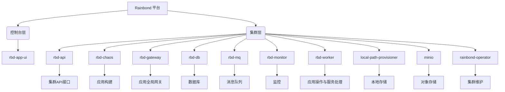

## 概述

本文专为 Rainbond 平台管理员设计，通过解析平台核心组件的功能、依赖关系及故障映射逻辑，建立 “问题 - 组件 - 排查” 的标准化流程。文档按组件分类，详细说明职责、常见故障场景、排查步骤及官方文档索引，帮助管理员快速定位故障源头，提升运维效率。

## Rainbond 组件架构



## 核心组件职责与问题排查指南

### 1. 控制台组件（rbd-app-ui）

##### 组件职责

- **唯一交互入口**：提供 Web 界面，处理用户创建应用、查看日志等操作。
- **状态同步**：通过 `rbd-api` 同步集群状态，依赖 `rbd-gateway` 的 WebSocket 端口（6060）实现日志推送、Web 终端等实时功能。
- **依赖链**：`rbd-app-ui` → `rbd-api`（数据交互）→ `rbd-gateway`（网络通信）

##### 常见问题场景

| 问题现象                | 可能原因                                 | 核心关联组件         |
| ----------------------- | ---------------------------------------- | -------------------- |
| 控制台无法登录 / 空白   | 组件崩溃、rbd-api 通信中断、前端资源缺失 | rbd-app-ui、rbd-api  |
| 操作无响应 / 数据不同步 | WebSocket 断开、API 接口超时             | rbd-gateway、rbd-api |

##### 排查思路

1. 组件状态检查

   ```bash
   # 确保状态为 Running
   kubectl get pod -l name=rbd-app-ui -n rbd-system
   # 查看前端报错（如资源 404、接口 500）
   ```

   ```bash
   # 查看控制台日志
   # 页面查看日志：平台管理 -> 日志 -> 控制台日志
   # 命令行查看：
   kubectl exec -it rbd-app-ui-xxx -n rbd-system -- bash
   cat /app/logs/goodrain.log
   ```

2. 通信链路验证

   - **API 连通性**：通过 `curl -k https://<集群IP>:8443/apidocs` 测试 `rbd-api` 接口，返回 200 表示正常。
   - **WebSocket 配置**：确认 **平台管理 → 集群 → 编辑** 中 WebSocket 地址为 `ws://IP/域名:6060`（HTTP）或 `wss://域名:6060`（HTTPS）。

### 2. 集群核心 API 服务（rbd-api）

##### 组件职责

- **管理中枢**：接收 `rbd-app-ui` 的操作指令，调用 `rbd-worker` 处理组件生命周期，存储元数据至 `rbd-db`。
- **依赖链**：`rbd-api` → `rbd-db`（数据库连接）→ `Kubernetes`（集群资源查询）

##### 常见问题场景

| 问题现象              | 可能原因                            | 核心关联组件        |
| --------------------- | ----------------------------------- | ------------------- |
| 集群状态无法同步      | rbd-api 崩溃、数据库连接失败        | rbd-api、rbd-db     |
| 控制台提示 “通信异常” | 证书不匹配、K8S API Server 端口不通 | rbd-api、Kubernetes |

##### 排查思路

1. 服务状态与日志

   ```bash
   kubectl get pod -l name=rbd-api -n rbd-system       # 确保 Ready: 1/1
   kubectl logs -f -l name=rbd-api -n rbd-system       # 重点排查数据库连接、证书错误
   ```

2. 依赖检查

   - 数据库连接：通过 `kubectl describe pod rbd-api` 查看启动参数，确认 `--mysql` 配置正确。
   - 证书匹配：对比 `region-config` ConfigMap 与控制台集群配置（见 集群通信异常文档）。

##### 对应文档

- [集群通信异常排查](/docs/troubleshooting/cluster-connect#1集群通信异常或集群端失去响应)

### 3. 应用构建服务（rbd-chaos）

##### 组件职责

- **构建引擎**：基于 BuildKit 处理源码构建、镜像打包，依赖 `rbd-hub` 存储镜像，调用 `Kubernetes` 创建构建 Job。
- **依赖链**：`rbd-chaos` → `代码源`（Git/SVN）→ `rbd-hub`（镜像存储）→ `Kubernetes`（构建任务）

##### 常见问题场景

| 问题现象     | 可能原因                           | 核心关联组件       |
| ------------ | ---------------------------------- | ------------------ |
| 源码构建卡住 | 代码拉取失败、BuildKit 配置错误    | rbd-chaos、代码源  |
| 镜像推送失败 | 私有仓库认证错误、rbd-hub 服务异常 | rbd-chaos、rbd-hub |

##### 排查思路

1. 构建任务状态

   ```bash
   kubectl get pod -n rbd-system -l job=codebuild  # 检查构建 Job 是否成功
   ```

2. 配置验证

   - 私有仓库：检查 `registries.yaml`（Containerd 配置）或 `goodrain.me` ConfigMap（BuildKit 认证）。
   - 镜像加速：确认 `docker.io` 镜像加速地址已添加至 `registries.yaml`。

##### 对应文档

- [构建失败故障排查](/docs/troubleshooting/common#1-构建失败故障排查)

### 4. 全局网关服务（rbd-gateway）

##### 组件职责

- **流量中枢**：基于 APISIX 提供域名解析、负载均衡，转发 HTTP/HTTPS 请求至后端组件，依赖 `Kubernetes` 服务发现。
- **依赖链**：`rbd-gateway` → `Kubernetes`（服务端点查询）→ 后端组件（如 `rbd-app-ui`、用户应用）

##### 常见问题场景

| 问题现象             | 可能原因                          | 核心关联组件            |
| -------------------- | --------------------------------- | ----------------------- |
| 域名访问返回 502/503 | 后端组件未就绪、网关配置错误      | rbd-gateway、后端组件   |
| WebSocket 功能失效   | 6060 端口未开放、域名与证书不匹配 | rbd-gateway、rbd-app-ui |

##### 排查思路

1. 网关组件状态

   ```bash
   kubectl get pod -l name=rbd-gateway -n rbd-system   # 确保Running
   ```

   ```bash
   # 查看日志
   # 页面查看日志：平台管理 -> 日志 -> 网关日志
   # 命令行查看：
   kubectl logs -f -l name=rbd-gateway -n rbd-system -c apisix
   # 搜索 `upstream timeout`、`connection refused` 等关键词
   ```

2. 配置检查

   - 域名绑定：确认 **应用视图 → 网关管理** 中域名已正确绑定组件。
   - WebSocket 端口：检查 6060 端口是否开放，且 WebSocket 地址配置为 `ws://IP/域名:6060`。

##### 对应文档

- [域名访问配置指南](/docs/ops-guides/configuration/use-domain-for-rainbond)
- [HTTP 错误代码排查](/docs/troubleshooting/common#4-应用组件-http-对外无法访问)

### 5. 数据库服务（rbd-db）

##### 组件职责

- **数据基石**：存储平台元数据（`console` 控制台数据、`region` 集群数据），支持内置 MySQL 或外部数据库迁移。
- **依赖链**：`rbd-db` → 本地存储（数据持久化）→ `rbd-api`（数据读写）

##### 常见问题场景

| 问题现象          | 可能原因                     | 核心关联组件     |
| ----------------- | ---------------------------- | ---------------- |
| 数据丢失 / 不一致 | 数据库连接错误、迁移配置错误 | rbd-db、rbd-api  |
| 组件启动失败      | 密码错误、端口被占用         | rbd-db、本地存储 |

##### 排查思路

1. 服务状态

   ```bash
   kubectl get pod -l name=rbd-db -n rbd-system        # StatefulSet 确保 Pod 有序启动
   kubectl exec -it rbd-db-0 -n rbd-system -- mysql -p  # 验证数据库登录（默认密码通过 env | grep MYSQL 查看）
   ```

2. 迁移验证

   - 外部数据库：检查 `rainbondcluster` CRD 中 `uiDatabase`/`regionDatabase` 配置是否正确。
   - 数据备份：迁移前通过 `mysqldump` 备份 `console` 和 `region` 数据库（见 数据库迁移文档）。

##### 对应文档

- [数据库迁移指南](/docs/ops-guides/management/data-migration)

### 6. 镜像仓库服务（rbd-hub）

##### 组件职责

- **镜像存储中枢**：基于 Docker Registry 实现的内置镜像仓库，用于存储平台构建生成的镜像（如源码构建、Dockerfile 构建产物）。
- **仓库管理**：支持切换至外部私有仓库，处理镜像的推送（`push`）与拉取（`pull`）请求，依赖 `Containerd` 容器运行时完成镜像操作。
- **依赖链**：`rbd-chaos`（构建服务）→ `rbd-hub`（镜像存储）→ `Kubernetes 组件`（镜像拉取启动）

##### 常见问题场景

| 问题现象             | 可能原因                                 | 核心关联组件                 |
| -------------------- | ---------------------------------------- | ---------------------------- |
| 镜像拉取失败         | 仓库认证错误、镜像不存在、网络不通       | rbd-hub、Containerd          |
| 构建成功但镜像未推送 | rbd-chaos 构建配置错误、rbd-hub 服务异常 | rbd-chaos、rbd-hub           |
| 切换外部仓库后异常   | 仓库地址错误、认证信息缺失               | rbd-hub、rainbondcluster CRD |

##### 排查思路

1. 仓库状态

   ```bash
   kubectl get pod -l name=rbd-hub -n rbd-system       # 确保 Deployment 运行正常
   docker login goodrain.me -u admin -p admin1234      # 测试内置仓库登录（默认账号密码）
   ```

2. 配置检查

   - 私有仓库：快速安装用户检查 `/etc/rancher/k3s/registries.yaml`，主机安装用户检查 `/etc/rancher/rke2/registries.yaml`。
   - 仓库切换：编辑 `rainbondcluster` CRD，确认 `imageHub.domain` 配置正确（见 镜像仓库管理文档）。

##### 对应文档

- [私有镜像仓库配置](/docs/ops-guides/management/buildkit-args)
- [构建失败故障排查](/docs/troubleshooting/common#1-构建失败故障排查)

### 7. 应用操作处理服务（rbd-worker）

##### 组件职责

- **核心作用**：负责处理所有与应用组件相关的操作，包括组件的**启动、停止、更新、伸缩、删除**等，直接与 Kubernetes API 交互，确保平台操作与集群资源状态一致。
- **交互流程**：接收来自 `rbd-api` 的操作指令（如创建组件），调用 Kubernetes 接口创建 Deployment/Service 等资源，并监控操作结果（如滚动更新状态）。
- **依赖链**：`rbd-worker` → `rbd-api`（指令接收）→ `Kubernetes`（资源操作）

##### 常见问题场景

| 问题现象               | 可能原因                          | 核心关联组件           |
| ---------------------- | --------------------------------- | ---------------------- |
| 组件操作停滞（部署中） | rbd-worker 崩溃、K8S 节点资源不足 | rbd-worker、Kubernetes |
| 状态同步异常           | 资源创建失败、RBAC 权限不足       | rbd-worker、Kubernetes |

##### 排查思路

1. 组件状态检查

   ```bash
   kubectl get pod -l name=rbd-worker -n rbd-system  # 确保状态为 Running，且 Ready: 1/1
   kubectl describe pod -l name=rbd-worker -n rbd-system  # 查看事件，确认是否有资源调度、权限相关错误
   ```

2. 操作日志分析

   ```bash
   # 查看日志
   # 页面查看日志：平台管理 -> 日志 -> 运行日志
   # 命令行查看：
   kubectl logs -f -l name=rbd-worker -n rbd-system -c apisix
   # 搜索 `upstream timeout`、`connection refused` 等关键词
   ```
   

### 集群端其他组件

- rbd-mq：消息队列服务，提供消息队列功能。
- rbd-monitor：监控服务，基于 Prometheus 封装，提供平台与组件的资源监控。
- [local-path-provisioner](https://github.com/rancher/local-path-provisioner)：本地存储服务，提供组件的本地存储功能。
- minio：对象存储服务，是离线导入导出应用包的存储服务。
- rainbond-operator：集群维护服务

<details>
  <summary>rainbond-operator 详细说明</summary>
  <div>

rainbond-operator 控制着 Rainbond 所有组件的配置与运行状态，持续的监控各个组件的状态，做出不同的动作，比如，rbd-api 的 pod 实例被删除或者参数修改了，operator立即会做出反馈。

> [rainbond-operator](https://github.com/goodrain/rainbond-operator) 是基于 [kubebuilder](https://book.kubebuilder.io/) 实现。

在安装集群端时，首先会安装 rainbond-operator，接下来会创建一些 CRD 资源，如下：

* rainbondclusters.rainbond.io
* rbdcomponents.rainbond.io

**rainbondclusters.rainbond.io**

`rainbondclusters.rainbond.io` 是集群端的配置文件，例如设置网关节点、构建节点等。

在安装了集群后，我们可以通过此 CRD 资源来修改网关节点、构建节点、数据库连接信息等。

```yaml title="kubectl edit rainbondclusters.rainbond.io -n rbd-system"
spec:
  gatewayIngressIPs: # 网关对外IP
  - xxxx
  imageHub:
    domain: goodrain.me
    password: xxx
    username: admin  
  nodesForChaos: # 构建节点
    name: 192.168.3.161
    name: 192.168.3.162
  nodesForGateway: # 网关节点
  - externalIP: 192.168.3.161
    internalIP: 192.168.3.161
    name: 192.168.3.161
  - externalIP: 192.168.3.162
    internalIP: 192.168.3.162
    name: 192.168.3.162
  rainbondImageRepository: registry.cn-hangzhou.aliyuncs.com/goodrain
  regionDatabase: # 集群端数据库
    host: xxx
    password: xxx
    port: 3306
    username: region
  uiDatabase: # 控制台数据库
    host: xxx
    password: xxx
    port: 3306
    username: console
  installVersion: v6.x.x-release # 集群安装版本
  suffixHTTPHost: xxx.nip.io # 平台泛域名
```

**rbdcomponents.rainbond.io**

`rbdcomponents.rainbond.io` 是控制台集群端所有 POD 的 CRD 资源，会创建出所有控制器以及POD，也可以在安装完成后修改对应组件的配置。

```shell
# 查询组件
kubectl get rbdcomponents.rainbond.io -n rbd-system

# 编辑 rbdcomponents 所有组件配置
kubectl edit rbdcomponents.rainbond.io -n rbd-system

# 编辑 rbdcomponents rbd-api 配置
kubectl edit rbdcomponents.rainbond.io rbd-api -n rbd-system
```

  </div>
</details>


## 常用排查命令速查表

| 场景         | 命令示例                                                     |
| ------------ | ------------------------------------------------------------ |
| 查看集群状态 | `kubectl get nodes`                                          |
| 查看组件状态 | `kubectl get pod -l name=<组件名> -n rbd-system`             |
| 实时跟踪日志 | `kubectl logs -f -l name=<组件名> -n rbd-system`             |
| 查看集群资源 | `kubectl top nodes && kubectl top pods -A`                   |
| 进入容器调试 | `kubectl exec -it <pod-name> -n rbd-system -- bash`          |
| 重启组件     | `kubectl delete pod -l name=<组件名> -n rbd-system`（自动重建） |


## 日志查看指南

### 方式一：通过页面查看日志

1. 进入平台：`平台管理 → 日志`
2. 可查看：
   - 控制台日志
   - 集群组件日志

### 方式二：通过命令行查看

```bash
# 语法：kubectl logs -fl name=<组件名> -n rbd-system
# 示例：查看 rbd-api 日志
kubectl logs -fl name=rbd-api -n rbd-system
```

### 查看控制台日志

#### 快速安装版本

```bash
# 1. 进入容器
docker exec -it rainbond bash

# 2. 进入 Pod
kubectl exec -it $(kubectl get pod -l name=rbd-app-ui -n rbd-system -o name) -n rbd-system -- bash

# 3. 查看日志
tail -f /app/logs/goodrain.log
```

#### 主机或 Helm 安装版本

```bash
# 1. 进入 Pod
kubectl exec -it $(kubectl get pod -l name=rbd-app-ui -n rbd-system -o name) -n rbd-system -- bash

# 2. 查看日志
tail -f /app/logs/goodrain.log
```

## 参考文档

- [安装故障排查指南](/docs/troubleshooting/install)
- [集群故障排查指南](/docs/troubleshooting/cluster-connect)
- [应用组件故障排查](/docs/troubleshooting/common)