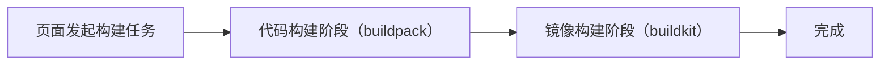
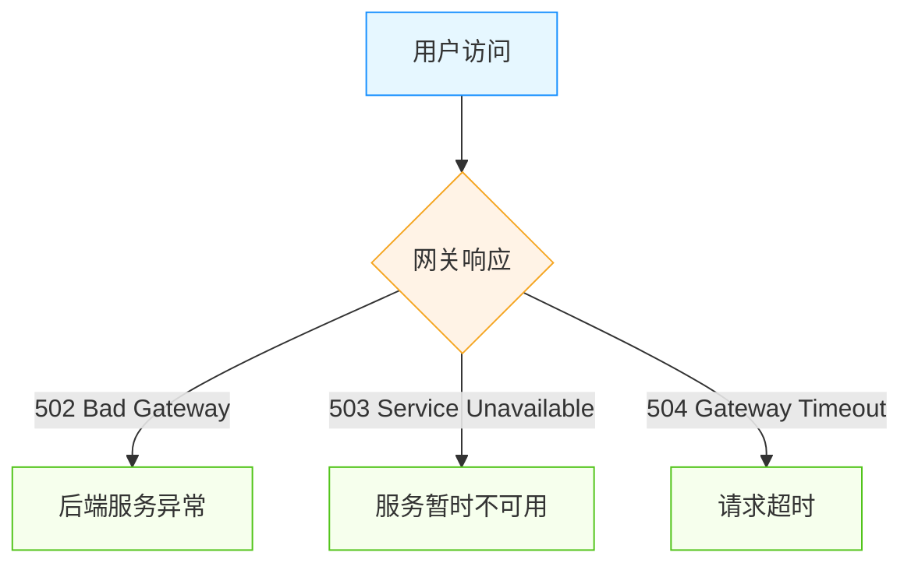

## 1. 构建失败故障排查



- **代码构建阶段**: 进入代码构建阶段，首先会进行代码的打包，如果代码打包失败，则构建任务失败。
- **镜像构建阶段**: 如果代码打包成功，则进入镜像构建阶段，如果镜像构建失败，则构建任务失败。
- **完成**: 如果镜像构建成功，则构建任务完成。

### 代码构建阶段常见问题（buildpack）

- 构建日志一直卡在 `Start clone source code from git` 获取源代码阶段
    1. 请检查代码源是否正确，以及是否存在权限问题。
    2. 请检查网络连接是否正常。
- 构建日志一直卡在 `make code package success, create build code job success` 启动代码构建任务阶段
    - 代码构建任务会在 `rbd-system` 命名空间下启动一个 Job 任务，请检查该 Job 任务状态。
    ```bash
    $ kubectl get pod -n rbd-system
    NAME                                              READY   STATUS    RESTARTS      AGE
    ef9363dc8987cc5afa439e296e378622-20250317161307   1/1     Running   0             8s
    ......
    ```
- 其他情况可能是代码问题，请详细查看构建日志进行排查。

### 镜像构建阶段常见问题（buildkit）
- 构建日志一直卡在 `code build success, create build code job success` 启动镜像构建任务阶段
    - 镜像构建任务会在 `rbd-system` 命名空间下启动一个 Job 任务，请检查该 Job 任务状态。
    ```bash
    $ kubectl get pod -n rbd-system
    NAME                                                        READY   STATUS    RESTARTS      AGE
    ef9363dc8987cc5afa439e296e378622-20250317161307-dockerfile   1/1     Running   0             8s
    ......
    ```
- 源码构建提示 error: failed to solve: goodrain.me/runner:latest-amd64，这种情况通常是无法从 `goodrain.me` 镜像仓库获取 `runner` 镜像，尝试手动重新推送该镜像:
    1. 获取最新的 `runner` 镜像
    ```bash
    nerdctl pull registry.cn-hangzhou.aliyuncs.com/goodrain/runner:stable
    ```
    2. 推送到 `goodrain.me` 镜像仓库
    ```bash
    nerdctl tag registry.cn-hangzhou.aliyuncs.com/goodrain/runner:stable goodrain.me/runner:latest-amd64
    nerdctl login goodrain.me -u admin -padmin1234 --insecure-registry
    nerdctl push goodrain.me/runner:latest-amd64 --insecure-registry
    ```
#### BuildKit 源码构建配置

默认采用 [BuildKit](https://github.com/moby/buildkit) 作为源码构建镜像打包工具。

BuildKit 配置文件名称默认为 `goodrain-me`，如在安装时指定了镜像仓库名称，则配置文件名称为镜像仓库名称，如 `registry-cn-hangzhou-aliyuncs-com`。

##### DockerHub 镜像加速

Dockerfile 源码构建引用 DockerHub 镜像获取超时，修改 BuildKit 配置镜像加速。

```yaml title="kubectl edit cm goodrain-me -n rbd-system"
apiVersion: v1
data:
  buildkittoml: |-
    debug = true
    [registry."goodrain.me"]
      http = false
      insecure = true
+   [registry."docker.io"]
+     mirrors = ["docker.rainbond.cc"]
kind: ConfigMap
metadata:
  name: goodrain.me
  namespace: rbd-system
```

##### 源码构建报错 x509: certificate signed by unknown authority

安装时对接了私有仓库是 HTTP 协议，源码构建时拉取镜像报错 `x509: certificate signed by unknown authority`，需修改 BuildKit 配置文件。

```yaml title="kubectl edit cm goodrain-me -n rbd-system"
apiVersion: v1
data:
  buildkittoml: |-
    debug = true
    [registry."goodrain.me"]
      http = false
      insecure = true
+   [registry."xxx.xxx.xxx.xxx:5000"]
+     http = true
+     insecure = true
kind: ConfigMap
metadata:
  name: goodrain.me
  namespace: rbd-system
```

### 源码构建提示 dial tcp look up goodrain.me on xxx:53: no such host

一般这是由于本地 `/etc/hosts` 没有自动写入 `goodrain.me` 的解析，通过以下命令重新写入：

```bash
kubectl delete pod -l name=rainbond-operator -n rbd-system
```

rainbond-operator 会自动重新启动写入 `/etc/hosts` 的 Job 任务。


## 2. 组件运行故障排查

### 组件无运行日志信息

组件的日志通过 `WebSocket` 进行推送，如果无日志信息，在 **平台管理 -> 集群 -> 编辑**，查看 `WebSocket` 通信地址是否正确，本地是否可以与该地址进行通信。

### 组件异常状态故障排查

- **调度中**：组件实例一直处于**调度中**状态的实例，体现为橙黄色的方块。说明集群中已经没有足够的资源来运行这个实例。具体的资源项短缺详情，可以点击橙黄色的方块，打开实例详情页面后在 `说明` 处了解到。例如：
  ```bash
  实例状态：调度中
  原因：   Unschedulable
  说明：   0/1 nodes are available: 1 node(s) had desk pressure
  ```
  - 根据 `说明` 可以了解到，当前集群中共有 1 个宿主机节点，但是处于不可用状态，原因是该节点存在磁盘压力。根据原因对节点进行磁盘扩容或空间清理后，该问题会自动解除。常见的资源短缺类型还包括：CPU 不足、内存不足。

- **等待启动**：组件实例一直处于等待启动状态。Rainbond 平台根据组件之间的依赖关系确定启动顺序，如果组件长时间处于等待启动状态，则说明其依赖的某些组件未能正常启动。切换至应用拓扑视图梳理组件间依赖关系，确保其依赖的组件都处于正常的运行状态。

- **运行异常**：运行异常状态代表该实例无法正常运行。点击红色的方块，可以在实例详情页面找到提示，重点关注实例中的容器的状态，通过状态的不同，来继续排查问题。以下是常见的几种问题状态：
  - **ImagePullBackOff**: 该状态说明当前容器的镜像无法被拉取，下拉至 `事件` 列表处，可以得到更为详细的信息。确保对应的镜像可以被拉取，如果发现无法拉取的镜像以 `goodrain.me` 开头，则可以尝试构建该组件解决问题。
  - **CrashLoopBackup**: 该状态说明当前容器本身启动失败，或正在遭遇运行错误。切换至 `日志` 页面查看业务日志输出并解决问题即可。
  - **OOMkilled**: 该状态说明为容器分配的内存太小，或业务本身存在内存泄漏问题。业务容器的内存配置入口位于 `伸缩` 页面。插件容器的内存配置入口位于 `插件` 页面。

## 3. 第三方组件故障排查

请按照以下步骤操作第三方组件：

1. 打开第三方组件对内端口
2. 设置第三方组件健康检测
3. 启动/更新第三方组件

直至第三方组件状态为 `就绪`，才能正常使用。

如果第三方组件状态为 `就绪`, 但是无法对内或对外访问，请通过以下步骤排查：

1. 检查第三方组件创建的 endpoint 是否正确
  ```bash
  kubectl get ep -n <namespace>
  ```
2. 检查第三方组件创建的 service 是否正确，并通过 curl 命令检查是否能够访问
  ```bash
  kubectl get svc -n <namespace>
  ```
3. 检查第三方组件创建的 ingress 是否正确
  ```bash
  kubectl get ing -n <namespace>
  ```

## 4. 应用/组件 HTTP 对外无法访问



### 错误代码说明

在排查前，首先了解这些错误代码的含义：

| 错误代码 | 错误名称 | 含义 |
|---------|---------|------|
| 502 | Bad Gateway | 网关从上游服务器收到无效响应 |
| 503 | Service Unavailable | 服务当前不可用（过载或维护中） |
| 504 | Gateway Timeout | 网关尝试执行请求时，上游服务器未能在规定时间内响应 |

### 502 Bad Gateway 错误排查

**可能原因**
1. **后端服务未正常运行**：组件处于异常状态或未启动
2. **端口配置错误**：暴露的端口与实际服务端口不匹配
3. **健康检查失败**：组件无法通过网关的健康检查

**排查步骤**
1. **检查组件运行状态**
2. **验证端口配置**
   - 进入组件详情页面 → 端口，确认内部和对外服务端口配置正确
   - 确认容器内的应用确实在监听该端口
   ```bash
   # 进入 Web 终端查看端口监听情况
   netstat -nltp
   ```

3. **检查服务日志**
   - 查看组件运行日志，寻找可能的错误信息
   - 查看 `rbd-gateway` 网关日志
   ```bash
   kubectl logs -f -l name=rbd-gateway -n rbd-system -c apisix
   ```

### 503 Service Unavailable 错误排查

**可能原因**

1. **服务过载**：组件资源不足或请求量过大
2. **组件正在部署/更新**：滚动更新过程中可能暂时不可用

**排查步骤**

1. **检查组件资源使用情况**
2. **检查组件正在进行的操作**
   - 查看是否有正在进行的部署、更新操作
   - 检查滚动更新策略配置

### 504 Gateway Timeout 错误排查

**可能原因**

1. **请求处理时间过长**：业务逻辑复杂或数据处理耗时
2. **上游服务超时**：依赖的其他服务响应慢
3. **网络连接问题**：集群内网络延迟高

**排查步骤**

1. **检查组件超时设置**
   - 检查组件内部处理超时设置

2. **定位耗时操作**
   - 查看应用日志中标记的耗时操作
   - 使用性能分析工具定位瓶颈

3. **排查网络连接**
   - 检查网络延迟

### 网关日志分析

网关的日志信息对排查问题至关重要：

```bash
# 查看 APISIX 网关日志
kubectl logs -f -l name=rbd-gateway -n rbd-system -c apisix
```

常见的错误日志模式：

- 对于 502 错误，查找类似 `connection refused` 或 `upstream unavailable` 的日志
- 对于 503 错误，关注 `circuit breaking` 或 `rate limited` 相关日志
- 对于 504 错误，查找 `timeout` 相关的信息

## 5. 无法上传离线包、软件包、Jar、WAR、ZIP等

通常是因为本地浏览器与 Rainbond WebSocket 通信失败导致的。你可以在 `平台管理 -> 集群 -> 编辑集群` 修改 `WebSocket` 地址。

## 6. Web 终端无法使用

Web 终端无法使用，通常是因为 `WebSocket` 地址配置错误导致的。你可以在 `平台管理 -> 集群 -> 编辑集群` 修改 `WebSocket` 地址。

## 7. 应用/组件 TCP 对外无法访问

TCP 对外服务实际是使用 K8S 的 NodePort 服务，如果无法访问，请检查以下几点：

1. 检查 TCP 端口在服务器上是否监听
2. 检查 `kube-proxy` 服务是否正常运行，是否存在错误日志
3. 快速安装的 Rainbond 默认情况下只开放了 30000～30010 10个 TCP 端口，添加[更多 TCP 端口](../faq#快速安装添加更多-tcp-端口)
4. 超出 K8S NodePort 端口范围，请[扩展端口范围](../faq#扩展-tcpnodeport-端口范围)