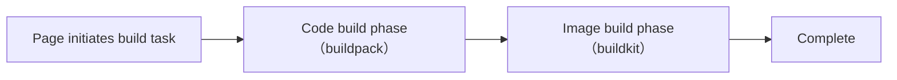
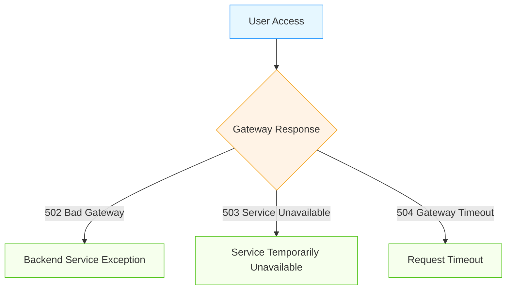

## 1. Build Failure Troubleshooting



- **Code Build Phase**: In the code build phase, code packaging is performed first. If code packaging fails, the build task fails.
- **Image Build Phase**: If code packaging succeeds, it enters the image build phase. If image building fails, the build task fails.
- **Complete**: If image building succeeds, the build task is completed.

### Common Issues in Code Build Phase (buildpack)

- Build logs stuck at `Start clone source code from git` source code acquisition phase
    1. Please check if the code source is correct and if there are any permission issues.
    2. Please check if the network connection is normal.
- Build logs stuck at `make code package success, create build code job success` code build task startup phase
    - The code build task will start a Job task in the `rbd-system` namespace. Please check the status of this Job task.
    ```bash
    $ kubectl get pod -n rbd-system
    NAME                                              READY   STATUS    RESTARTS      AGE
    ef9363dc8987cc5afa439e296e378622-20250317161307   1/1     Running   0             8s
    ......
    ```
- Other cases may be code issues. Please check the build logs in detail for troubleshooting.

### Common Issues in Image Build Phase (buildkit)
- Build logs stuck at `code build success, create build code job success` image build task startup phase
    - The image build task will start a Job task in the `rbd-system` namespace. Please check the status of this Job task.
    ```bash
    $ kubectl get pod -n rbd-system
    NAME                                                        READY   STATUS    RESTARTS      AGE
    ef9363dc8987cc5afa439e296e378622-20250317161307-dockerfile   1/1     Running   0             8s
    ......
    ```
- Source code build shows error: failed to solve: goodrain.me/runner:latest-amd64. This usually occurs when unable to get the `runner` image from the `goodrain.me` image repository. Try manually pushing the image again:
    1. Get the latest `runner` image
    ```bash
    nerdctl pull registry.cn-hangzhou.aliyuncs.com/goodrain/runner:stable
    ```
    2. Push to the `goodrain.me` image repository
    ```bash
    nerdctl tag registry.cn-hangzhou.aliyuncs.com/goodrain/runner:stable goodrain.me/runner:latest-amd64
    nerdctl login goodrain.me -u admin -padmin1234 --insecure-registry
    nerdctl push goodrain.me/runner:latest-amd64 --insecure-registry
    ```
#### BuildKit Source Code Build Configuration

By default, [BuildKit](https://github.com/moby/buildkit) is used as the source code build image packaging tool.

The BuildKit configuration file name defaults to `goodrain-me`. If an image repository name is specified during installation, the configuration file name will be the image repository name, such as `registry-cn-hangzhou-aliyuncs-com`.

##### DockerHub Image Acceleration

Dockerfile source code build references DockerHub images timeout. Modify BuildKit configuration for image acceleration.

```yaml title="kubectl edit cm goodrain-me -n rbd-system"
apiVersion: v1
data:
  buildkittoml: |-
    debug = true
    [registry."goodrain.me"]
      http = false
      insecure = true
+   [registry."docker.io"]
+     mirrors = ["docker.rainbond.cc"]
kind: ConfigMap
metadata:
  name: goodrain.me
  namespace: rbd-system
```

##### Source Code Build Error x509: certificate signed by unknown authority

When connecting to a private repository using HTTP protocol during installation, source code build fails with error `x509: certificate signed by unknown authority`. Modify the BuildKit configuration file.

```yaml title="kubectl edit cm goodrain-me -n rbd-system"
apiVersion: v1
data:
  buildkittoml: |-
    debug = true
    [registry."goodrain.me"]
      http = false
      insecure = true
+   [registry."xxx.xxx.xxx.xxx:5000"]
+     http = true
+     insecure = true
kind: ConfigMap
metadata:
  name: goodrain.me
  namespace: rbd-system
```

### Source Code Build Shows dial tcp look up goodrain.me on xxx:53: no such host

This is usually because the local `/etc/hosts` does not automatically write the resolution for `goodrain.me`. Re-write it using the following command:

```bash
kubectl delete pod -l name=rainbond-operator -n rbd-system
```

rainbond-operator will automatically restart and write the `/etc/hosts` Job task.


## 2. Component Operation Troubleshooting

### No Component Operation Log Information

Component logs are pushed through `WebSocket`. If there are no log messages, go to **Platform Management -> Cluster -> Edit** and check if the `WebSocket` communication address is correct and if local communication with this address is possible.

### Component Abnormal State Troubleshooting

- **Scheduling**: Component instances that remain in the **Scheduling** state, shown as orange-yellow squares, indicate that there are not enough resources in the cluster to run this instance. Specific resource shortage details can be found by clicking the orange-yellow square and checking the `Description` in the instance details page. For example:
  ```bash
  Instance Status: Scheduling
  Reason:   Unschedulable
  Description:   0/1 nodes are available: 1 node(s) had desk pressure
  ```
  - From the `Description`, we can see that there is currently 1 host node in the cluster, but it is in an unavailable state because the node has disk pressure. After expanding disk space or cleaning up space based on the reason, this issue will automatically resolve. Common resource shortage types also include: insufficient CPU, insufficient memory.

- **Waiting to Start**: Component instances remain in the waiting to start state. The Rainbond platform determines the startup order based on dependencies between components. If a component remains in the waiting to start state for a long time, it means some of its dependent components have not started normally. Switch to the application topology view to sort out component dependencies and ensure all dependent components are in normal running state.

- **Running Exception**: The running exception state indicates that the instance cannot run normally. Click the red square to find prompts in the instance details page, focusing on the status of containers in the instance. Continue troubleshooting based on different statuses. Here are some common problem states:
  - **ImagePullBackOff**: This state indicates that the current container's image cannot be pulled. Scroll down to the `Events` list for more detailed information. Ensure the corresponding image can be pulled. If you find that the image that cannot be pulled starts with `goodrain.me`, you can try building the component to solve the problem.
  - **CrashLoopBackup**: This state indicates that the current container itself failed to start or is experiencing runtime errors. Switch to the `Logs` page to view business log output and solve the problem.
  - **OOMkilled**: This state indicates that the memory allocated to the container is too small, or there is a memory leak in the business itself. The memory configuration entry for business containers is located on the `Scaling` page. The memory configuration entry for plugin containers is located on the `Plugins` page.

## 3. Third-party Component Troubleshooting

Please follow these steps for third-party components:

1. Open internal ports for third-party components
2. Set health checks for third-party components
3. Start/update third-party components

Until the third-party component status is `Ready`, it can be used normally.

## 4. Application/Component HTTP External Access Issues



### Error Code Explanation

Before troubleshooting, first understand the meaning of these error codes:

| Error Code | Error Name | Meaning |
|---------|---------|------|
| 502 | Bad Gateway | Gateway received invalid response from upstream server |
| 503 | Service Unavailable | Service currently unavailable (overloaded or under maintenance) |
| 504 | Gateway Timeout | Upstream server did not respond within specified time when gateway attempted to execute request |

### 502 Bad Gateway Error Troubleshooting

**Possible Causes**
1. **Backend Service Not Running Normally**: Component in abnormal state or not started
2. **Port Configuration Error**: Exposed port does not match actual service port
3. **Health Check Failure**: Component cannot pass gateway health check

**Troubleshooting Steps**
1. **Check Component Running Status**
2. **Verify Port Configuration**
   - Go to component details page → Ports, confirm internal and external service port configurations are correct
   - Confirm the application in the container is actually listening on this port
   ```bash
   # Enter Web terminal to check port listening status
   netstat -nltp
   ```

3. **Check Service Logs**
   - View component operation logs for possible error messages
   - Check in Platform Management → Logs → Gateway Logs

### 503 Service Unavailable Error Troubleshooting

**Possible Causes**

1. **Service Overload**: Component resources insufficient or request volume too large
2. **Component Being Deployed/Updated**: May be temporarily unavailable during rolling update

**Troubleshooting Steps**

1. **Check Component Resource Usage**
2. **Check Component Ongoing Operations**
   - Check if there are ongoing deployment or update operations
   - Check rolling update strategy configuration

### 504 Gateway Timeout Error Troubleshooting

**Possible Causes**

1. **Request Processing Time Too Long**: Complex business logic or time-consuming data processing
2. **Upstream Service Timeout**: Dependent services responding slowly
3. **Network Connection Issues**: High network latency within cluster

**Troubleshooting Steps**

1. **Check Component Timeout Settings**
   - Check component internal processing timeout settings

2. **Locate Time-consuming Operations**
   - Check application logs for marked time-consuming operations
   - Use performance analysis tools to locate bottlenecks

3. **Troubleshoot Network Connection**
   - Check network latency

### Gateway Log Analysis

Gateway log information is crucial for troubleshooting. Check in **Platform Management -> Logs -> Gateway Logs**.

Common error log patterns:

- For 502 errors, look for logs like `connection refused` or `upstream unavailable`
- For 503 errors, focus on `circuit breaking` or `rate limited` related logs
- For 504 errors, look for `timeout` related information

## 5. Unable to Upload Offline Packages, Software Packages, Jar, WAR, ZIP, etc.

This is usually caused by local browser failing to communicate with Rainbond WebSocket. You can modify the `WebSocket` address in `Platform Management -> Cluster -> Edit Cluster`.

## 6. Web Terminal Cannot Be Used

Web terminal cannot be used, usually because the `WebSocket` address is configured incorrectly. You can modify the `WebSocket` address in `Platform Management -> Cluster -> Edit Cluster`.

## 7. Application/Component TCP External Access Issues

TCP external service actually uses K8S's NodePort service. If it cannot be accessed, please check the following points:

1. Check if TCP port is listening on the server
2. Check if `kube-proxy` service is running normally and if there are any error logs
3. For quick installation of Rainbond, only 10 TCP ports (30000～30010) are open by default. Add [more TCP ports](../faq#quick-installation-add-more-tcp-ports)
4. If exceeding K8S NodePort port range, please [extend port range](../faq#extend-tcpnodeport-port-range)