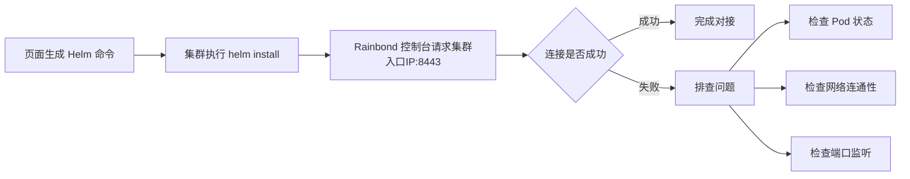

Rainbond 在各种环境下的安装过程中，可能会遇到各种问题，本章节将会对 Rainbond 安装过程中的常见问题进行排查。

## 1. 快速安装故障排查


**Rainbond 快速安装版本**是将所有的服务都运行在一个容器中，方便用户快速使用。在 [Docker 容器中运行 K3s](https://docs.k3s.io/advanced#running-k3s-in-docker)，所有的故障排查操作都在 `rainbond` 容器中进行。

### 排查思路

容器启动过程都由 K3s 控制。在排查过程中，我们可以通过以下几个步骤来排查问题：

1. 查看 `rainbond` 容器的启动日志，查看是否有错误信息。
2. 查看 `rainbond` 容器中的 `k3s` 服务是否正常启动。
3. 查看 `rainbond` 容器中的 `rainbond` 所有服务是否正常启动。

#### 启动 K3s 阶段

首先需要查看 `rainbond` 容器的启动日志，查看是否有错误信息。

```bash
docker logs -f rainbond
```

执行以下命令，进入 `rainbond` 容器，查看 `rainbond` 容器中的 `k3s` 服务是否正常启动。

```bash
docker exec -it rainbond bash
```

执行以下命令，查看 `k3s` 服务是否正常启动。

```bash
kubectl get node
```

#### 启动 Rainbond 阶段

执行以下命令，查看 `rainbond` 容器中的 `rainbond` 所有服务是否正常启动。

```bash
kubectl get pod -n rbd-system
```

#### 可能遇到的问题

Rainbond 快速安装版本默认会将数据存储 `/opt/rainbond` 目录中，如果磁盘空间不足，可能会导致 Rainbond 无法正常启动。

1. 基于 MacOS 安装无法更改为本地目录，请通过 Docker Desktop 扩容存储空间。
2. 基于 Linux 安装可以通过修改 `install.sh` 安装脚本中的 `volume` 字段，修改默认的本地目录，如下：
```bash
$ vim install.sh

VOLUME_OPTS="-v /opt/rainbond:/opt/rainbond"
```

3. 删除 `rainbond` 容器，然后重新执行 `install.sh` 脚本即可。

```bash
docker rm -f rainbond

bash ./install.sh
```

## 2. 基于 Kubernetes 安装故障排查

Pod 处于Pending 、CrashLoopBackOff 、Evicted 、ImagePullBackOff等状态

* **Pending:** 当 Pod 处于 Pending 状态时，代表其没有进入正常的启动流程，通过命令 `kubectl describe pod xxx -n rbd-system` 观察事件详情，来进一步进行排查。

* **CrashLoopBackOff:** CrashLoopBackOff 状态意味着当前 Pod 已经可以正常启动，但是其内部的容器自行退出，这通常是因为内部的服务出了问题。通过命令 `kubectl logs -f xxx -n rbd-system` ，观察日志的输出，通过业务日志来确定问题原因。

* **Evicted:** Evicted 状态意味着当前 Pod 遭到了调度系统的驱逐，触发驱逐的原因可能包括根分区磁盘占用率过高、容器运行时数据分区磁盘占用率过高等，根据经验，上述原因最为常见，需要进行磁盘空间清理解除驱逐状态。可以通过执行命令 `kubectl describe node` ，观察返回中的 `Conditions` 段落输出来确定当前节点的状态。

* **ImagePullBackOff:** ImagePullBackOff 状态意味着 Pod 镜像下载失败退出，通常是因为镜像过大或者网络差引起的，通过命令 `kubectl describe pod xxx -n rbd-system` 观察事件详情，进一步进行排查。


## 3. 基于主机安装故障排查


### 安装 K8S 阶段

这个阶段 Rainbond 会提供一条命令用于安装 K8S 集群，实际上安装的过程都是在本地执行的。正常情况下，执行命令后，会自动安装 K8S 集群，直至在页面中查看节点为 `Ready` 状态即可进行下一步操作。


#### 排查思路

在目标服务器中执行安装命令后，会自动注册到 Rainbond 集群中，此时会处于 `registering` 状态。如果长时间处于 `registering` 状态，请检查以下问题：

1. 首先检查 K8S 集群是否安装成功，通过以下命令查看节点状态。
    ```bash
    export KUBECONFIG=/etc/rancher/rke2/rke2.yaml
    /var/lib/rancher/rke2/bin/kubectl get nodes
    ```
    - 如果执行命令后，没有返回任何信息，请通过 `journalctl -u rke2-server` 或 `journalctl -u rke2-agent` 查看日志信息。
    - 如果执行命令后，节点状态为 `NotReady` 状态，请检查 `kubectl get pod -n kube-system` 命令的输出信息，查看 `kube-proxy` 、`coredns` 、`metrics-server` 等 Pod 是否处于 `Running` 状态。

2. 检查 Rainbond 控制台的网络是否可以连接到目标服务器的 6443 端口，默认情况下会通过 `https://<内网IP>:6443` 连接（如填写了外网 IP 会通过 `https://<外网IP>:6443` 连接）。

### 安装 Rainbond 阶段

#### 常见问题

1. rbd-gateway 无法启动，通常是因为 `rbd-gateway` 有端口被占用，可以通过以下命令查看 `rbd-gateway` 的日志。

```bash
kubectl logs -f -n rbd-system -l name=rbd-gateway -c apisix
```

## 4. 对接 Kubernetes 集群故障排查



### 排查思路

对接 Kubernetes 集群时，Rainbond 控制台会通过 `https://<集群入口IP>:8443` 与集群进行通信。如果长时间无法完成对接，请按以下步骤排查：

#### 1. 检查 Pod 状态

首先检查 Rainbond 相关 Pod 是否正常运行：

```bash
kubectl get pod -n rbd-system
```

重点关注 `rbd-api` Pod 的状态，如果状态异常，查看日志：

```bash
kubectl logs -f -n rbd-system -l name=rbd-api
```

#### 2. 检查网络连通性

确保 Rainbond 控制台所在的网络可以访问目标集群的入口 IP 和 8443 端口：

```bash
# 在控制台所在服务器执行
curl -k https://<集群入口IP>:8443
```

如果无法连接，请检查：
- 防火墙规则是否放行 8443 端口
- 安全组配置是否正确
- 网络路由是否可达

#### 3. 检查端口监听

在目标集群节点上检查 8443 端口是否正常监听：

```bash
netstat -tlnp | grep 8443
# 或
ss -tlnp | grep 8443
```

如果端口未监听，请检查 `rbd-api` 服务是否正常启动。

### 常见问题

1. **连接超时**：通常是网络不通或防火墙拦截，请检查网络策略和防火墙规则。
2. **连接被拒绝**：端口未监听，请检查 `rbd-api` Pod 状态和日志。
3. **证书错误**：可以使用 `-k` 参数跳过证书验证进行测试。