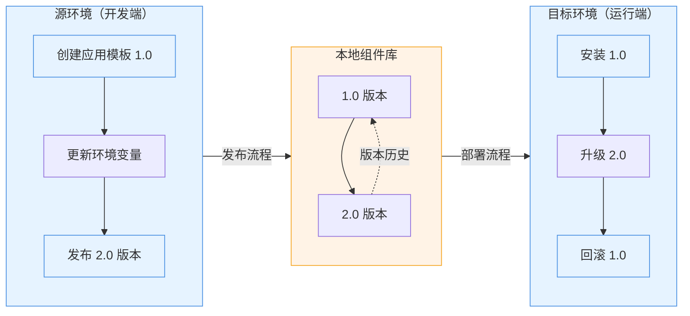

完成本教程您将掌握：
1. 创建并发布应用模板 1.0 至本地组件库
2. 一键安装应用模板
3. 发布升级至 2.0 版本
4. 版本升级与回滚操作

## 前提

- 已完成 [Rainbond 快速安装](/docs/quick-start/quick-install)。

## 创建应用模板（1.0 版本）

### 部署容器镜像服务

1. 进入目标团队视图，创建新应用，名为 `source-app`。
2. 选择从镜像构建 ➡️ 容器。
    - 名称为：`app`。
    - 镜像地址：`registry.cn-hangzhou.aliyuncs.com/goodrain/nginx:alpine`
3. 其他配置均保持默认。

### 发布到本地组件库

1. 进入应用视图 ➡️ 发布应用 ➡️ 发布到组件库。
2. 新建应用模板：
    - 模板名称：`app-template`。
    - 版本号：`1.0`。
3. 其他配置均保持默认。
4. 确认提交。

## 一键安装应用模板（1.0 版本）

1. 进入目标团队视图，新疆名称为 `target-app` 的应用。
2. 选择从应用市场安装 ➡️ 本地组件库，选择 `app-template` 并安装。
3. 预期结果：`target-app` 应用内存在名为 `app` 的组件。

## 发布 2.0 版本

1. 进入到 `source-app` 应用视图。
2. 点击上方的**快速复制**按钮，复制出一个新的组件。
3. 进入到 `app` 组件 ➡️ 环境配置：
    - 添加环境变量 `demo=demo`。
    - 点击右上角**更新**按钮。
4. 进入应用视图 ➡️ 发布应用 ➡️ 发布到组件库。
    - 选择 `app-template` 应用模板。
    - 版本号为 `2.0`。
    - 确认提交。

## 版本升级

1. 进入到 `target-app` 应用视图 ➡️ 应用升级，升级到 2.0 版本。
2. 验证升级结果：
    - 新增 `app-copy` 组件。
    - 原 `app` 组件新增 `demo=demo` 环境变量。

## 版本回滚

1. 进入到 `target-app` 应用视图 ➡️ 应用升级 ➡️ 升级记录。
2. 回滚到 1.0 版本。
3. 验证回滚结果：
    - `app-copy` 组件保留（未删除）。
    - `app` 组件的 `demo=demo` 环境变量被移除。

> 扩展学习：[应用模板升级规则](#)