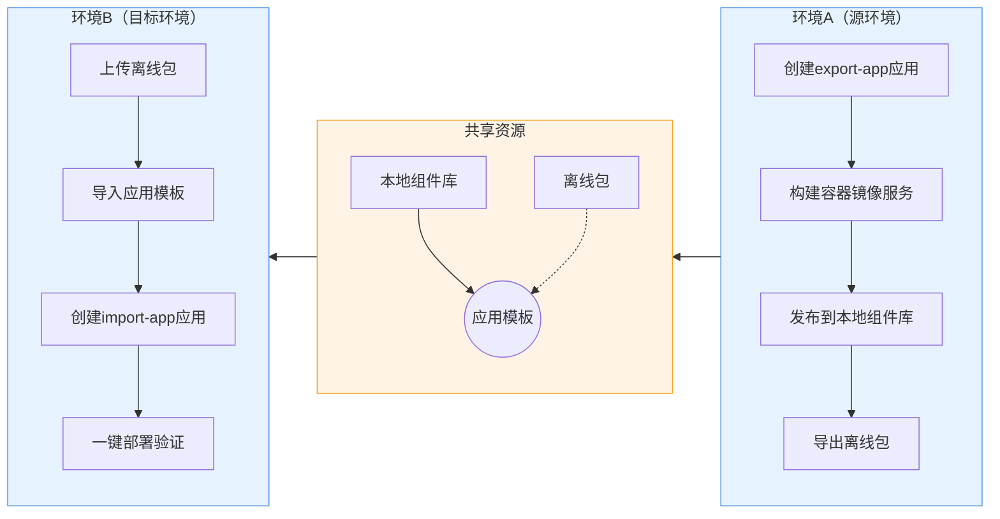

完成本教程您将掌握：
1. 创建标准化应用模板并发布
2. 生成与迁移离线交付包
3. 跨环境一键部署验证

## 前提

- 准备两套独立环境（标记为环境A/B）
- 均已完成 [Rainbond 快速安装](/docs/quick-start/quick-install)。

## 生成离线包（环境A）
### 部署基准应用

1. 进入目标团队视图，新建应用，名为 `export-app`。
2. 选择从镜像构建 ➡️ 容器。
    - 名称为：`app`。
    - 镜像地址：`registry.cn-hangzhou.aliyuncs.com/goodrain/nginx:alpine`
3. 其他配置均保持默认。

### 发布应用模板

1. 进入应用视图 ➡️ 发布应用 ➡️ 发布到组件库。
2. 新建应用模板：
    - 模板名称：`app-delivery`。
    - 版本号：`1.0`。
3. 确认发布。

### 打包离线资源

1. 进入应用视图 ➡️ 发布应用 ➡️ 导出应用模板，导出应用模型规范。
2. 下载生成的 `app-delivery-1.0.ram.tar.gz` 格式离线包。

## 实施跨环境交付（环境B）
### 导入应用模板

1. 平台管理 ➡️ 应用市场 ➡️ 离线导入。
2. 上传获取的离线包文件。

### 部署验证

1. 进入目标团队视图，新建 `import-app` 应用。
2. 选择从应用市场安装 ➡️ 本地组件库 ➡️ 安装 `app-delivery` 应用。
3. 验证结果：
   - 成功部署 `app` 组件
   - 服务状态显示为运行正常
