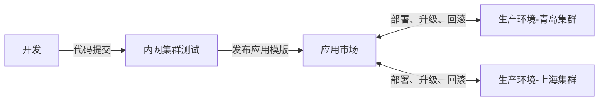

## 概述

Rainbond 多环境跨云交付方案允许企业将应用部署到不同的云环境中，实现开发、测试和生产环境的统一管理与持续交付。本文将以后台管理系统为例，详细介绍如何在 Rainbond 上实现跨云、跨环境的应用交付流程。

## 多环境跨云交付流程

### 流程说明

1. **多集群对接**：
   - 通过 Rainbond 控制台对接多个集群，包括私有云、公有云等不同环境
   - 每个集群可以作为不同的环境（如开发、测试、生产）或地域部署点

2. **应用开发与测试**：
   - 开发者在内网环境完成应用开发
   - 应用测试通过后，发布到本地应用市场

3. **跨环境部署**：
   - 通过应用市场中的应用模版实现各个环境的一键部署
   - 支持不同云厂商、不同地域的统一交付管理

4. **持续升级与回滚**：
   - 应用版本迭代后，各环境可以独立选择升级时机
   - 问题出现时支持一键回滚到稳定版本

## 操作步骤

### 前提条件

- 已完成 [Rainbond 快速安装](/docs/quick-start/quick-install)
- 拥有企业管理员权限
- 准备好至少一个可被所有环境访问的镜像仓库
- 准备多个云环境的服务器资源（用于部署不同环境）

### 一、Rainbond 对接多集群

1. **添加集群**
   - 在 Rainbond 控制台，进入`平台管理 → 集群 → 添加集群`
   - 按照界面指引，在不同云环境的服务器上安装 Rainbond 集群端
   - 完成对接后，控制台将显示所有已连接的集群
      :::tip 提示
      添加集群时需确保网络互通，建议为集群设置有意义的名称，如"阿里云-上海"、"腾讯云-成都"等，便于识别。
      :::

2. **创建多环境团队**

   - 进入`平台管理 → 团队 → 创建团队`
   - 创建对应不同环境的团队，如：
      - 测试-内网（关联内网集群）
      - 生产-青岛（关联阿里云-青岛集群）
      - 生产-上海（关联阿里云-上海集群）
   - 创建团队时，选择对应的集群进行关联

   

### 二、设置镜像仓库

**配置外部镜像仓库**

- 进入`平台管理 → 设置 → 内部组件库镜像仓库`
- 配置一个可以被所有环境访问的镜像仓库
- 填写仓库地址、用户名、密码等信息
- 保存配置

:::tip 提示
所选镜像仓库必须能被所有集群网络访问，这是多环境部署的关键。推荐使用公共镜像仓库服务或确保内部镜像仓库有公网访问能力。
:::

### 三、部署开发测试环境

**部署业务组件**

- 进入开发团队视图 → 创建应用 → 从源码构建 → 源码。
   - 自定义应用名称。
   - 仓库地址：`https://gitee.com/rainbond/java-maven-demo.git`。
   - 分支：`master`。
- 根据页面流程，完成组件的部署。

### 四、制作应用模版

1. **进入模版发布页面**
   - 在应用发布页面，选择`发布 → 发布到本地组件库`
   - 进入模版设置页面

2. **设置模版信息**
   - 创建新应用模版，命名为**后台管理系统**
   - 发布范围选择**企业**
   - 版本号设置为**1.0**
   - 填写应用描述、分类等信息
   - 上传应用图标（可选）

3. **确认发布**
   - 点击**提交**按钮，系统开始同步所有组件镜像到配置的镜像仓库
   - 镜像同步完成后，点击**确认发布**
   - 发布后可在`平台管理 → 应用市场 → 本地组件库`中查看

:::warning 注意
镜像同步过程可能需要几分钟到几十分钟不等，取决于应用规模和网络状况。只有企业管理员可以看到**平台管理**按钮。
:::

### 五、多环境交付

**测试环境验证**

1. 测试人员在`测试-内网`团队中安装并测试应用
2. 测试通过后，在应用市场中将该版本标记为**Release**状态
3. 进入`平台管理 → 应用市场 → 本地组件库 → 后台管理系统`
4. 找到**1.0**版本，点击**设置为 Release 状态**

**部署到生产环境-青岛**

1. 进入`平台管理 → 应用市场 → 本地组件库`
2. 找到**后台管理系统**应用模版
3. 点击右侧的**安装**按钮
4. 选择**生产-青岛**团队
5. 选择要安装的应用名称和版本
6. 确认并完成安装

**部署到生产环境-上海**

1. 重复上述步骤，但选择**生产-上海**团队
2. 确认应用在所有环境中部署成功并正常运行

### 六、持续升级和回滚

**发布新版本**

1. 开发人员在测试环境完成新功能开发
2. 发布新版本（如**2.0**）到应用市场
3. 测试人员验证新版本功能

**生产环境升级**

1. 运维人员在已部署的生产环境中选择应用
2. 进入应用升级页面，点击**升级**按钮，选择最新版本
3. 查看版本差异，确认升级内容
4. 确认后系统自动完成升级

**版本回滚**

1. 如果升级后发现问题，进入应用页面
2. 选择`升级 → 升级记录 → 回滚`
3. 选择要回滚到的版本
4. 确认后系统自动完成回滚操作

## 最佳实践与常见问题

### 最佳实践

- **环境分离管理**：不同环境使用不同的团队和权限管理，避免误操作
- **版本管理策略**：建立明确的版本发布流程，重要版本变更应记录详细的发布说明
- **镜像仓库选择**：对于多地域部署，建议选择有CDN加速能力的镜像仓库服务
- **配置管理**：使用环境变量或配置中心管理不同环境的配置差异
- **定期数据备份**：特别是生产环境，确保在升级前有可靠的数据备份

### 常见问题

1. **Q: 不同环境的配置需要如何管理？**\
   A: 可以通过应用模版的环境变量设置，在不同环境安装时进行差异化配置。也可以使用配置中心进行统一管理。

2. **Q: 镜像无法在某些环境拉取怎么办？**\
   A: 检查镜像仓库的网络可达性，确保所有集群都能访问该仓库。可能需要配置网络策略或使用公网可访问的镜像仓库。

3. **Q: 多环境部署时，数据如何迁移？**\
   A: 对于需要数据迁移的场景，建议使用数据库备份恢复工具或其他数据备份工具，根据业务需求选择合适的迁移策略。

## 参考资料

- [Rainbond 应用模版参数说明](../app-model-parameters.md)
- [Rainbond 应用升级属性变更规则](../upgrade-app.md)