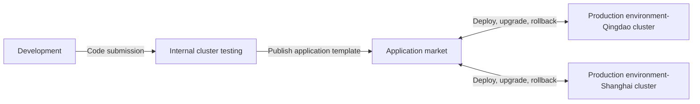

## Overview

Rainbond's multi-environment cross-cloud delivery solution allows enterprises to deploy applications to different cloud environments, achieving unified management and continuous delivery across development, testing, and production environments.This article will take the background management system as an example to detail how to implement cross-cloud, cross-environment application delivery processes on Rainbond.

## Multi-environment cross-cloud delivery process

### Process description

1. **Multi-cluster connection**:
   - Connect multiple clusters through the Rainbond console, including different environments such as private cloud and public cloud
   - Each cluster can serve as a different environment (e.g., development, testing, production) or regional deployment point

2. **Application development and testing**:
   - Developers complete application development in the internal network environment
   - After passing the application test, publish to the local application market

3. **Cross-environment deployment**:
   - Achieve one-click deployment across environments through application templates in the application market
   - Support unified delivery management across different cloud vendors and regions

4. **Continuous upgrade and rollback**:
   - After application version iteration, each environment can independently choose the upgrade timing
   - Support one-click rollback to a stable version when problems occur

## Operation steps

### Preconditions

- Completed [Rainbond quick installation](/docs/quick-start/quick-install)
- Have enterprise administrator permissions
- Prepare at least one image repository accessible by all environments
- Prepare server resources for multiple cloud environments (for deploying different environments)

### 1. Rainbond connects to multiple clusters

1. **Add cluster**
   - In the Rainbond console, go to `Platform Management → Cluster → Add Cluster`
   - Follow the interface instructions to install the Rainbond cluster side on servers in different cloud environments
   - After completing the connection, the console will display all connected clusters
      :::tip Tip
      When adding a cluster, ensure network connectivity is established. It is recommended to set meaningful names for clusters, such as "Alibaba Cloud-Shanghai", "Tencent Cloud-Chengdu", etc., for easy identification.
      :::

2. **Create multi-environment teams**

   - Go to `Platform Management → Team → Create Team`
   - Create teams corresponding to different environments, such as:
      - Test-Internal network (associated with internal network cluster)
      - Production-Qingdao (associated with Alibaba Cloud-Qingdao cluster)
      - Production-Shanghai (associated with Alibaba Cloud-Shanghai cluster)
   - When creating a team, select the corresponding cluster for association

   

### 2) Set up the image repository

**Configure external image repository**

- Go to `Platform Management → Settings → Internal component library image repository`
- Configure an image repository that can be accessed by all environments
- Fill in the repository address, username, password and other information
- Save configuration

:::tip Tip
The selected image repository must be accessible by all cluster networks, which is key to multi-environment deployment.It is recommended to use public image repository services or ensure that internal image repositories have public network access capabilities.
:::

### 3. Deploy development and testing environments

**Deploy business components**

- Enter the development team view → Create application → Build from source → Source code.
   - Customize the application name.
   - Repository address: `https://gitee.com/rainbond/java-maven-demo.git`.
   - Branch: `master`.
- Follow the page process to complete the component deployment.

### 4. Create application templates

1. **Enter the template release page**
   - On the application release page, select `Publish → Publish to local component library`
   - Enter the template settings page

2. **Set template information**
   - Create a new application template, named **Background Management System**
   - Select **Enterprise** for the release scope
   - Set the version number to **1.0**
   - Fill in application description, classification and other information
   - Upload application icon (optional)

3. **Confirm Release**
   - Click the **Submit** button, and the system will start synchronizing all component images to the configured image repository
   - After the image synchronization is completed, click **Confirm Release**
   - After release, you can view it in `Platform Management → App Market → Local Component Library`

:::warning Note
The image synchronization process may take from a few minutes to several tens of minutes, depending on the application size and network conditions.Only enterprise administrators can see the **Platform Management** button.
:::

### Multi-environment Delivery

**Test Environment Verification**

1. Testers install and test the application in the `Test-Internal` team
2. After the test is passed, mark this version as **Release** status in the app market
3. Go to `Platform Management → App Market → Local Component Library → Backend Management System`
4. Find the **1.0** version, click **Set as Release Status**

**Deploy to Production Environment-Qingdao**

1. Go to `Platform Management → App Market → Local Component Library`
2. Find the **Backend Management System** application template
3. Click the **Install** button on the right
4. Select the **Production-Qingdao** team
5. Select the application name and version to install
6. Confirm and complete the installation

**Deploy to Production Environment-Shanghai**

1. Repeat the above steps, but select the **Production-Shanghai** team
2. Confirm that the application is successfully deployed and running normally in all environments

### Continuous Upgrade and Rollback

**Release New Version**

1. Developers complete new feature development in the test environment
2. Release a new version (e.g., **2.0**) to the app market
3. Testers verify the functionality of the new version

**Production Environment Upgrade**

1. Operations personnel select the application in the deployed production environment
2. Go to the application upgrade page, click the **Upgrade** button, and select the latest version
3. View version differences and confirm upgrade content
4. After confirmation, the system automatically completes the upgrade

**Version Rollback**

1. If problems are found after the upgrade, go to the application page
2. Select `Upgrade → Upgrade Record → Rollback`
3. Select the version to roll back to
4. After confirmation, the system automatically completes the rollback operation

## Best Practices and Common Problems

### Best Practices

- **Environment Separation Management**: Different environments use different teams and permission management to avoid misoperation
- **Version Management Strategy**: Establish a clear version release process, and important version changes should record detailed release notes
- **Image repository selection**: For multi-region deployment, it is recommended to choose an image repository service with CDN acceleration capability
- **Configuration Management**: Use environment variables or configuration centers to manage configuration differences in different environments
- **Regular Data Backup**: Especially for the production environment, ensure reliable data backup before upgrading

### Common Problems

1. **Q: How to manage configurations for different environments?**\
   A: You can set environment variables in the application template for differentiated configuration when installing in different environments.You can also use a configuration center for unified management.

2. **Q: What to do if the image cannot be pulled in some environments?**\
   A: Check the network accessibility of the image repository to ensure all clusters can access the repository.You may need to configure network policies or use a publicly accessible image repository.

3. **Q: How to migrate data during multi-environment deployment?**\
   A: For scenarios requiring data migration, it is recommended to use database backup and recovery tools or other data backup tools, and choose an appropriate migration strategy according to business needs.

## Reference Materials

- [Rainbond Application Template Parameter Description](../app-model-parameters.md)
- [Rainbond Application Upgrade Attribute Change Rules](../upgrade-app.md)