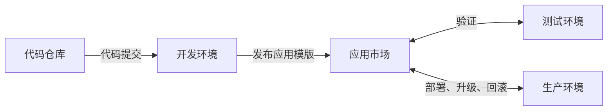

## 概述

Rainbond 应用模版持续交付是一种高效的软件交付方式，它允许开发、测试和运维团队通过统一的应用模版快速完成环境部署和版本迭代。

## 应用模版持续交付流程

### 流程说明

1. **代码提交与自动化测试**：
   - 开发人员提交代码到源码仓库
   - 触发开发环境的自动构建和自动化测试
   - 测试不通过时，反馈给开发人员进行修复

2. **版本发布与测试环境部署**：
   - 功能开发完成后，将应用发布到应用市场作为`1.0`版本
   - 测试人员从应用市场一键安装`1.0`版本到测试环境
   - 开发人员继续在开发环境迭代，测试人员进行功能测试

3. **版本迭代与更新**：
   - 根据测试反馈，开发人员修复问题后发布`2.0`版本
   - 测试人员在测试环境一键升级至新版本并继续测试
   - 循环迭代直至版本质量满足要求

4. **生产环境交付**：
   - 当版本（如`3.0`）测试通过后，在应用市场将其标记为`Release`状态
   - 生产环境直接从应用市场部署已发布的稳定版本

## 操作步骤

### 前提条件

- 已完成 [Rainbond 快速安装](../../../quick-start/quick-install.mdx)
- 已创建多个团队/项目（如开发环境、测试环境、生产环境）
- 拥有相应的操作权限

### 一、部署开发环境

**部署业务组件**

1. 进入开发团队视图 → 创建新应用。
2. 选择从源码构建 → 源码。
   - 自定义应用名称。
   - 仓库地址：`https://gitee.com/rainbond/java-maven-demo.git`。
   - 分支：`dev`。

### 二、制作应用模版

1. **进入应用发布页面**
   - 进入`应用发布 → 发布到本地组件库`
   - 此时会进入模版设置页面

2. **设置模版信息**
   - 创建新应用模版，命名为**后台管理系统**
   - 发布范围选择**企业**
   - 设置版本号为**1.0**
   - 填写应用描述、分类等信息
   - 可选择上传应用图标，增强识别度

3. **确认发布**
   - 点击**提交**，系统会同步所有组件镜像到本地仓库

   - 同步完成后，点击**确认发布**完成发布流程

   - 发布后在`平台管理 → 应用市场 → 本地组件库`中查看发布结果
   > **注意**：只有企业管理员可以看到**平台管理**按钮。镜像同步过程可能需要几分钟时间，请耐心等待。

### 三、部署测试环境

1. **创建测试环境**
   - 新建一个名为**测试环境**的团队（如已有可跳过）
   - 在该团队中创建应用，命名为**后台管理系统**

2. **从应用市场安装应用**
   - 在应用页面中，点击`添加组件 → 本地组件库`
   - 选择刚发布的**后台管理系统**模版
   - 选择**1.0**版本，点击安装
   - 等待应用部署完成，检查功能是否正常

3. **进行测试与迭代**
   - 测试人员在测试环境中进行功能测试
   - 将发现的问题反馈给开发人员
   - 开发人员修复问题后，在开发环境中发布新的版本（如**2.0**）

4. **应用升级**
   - 测试人员在测试环境中选择应用，点击**升级**
   - 查看版本差异（**2.0**vs**1.0**）
   - 确认升级，系统将自动完成应用更新
   - 升级后继续测试，直到某个版本（如**3.0**）通过完整测试

5. **标记稳定版本**
   - 当**3.0**版本通过完整测试后
   - 管理员前往`平台管理 → 应用市场 → 本地组件库 → 后台管理系统`
   - 找到**3.0**版本，点击**设置为 Release 状态**
   - 这标志着该版本已经是高质量可交付的稳定版本

### 四、部署生产环境

1. **查看可用的发布版本**
   - 具有生产环境部署权限的用户进入`平台管理 → 应用市场 → 本地组件库`
   - 查看**后台管理系统**的版本状态，确认**3.0**已标记为**Release**

2. **部署到生产环境**
   - 点击**后台管理系统**模版右侧的**安装**按钮
   - 选择**生产环境**团队
   - 选择要安装的应用名称和版本（**3.0**）
   - 点击确认，一键完成生产环境部署

3. **后续版本更新**
   - 当有新的功能或修复时，开发人员发布新版本（如**3.1**）
   - 新版本经测试环境验证通过后
   - 运维人员在生产环境的应用中选择**升级**
   - 确认升级信息后，完成生产环境的平滑更新

## 最佳实践与常见问题

### 最佳实践

- **版本命名规范**：建议采用语义化版本号（如 1.0.0），便于理解版本变更程度
- **模版说明完善**：在发布模版时添加详细的功能说明和版本变更记录
- **分阶段测试**：重要版本先在预发布环境验证后再升级生产环境
- **保留回滚路径**：生产环境升级前备份关键数据，确保必要时可回滚

### 常见问题

1. **Q: 应用模版发布失败怎么办？**\
   A: 检查网络环境、镜像仓库状态，确认所有组件都已正常运行，然后重试发布。

2. **Q: 升级过程中出现服务中断？**\
   A: 检查新版本的配置变更，确保环境变量、配置文件等兼容性。建议在非高峰期进行升级。

3. **Q: 如何回滚到之前的版本？**\
   A: 在应用升级页面选择之前的稳定版本进行回滚操作。

4. **Q: 多人协作时如何避免版本冲突？**\
   A: 建立明确的版本发布流程，指定专人负责应用发布，避免同时发布不同版本。

## Reference

- [Rainbond 应用模版参数说明](../app-model-parameters.md)
- [Rainbond 应用升级属性变更规则](../upgrade-app.md)

