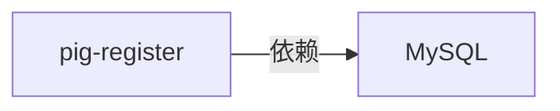
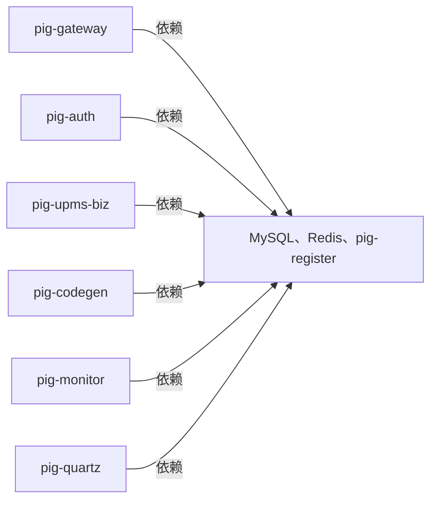

本文将指导您如何在 Rainbond 平台上一键部署完整的 [Spring Cloud Pig](https://gitee.com/log4j/pig) 微服务应用。通过本教程，您将体验 Rainbond 强大的微服务治理能力和便捷的部署流程。

在本教程中，我们将部署一个完整的 Spring Cloud Pig 应用，包括：

1. 基础设施：MySQL 数据库、Redis 缓存
2. 后端服务：7 个 Spring Cloud 微服务组件
3. 前端界面：基于 Vue 的管理界面

## 前提

- 已安装的 [Rainbond 快速安装](../../quick-start/quick-install.mdx) 平台
- 资源最低要求：`4C 16G 100G`

## 部署步骤

本教程基于 [Spring Cloud Pig jdk17](https://gitee.com/rainbond/pig/tree/v3.8.2) 分支进行部署。

### 一、部署 MySQL 数据库

> 通过源码方式创建 MySQL 组件

**1.1 进入目标团队 → 新建应用 → 从源码构建 → 源码**

- 组件名称：自定义（例如：mysql）
- 组件英文名称：自定义
- 仓库地址：`https://gitee.com/rainbond/pig.git`
- 子目录路径：`db`
- 代码分支：`v3.8.2`

**1.2 配置 MySQL 组件类型**

- 修改组件部署类型为 **有状态服务(Statefulset类型)**
- 下一步

**1.3 配置组件端口**

- 点击默认的 3306 端口，修改端口别名为 `MYSQL`
- 确保打开该端口的**对内服务**开关

**1.4 配置组件环境变量**

- 添加环境变量：
  - 变量名：`MYSQL_ROOT_PASSWORD`
  - 变量值：`root`
- 添加环境变量：
  - 变量名：`MYSQL_ROOT_HOST`
  - 变量值：`%`

**1.5 配置组件存储**

- 点击 **存储** 标签页
- 添加存储卷：
  - 存储卷名称：`mysql-data`
  - 挂载路径：`/var/lib/mysql`
  - 存储卷类型：本地存储

**1.6 构建组件**

- 等待组件构建完成变为 **运行中** 状态

**1.7 验证 MySQL 组件**

- 进入 Web 终端

```bash
mysql -uroot -proot # 连接 MySQL 数据库
show databases; # 查看数据库列表
use pig; # 切换到 pig 数据库
show tables; # 查看表列表
select * from sys_user; # 查看用户表数据
exit; # 退出 MySQL 客户端
```

### 二、部署 Redis

**2.1 从应用商店安装 Redis**

1. 进入目标团队 → 添加组件 → 从应用商店安装 → 开源应用商店
2. 在搜索框中输入 `Redis` 安装 `5.0.7` 版本

**2.2 确认 Redis 组件状态**

安装完成后，确认 Redis 组件已正常运行：

1. 查看 Redis 组件状态是否为 **运行中**
2. 进入组件详情页 → Web 终端，连接 Redis 客户端

```bash
$ redis-cli -h ${REDIS_HOST} -p ${REDIS_PORT}
gr72321b:6379> set test test
OK
```

### 三、部署 Pig 后端服务

**3.1 通过源码方式创建 Pig 后端服务组件**

通过源码方式创建 Pig 后端组件，填写以下信息：

- 组件名称：自定义
- 组件英文名称：自定义
- 仓库地址：`https://gitee.com/rainbond/pig.git`
- 代码分支：`v3.8.2`

**3.2 配置多模块构建**

系统会自动检测出多个微服务模块，在多模块构建页面：

1. 选择以下模块并创建：
  - pig-register （Nacos 注册中心）
  - pig-gateway （网关服务）
  - pig-auth （认证服务）
  - pig-upms/pig-upms-biz （用户权限管理）
  - pig-visual/pig-codegen （代码生成器）
  - pig-visual/pig-monitor （监控服务）
  - pig-visual/pig-quartz （定时任务）

:::warning 注意
以上模块在创建后都需要修改构建源信息，请在点击 `确认构建` 按钮前，取消 `并构建启动` 选项，否则会自动构建
:::

**3.3 修改构建源 JDK 版本**

为每个组件修改构建源 JDK 版本为 `17`：

- 进入组件详情页 → 构建源 → 源码构建参数设置
- 修改 JDK 版本为 `17`
- 确认修改

**3.4 配置微服务端口和别名**

为每个微服务组件配置正确的端口：

1. 进入每个组件的**端口**设置
2. 删除默认生成的端口
3. 添加每个组件所需的专用端口，并设置端口别名以及打开对内端口服务：

| 组件           | 端口               | 端口别名                              |
| ------------ | ---------------- | --------------------------------- |
| pig-register | 8848, 9848, 9849 | 8848端口别名: `NACOS` |
| pig-gateway  | 9999             | 端口别名: `GATEWAY`   |
| pig-auth     | 3000             | -                                 |
| pig-upms-biz | 4000             | -                                 |
| pig-codegen  | 5002             | -                                 |
| pig-monitor  | 5001             | -                                 |
| pig-quartz   | 5007             | -                                 |

**3.5 建立组件依赖关系**

使用 Rainbond 的可视化编排功能建立组件之间的依赖关系：

1. 进入应用视图 → 切换到 **编排模式**
2. 按照如下所示，拖动连接各组件，建立依赖关系：

- 配置 `pig-register` 组件依赖 `MySQL` 组件



- 配置所有微服务组件依赖 `MySQL`、`Redis`、`pig-register` 组件



:::tip 提示
通过 Rainbond 的依赖关系设置，[环境变量会自动注入](../app-ops/dependon.md)到依赖服务中，极大简化了微服务间的配置管理。
:::

**3.6 构建组件**

- 进入应用视图 → 列表 → 选择所有微服务组件，点击 **批量构建** 按钮
- 构建成功后，进入组件详情页，点击 **启动** 按钮，启动组件

### 四、部署 Pig-UI 前端

**4.1 创建前端组件**

通过源码方式创建前端组件，填写以下信息：

- 组件名称：自定义（例如：pig-ui）
- 组件英文名称：自定义
- 仓库地址：`https://gitee.com/rainbond/pig-ui.git`
- 代码分支：`v3.8.2`

**4.2 配置构建方式**

- 代码语言：`NodeJSStatic`
- 包管理器：`npm`
- 打包目录：`dist`

**4.3 配置 Node 版本**

- 配置 Node 版本为 `18.16.0`

**4.4 添加配置文件**

- 添加配置文件
  - 配置文件名称：自定义（例如：nginx-config）
  - 配置文件路径：`/app/nginx/conf.d/web.conf`
  - 配置文件内容：
    server {
        listen 5000;
    
        gzip on;
        gzip_static on; # 需要http_gzip_static_module 模块
        gzip_min_length 1k;
        gzip_comp_level 4;
        gzip_proxied any;
        gzip_types text/plain text/xml text/css;
        gzip_vary on;
        gzip_disable "MSIE [1-6]\.(?!._SV1)";
    
        # 存放前端打包后的 dist 默认目录
        root /app/www;
    
        # 注意维护新增微服务，gateway 路由前缀
        location ^~/api/ {
          proxy_pass http://${GATEWAY_HOST}:9999/; #注意/后缀
          proxy_connect_timeout 60s;
          proxy_read_timeout 120s;
          proxy_send_timeout 120s;
          proxy_set_header X-Real-IP $remote_addr;
          proxy_set_header X-Forwarded-For $proxy_add_x_forwarded_for;
          proxy_set_header X-Forwarded-Proto http;
          proxy_http_version 1.1;
          proxy_set_header Upgrade $http_upgrade;
          proxy_set_header Connection "upgrade";
          proxy_set_header Host $http_host;
          proxy_set_header from "";
        }
    
        # 屏蔽所有敏感路径，不用改代码
        location ~_ ^/(actuator|swagger-ui|v3/api-docs|swagger-resources|webjars|doc.html) {
          return 403; # 禁止访问
        }
    }

**4.5 确认构建组件**

**4.6 配置依赖关系**

1. 进入组件应用视图 → 切换到 **编排模式**
  - 将 `pig-ui` 组件连接到 `pig-gateway` 组件，建立依赖关系
2. 更新 `pig-ui` 组件，完成部署

### 五、访问和验证

**获取访问地址**

1. 进入 `pig-ui` 组件详情页
2. 在端口信息中找到对外服务的访问地址
3. 点击访问地址或复制到浏览器打开


## 最终部署效果

成功部署后，您将得到一个完整的微服务应用，如下图所示：


## 常见问题排查

### Q1: 前端访问后端服务报错？

检查 Nginx 配置文件中的代理配置，确保网关地址和端口正确。

### Q2: 数据库连接失败？

检查 Nacos 中的数据库配置，确保 MySQL 组件已正常启动，且依赖关系已正确建立。
