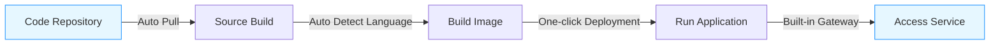

This tutorial will demonstrate the entry-level usage experience of Rainbond. By deploying the classic 2048 game, it will help you quickly understand the basic functions and operation process of Rainbond.

## Preconditions

- Completed [Rainbond Quick Installation](/docs/quick-start/quick-install)
- No additional configuration required, ready to use out of the box

## Deploy 2048 Game

### 🚀 Highlights

- **Zero-configuration Build**: Automatically detect language type, no need to manually write build scripts
- **Gateway Integration**: Automatically generate access domain names, no additional gateway configuration required

### 🧩 Operation Process

1. **Create Application and Source Component**
  1. Enter the target **Team View ➡️ Create Application**.
    
  2. Select **Build from Source Code** ➡️ **Source Code**, fill in the following information:
    
    - Repository Address: `https://gitee.com/rainbond/demo-2048.git`
    - Code Branch: `master`
    - Component Name: `2048` (customizable)
  3. Click **Confirm Creation**.

2. **Source Build Auto-detection Process**
  - Rainbond will automatically identify the project type as `static` (static website)

3. **Deployment Monitoring**
  1. Enter the application view to observe the changes in component deployment status:
    - **Building**: Building container image from source code
    - **Starting**: Image build completed, starting container
    - **Running**: Application successfully deployed (shown in green)

  2. Click the component to enter **Operation Records** to view the build logs.

4. **Access Application**
  1. Enter the **Component ➡️ Port** tab to see the automatically generated access address.
  2. Click the domain link to open and experience the 2048 game in your browser!

:::tip Usage Tips

- Your application has been automatically deployed in the Kubernetes cluster
- Automatically exposed through Rainbond's gateway service, no need to manually configure Ingress
- All resources (storage, network, etc.) have been automatically configured
  :::

## Explore More Features

Congratulations!You have successfully deployed your first application.But this is just the beginning of Rainbond's powerful features. Next, you can try:

- [Quickly Deploy Source Code and MySQL](../tutorial/via-rainbond-deploy-sourceandmiddleware)
- [Component New Version Build and Rollback](../tutorial/component-version-update-and-rollback)
- [Custom Domain Name and Configure HTTPS](../tutorial/custom-gateway)
- [One-click Installation and Upgrade of Applications via Application Template](../tutorial/app-template-manage)
- [Offline Cross-environment Delivery](../tutorial/app-template-offline)
- [Access Existing Servers and Create Multi-tenant Environment](../tutorial/docking-selfhost)