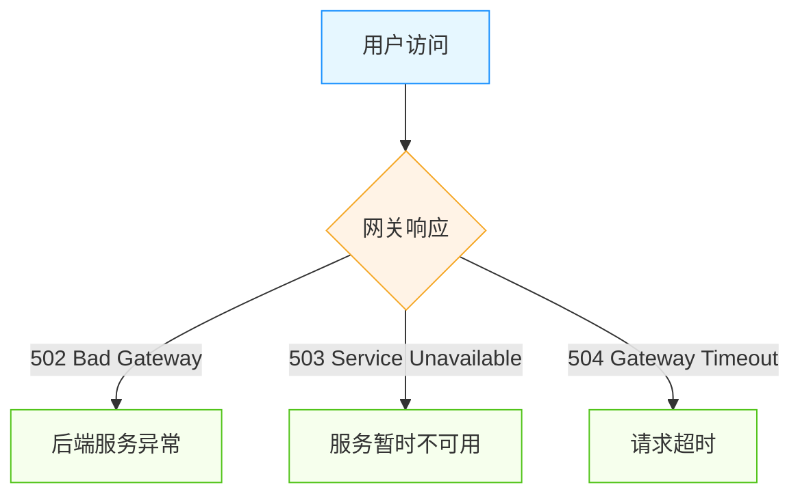

## 组件运行故障排查

### 组件无运行日志信息

组件的日志通过 `WebSocket` 进行推送，如果无日志信息，在 **平台管理 -> 集群 -> 编辑**，查看 `WebSocket` 通信地址是否正确，如果集群是公有云厂商提供的，此处地址是内网 IP，那么你本地无法与集群建立 WebSocket，就无法展示日志。将此处修改为你本地能连接上的 IP 即可。

### 组件异常状态故障排查

#### 调度中

组件实例一直处于 <font color="#ffa940"> 调度中  </font> 状态

处于 <font color="#ffa940"> 调度中  </font> 状态的实例，体现为橙黄色的方块。说明集群中已经没有足够的资源来运行这个实例。具体的资源项短缺详情，可以点击橙黄色的方块，打开实例详情页面后在 `说明` 处了解到。例如：

```css
实例状态：调度中
原因：   Unschedulable
说明：   0/1 nodes are available: 1 node(s) had desk pressure
```

根据 `说明` 可以了解到，当前集群中共有 1 个宿主机节点，但是处于不可用状态，原因是该节点存在磁盘压力。根据原因对节点进行磁盘扩容或空间清理后，该问题会自动解除。常见的资源短缺类型还包括：CPU 不足、内存不足。

#### 等待启动

组件实例一直处于 <font color="#ffa940"> 等待启动  </font> 状态

Rainbond 平台根据组件之间的依赖关系确定启动顺序。如果服务组件长时间处于 <font color="#ffa940"> 等待启动  </font> 状态，则说明其依赖的某些组件未能正常启动。切换至应用拓扑视图梳理组件间依赖关系，确保其依赖的组件都处于正常的运行状态。

#### 运行异常

组件实例一直处于 <font color="red"> 运行异常  </font> 状态

运行异常状态意味着该实例遭遇了无法正常运行的情况。点击红色的方块，可以在实例详情页面找到提示，重点关注实例中的容器的状态，通过状态的不同，来继续排查问题。以下是常见的几种问题状态：

- ImagePullBackOff: 该状态说明当前容器的镜像无法被拉取，下拉至 `事件` 列表处，可以得到更为详细的信息。确保对应的镜像可以被拉取，如果发现无法拉取的镜像以 `goodrain.me` 开头，则可以尝试构建该组件解决问题。
- CrashLoopBackup: 该状态说明当前容器本身启动失败，或正在遭遇运行错误。切换至 `日志` 页面查看业务日志输出并解决问题即可。
- OOMkilled: 该状态说明为容器分配的内存太小，或业务本身存在内存泄漏问题。业务容器的内存配置入口位于 `伸缩` 页面。插件容器的内存配置入口位于 `插件` 页面。

## 第三方组件故障排查

请按照以下步骤操作第三方组件：

1. 打开第三方组件对内端口
2. 设置第三方组件健康检测
3. 启动/更新第三方组件

直至第三方组件状态为 `就绪`，才能正常使用。

如果第三方组件状态为 `就绪`, 但是无法对内或对外访问，请通过以下步骤排查：

1. 检查第三方组件创建的 endpoint 是否正确

```bash
kubectl get ep -n <namespace>
```

2. 检查第三方组件创建的 service 是否正确，并通过 curl 命令检查是否能够访问

```bash
kubectl get svc -n <namespace>
```

3. 检查第三方组件创建的 ingress 是否正确

```bash
kubectl get ing -n <namespace>
```

## 获取节点列表失败

出现该问题说明 Kubernetes 集群的节点 Labels 不匹配，导致控制台无法获取节点列表，默认通过 `node-role.kubernetes.io/worker=true node-role.kubernetes.io/master=true` 标签来区分节点角色，查看节点标签是否正确：

```bash
kubectl get nodes --show-labels
```

如果不存在该标签，可以通过以下命令添加：

```bash
kubectl label nodes <node-name> node-role.kubernetes.io/worker=true
```

## 组件故障

平台管理首页出现组件故障，例如：`rbd-chaos` 组件出现故障，出现该问题有以下几种可能：

1. 监控数据收集的不及时，导致数据不正确，从而出现组件故障原因。
2. 组件的确出现故障，可以通过查看组件日志排查问题。

```bash
# 查看组件状态是否为 running
kubectl get pod -n rbd-system

# 查看组件日志
kubectl logs -fl name=rbd-chaos -n rbd-system
```

3. 组件正常工作，但组件故障的告警一直出现，可以通过以下重启组件解决：

```bash
kubectl delete pod -l name=rbd-chaos -n rbd-system
```

## 无法查看组件实时日志

组件内无法查看到实时日志，检查 Websocket 地址，**平台管理 -> 集群 -> 编辑集群** 查看 Websocket 地址，本地是否可以与该地址进行通信。

## 磁盘空间超 80% 时，应用无法正常部署

当磁盘根分区空间超过 80% 时，Kubernetes 会自动进入驱逐状态，所有的 Pod 都会被驱逐，届时 Rainbond 将无法正常工作，需要清理磁盘空间。

清理 Docker 不再使用的资源：

```bash
docker system prune
```

清理 Rainbond 镜像仓库存储的镜像，如果你采用的是 Rainbond 默认提供的镜像仓库，可参阅 [清理 rbd-hub 镜像](https://t.goodrain.com/d/21-rbd-hub)。

## 源码构建提示 dial tcp look up goodrain.me on xxx:53: no such host

一般这是由于本地 `/etc/hosts` 没有自动写入 `goodrain.me` 的解析，通过以下命令重新写入：

```bash
kubectl delete pod -l name=rainbond-operator -n rbd-system
```

rainbond-operator 会自动重新启动写入 `/etc/hosts` 的 Job 任务。

## 源码构建提示 error: failed to solve: goodrain.me/runner:latest-amd64

这种情况通常是无法从 `goodrain.me` 镜像仓库获取 `runner` 镜像，尝试手动重新推送该镜像:

1. 获取最新的 `runner` 镜像

```bash
nerdctl pull registry.cn-hangzhou.aliyuncs.com/goodrain/runner:stable
```

2. 推送到 `goodrain.me` 镜像仓库

```bash
nerdctl tag registry.cn-hangzhou.aliyuncs.com/goodrain/runner:stable goodrain.me/runner:latest-amd64
nerdctl login goodrain.me -u admin -padmin1234 --insecure-registry
nerdctl push goodrain.me/runner:latest-amd64 --insecure-registry
```

## 应用/组件对外无法访问



### 错误代码说明

在排查前，首先了解这些错误代码的含义：

| 错误代码 | 错误名称                | 含义                        |
| ---- | ------------------- | ------------------------- |
| 502  | Bad Gateway         | 网关从上游服务器收到无效响应            |
| 503  | Service Unavailable | 服务当前不可用（过载或维护中）           |
| 504  | Gateway Timeout     | 网关尝试执行请求时，上游服务器未能在规定时间内响应 |

### 502 Bad Gateway 错误排查

#### 可能原因

1. **后端服务未正常运行**：组件处于异常状态或未启动
2. **端口配置错误**：暴露的端口与实际服务端口不匹配
3. **健康检查失败**：组件无法通过网关的健康检查

#### 排查步骤

1. **检查组件运行状态**

2. **验证端口配置**
  - 进入组件详情页面 → 端口，确认内部和对外服务端口配置正确
  - 确认容器内的应用确实在监听该端口
  ```bash
  # 进入 Web 终端查看端口监听情况
  netstat -nltp
  ```

3. **检查服务日志**
  - 查看组件运行日志，寻找可能的错误信息
  - 查看 `rbd-gateway` 网关日志
  ```bash
  kubectl logs -f -l name=rbd-gateway -n rbd-system -c apisix
  ```

### 503 Service Unavailable 错误排查

#### 可能原因

1. **服务过载**：组件资源不足或请求量过大
2. **组件正在部署/更新**：滚动更新过程中可能暂时不可用

#### 排查步骤

1. **检查组件资源使用情况**
2. **检查组件正在进行的操作**
  - 查看是否有正在进行的部署、更新操作
  - 检查滚动更新策略配置

### 504 Gateway Timeout 错误排查

#### 可能原因

1. **请求处理时间过长**：业务逻辑复杂或数据处理耗时
2. **上游服务超时**：依赖的其他服务响应慢
3. **网络连接问题**：集群内网络延迟高

#### 排查步骤

1. **检查组件超时设置**
  - 检查组件内部处理超时设置

2. **定位耗时操作**
  - 查看应用日志中标记的耗时操作
  - 使用性能分析工具定位瓶颈

3. **排查网络连接**
  - 检查网络延迟

### 网关日志分析

网关的日志信息对排查问题至关重要：

```bash
# 查看 APISIX 网关日志
kubectl logs -f -l name=rbd-gateway -n rbd-system -c apisix
```

常见的错误日志模式：

- 对于 502 错误，查找类似 `connection refused` 或 `upstream unavailable` 的日志
- 对于 503 错误，关注 `circuit breaking` 或 `rate limited` 相关日志
- 对于 504 错误，查找 `timeout` 相关的信息
