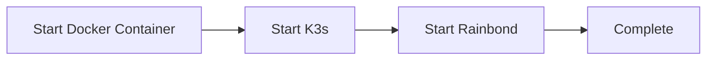
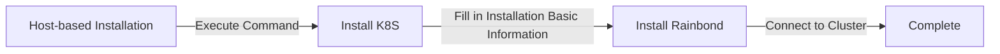

During the installation process of Rainbond in various environments, you may encounter various issues. This chapter will troubleshoot common problems during the Rainbond installation process.

## 1. Quick Installation Troubleshooting



**Rainbond Quick Installation Version** runs all services in a single container for user convenience. Running [K3s in Docker Container](https://docs.k3s.io/advanced#running-k3s-in-docker), all troubleshooting operations are performed in the `rainbond` container.

### Troubleshooting Approach

The container startup process is controlled by K3s. During troubleshooting, we can follow these steps to identify issues:

1. Check the startup logs of the `rainbond` container for any error messages.
2. Check if the `k3s` service in the `rainbond` container has started normally.
3. Check if all `rainbond` services in the `rainbond` container have started normally.

#### K3s Startup Phase

First, check the startup logs of the `rainbond` container for any error messages.

```bash
docker logs -f rainbond
```

Execute the following command to enter the `rainbond` container and check if the `k3s` service has started normally.

```bash
docker exec -it rainbond bash
```

Execute the following command to check if the `k3s` service has started normally.

```bash
kubectl get node
```

#### Rainbond Startup Phase

Execute the following command to check if all `rainbond` services in the `rainbond` container have started normally.

```bash
kubectl get pod -n rbd-system
```

#### Possible Issues

The Rainbond quick installation version stores data in the `/opt/rainbond` directory by default. If disk space is insufficient, Rainbond may fail to start normally.

1. For Mac and Windows installations, the local directory cannot be changed. Please expand storage space through Docker Desktop.
2. For Linux installations, you can modify the default local directory by changing the `volume` field in the `install.sh` installation script, as shown below:
```bash
$ vim install.sh

VOLUME_OPTS="-v /opt/rainbond:/opt/rainbond"
```

3. Delete the `rainbond` container and re-execute the `install.sh` script.

```bash
docker rm -f rainbond

bash ./install.sh
```

## 2. Kubernetes-based Installation Troubleshooting

Pods in Pending, CrashLoopBackOff, Evicted, ImagePullBackOff, etc. states

* **Pending:** When a Pod is in the Pending state, it means it has not entered the normal startup process. Use the command `kubectl describe pod xxx -n rbd-system` to observe event details for further troubleshooting.

* **CrashLoopBackOff:** The CrashLoopBackOff state means the current Pod can start normally, but its internal container exits on its own, usually due to internal service issues. Use the command `kubectl logs -f xxx -n rbd-system` to observe log output and determine the cause through business logs.

* **Evicted:** The Evicted state means the current Pod has been evicted by the scheduling system. Reasons for eviction may include high root partition disk usage, high container runtime data partition disk usage, etc. Based on experience, these reasons are most common and require disk space cleanup to resolve the eviction state. You can use the command `kubectl describe node` to observe the `Conditions` paragraph output to determine the current node's state.

* **ImagePullBackOff:** The ImagePullBackOff state means the Pod image download failed and exited, usually due to large image size or poor network. Use the command `kubectl describe pod xxx -n rbd-system` to observe event details for further troubleshooting.

## 3. Host-based Installation Troubleshooting



### K8S Installation Phase

In this phase, Rainbond provides a command for installing the K8S cluster. The actual installation process is executed locally. Normally, after executing the command, the K8S cluster will be automatically installed until the nodes show as `Ready` status in the page, then you can proceed to the next step.

#### Troubleshooting Approach

After executing the installation command on the target server, it will automatically register with the Rainbond cluster and be in the `registering` state. If it remains in the `registering` state for a long time, check the following issues:

1. First, check if the K8S cluster was installed successfully by viewing the node status with the following command.
    ```bash
    export KUBECONFIG=/etc/rancher/rke2/rke2.yaml
    /var/lib/rancher/rke2/bin/kubectl get nodes
    ```
    - If the command returns no information, check the log information through `journalctl -u rke2-server` or `journalctl -u rke2-agent`.
    - If the node status is `NotReady` after executing the command, check the output of the `kubectl get pod -n kube-system` command to see if Pods like `kube-proxy`, `coredns`, `metrics-server` are in the `Running` state.

2. Check if the Rainbond console's network can connect to the target server's 6443 port. By default, it will connect through `https://<internal IP>:6443` (if an external IP is filled in, it will connect through `https://<external IP>:6443`).

### Rainbond Installation Phase

#### Common Issues

1. rbd-gateway cannot start, usually because `rbd-gateway` has a port conflict. You can check the logs of `rbd-gateway` with the following command.

```bash
kubectl logs -f -n rbd-system -l name=rbd-gateway -c apisix
```
