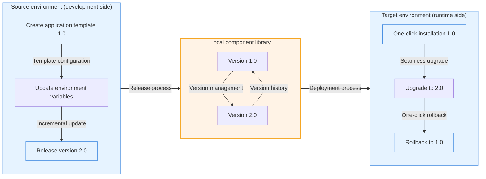

This tutorial will demonstrate some of the core capabilities of Rainbond application template management:

- **Application template management**: Package applications into reusable templates, supporting version control and distribution.
- **One-click deployment**: Quickly install pre-configured applications through the application market.
- **Version management**: Supports application upgrades and rollbacks to ensure business continuity.

## Preconditions

- Completed [Rainbond quick installation](/docs/quick-start/quick-install).

## 1. Create an application template (version 1.0)

### 🚀 Highlights

- **Template configuration**: Package application configuration, dependencies, and environment variables into reusable templates
- **Version tagging**: Supports semantic version numbers for easy tracking and management

### 🧩 Operation process

1. **Deploy container image service**
    1. Enter the target team view and create a new application named `source-app`.
    2. Select build from image ➡️ container.
        - Name: `app`.
        - Image address: `registry.cn-hangzhou.aliyuncs.com/goodrain/nginx:alpine`
    3. Other configurations remain default.

2. **Publish to local component library**
    1. Enter the application view ➡️ publish application ➡️ publish to component library.
    2. Create a new application template:
        - Template name: `app-template`.
        - Version number: `1.0`.
    3. Other configurations remain default.
    4. Confirm submission.

## 2. One-click installation of application template

### 🚀 Highlights

- **Zero-configuration installation**: One-click deployment of pre-configured applications without manual setup
- **Environment isolation**: Supports installing the same template across different teams and clusters

### 🧩 Operation process

**Install from application market**

1. Enter the target team view and create a new application named `target-app`.
2. Select install from application market ➡️ local component library, choose `app-template` and install.
3. Expected result: The `target-app` application contains a component named `app`.

## 3. Release a new version (2.0)

### 🚀 Highlights

- **Incremental update**: Only the changed parts need to be published, reducing release time
- **Configuration tracking**: Automatically records configuration differences between versions

### 🧩 Operation process

1. **Update source application configuration**
    1. Enter the `source-app` application view.
    2. Click the **Quick Copy** button above to copy a new component.
    3. Enter the `app` component ➡️ environment configuration:
        - Add environment variable `demo=demo`.
        - Click the **Update** button in the upper right corner.

2. **Release a new version**
    - Enter the application view ➡️ publish application ➡️ publish to component library.
        1. Select the `app-template` application template.
        2. Version number is `2.0`.
        3. Confirm submission.

## 4) Version upgrade and rollback

### 🚀 Highlights

- **Seamless upgrade**: Maintains data and configuration continuity
- **One-click rollback**: Quickly revert to a stable version in case of problems

### 🧩 Operation process

1. **Upgrade to new version**
    1. Enter the `target-app` application view ➡️ application upgrade, upgrade to version 2.0.
    2. Verify upgrade result:
        - New `app-copy` component added.
        - The original `app` component has added the `demo=demo` environment variable.

2. **Rollback to the old version**
    1. Enter the `target-app` application view ➡️ Application upgrade ➡️ Upgrade record.
    2. Rollback to version 1.0.
    3. Verify the rollback result:
        - The `app-copy` component has been removed.
        - The `demo` environment variable of the `app` component has been removed.

:::info

1. The application template does not contain runtime data, and rollback will not restore database content
2. Version numbers are recommended to follow the semantic version specification (X.Y.Z)
3. For production environments, it is recommended to first verify the upgrade process in a test environment
    :::

## Reference