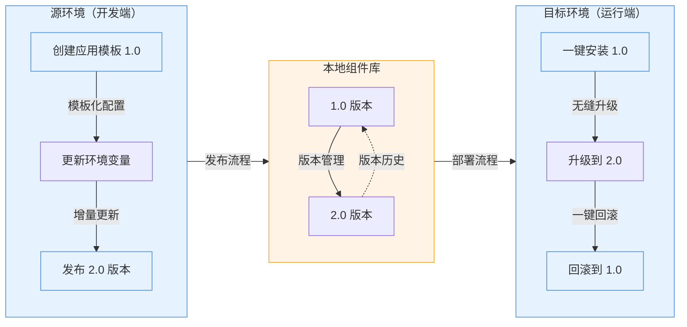

本教程将演示 Rainbond 应用模板管理的部分核心能力：

- **应用模板管理**：将应用打包为可复用的模板，支持版本控制和分发。
- **一键部署**：通过应用市场快速安装预配置的应用。
- **版本管理**：支持应用升级和回滚，确保业务连续性。

## 前提条件

- 已完成 [Rainbond 快速安装](/docs/quick-start/quick-install)。

## 一、创建应用模板（1.0 版本）

### 🚀 亮点

- **模板化配置**：将应用配置、依赖关系和环境变量打包为可复用模板
- **版本标记**：支持语义化版本号，便于追踪和管理

### 🧩 操作流程

1. **部署容器镜像服务**
    1. 进入目标团队视图，创建新应用，名为 `source-app`。
    2. 选择从镜像构建 ➡️ 容器。
        - 名称为：`app`。
        - 镜像地址：`registry.cn-hangzhou.aliyuncs.com/goodrain/nginx:alpine`
    3. 其他配置均保持默认。

2. **发布到本地组件库**
    1. 进入应用视图 ➡️ 发布应用 ➡️ 发布到组件库。
    2. 新建应用模板：
        - 模板名称：`app-template`。
        - 版本号：`1.0`。
    3. 其他配置均保持默认。
    4. 确认提交。

## 二、一键安装应用模板

### 🚀 亮点

- **零配置安装**：一键部署预配置的应用，无需手动设置
- **环境隔离**：支持在不同团队和集群间安装同一模板

### 🧩 操作流程

**从应用市场安装**

1. 进入目标团队视图，新建名称为 `target-app` 的应用。
2. 选择从应用市场安装 ➡️ 本地组件库，选择 `app-template` 并安装。
3. 预期结果：`target-app` 应用内存在名为 `app` 的组件。

## 三、发布新版本（2.0）

### 🚀 亮点

- **增量更新**：只需发布变更部分，减少发布时间
- **配置追踪**：自动记录版本间的配置差异

### 🧩 操作流程

1. **更新源应用配置**
    1. 进入到 `source-app` 应用视图。
    2. 点击上方的**快速复制**按钮，复制出一个新的组件。
    3. 进入到 `app` 组件 ➡️ 环境配置：
        - 添加环境变量 `demo=demo`。
        - 点击右上角**更新**按钮。

2. **发布新版本**
    - 进入应用视图 ➡️ 发布应用 ➡️ 发布到组件库。
        1. 选择 `app-template` 应用模板。
        2. 版本号为 `2.0`。
        3. 确认提交。

## 四、版本升级与回滚

### 🚀 亮点

- **无缝升级**：保持数据和配置的连续性
- **一键回滚**：出现问题时快速恢复到稳定版本

### 🧩 操作流程

1. **升级到新版本**
    1. 进入到 `target-app` 应用视图 ➡️ 应用升级，升级到 2.0 版本。
    2. 验证升级结果：
        - 新增 `app-copy` 组件。
        - 原 `app` 组件新增 `demo=demo` 环境变量。

2. **回滚到旧版本**
    1. 进入到 `target-app` 应用视图 ➡️ 应用升级 ➡️ 升级记录。
    2. 回滚到 1.0 版本。
    3. 验证回滚结果：
        - `app-copy` 组件被移除。
        - `app` 组件的 `demo` 环境变量被移除。

:::info

1. 应用模板不包含运行时数据，回滚不会恢复数据库内容
2. 版本号建议遵循语义化版本规范（X.Y.Z）
3. 生产环境建议先在测试环境验证升级流程
    :::

## Reference