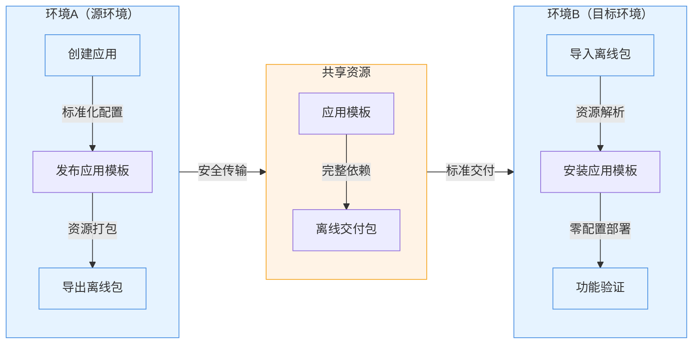

本教程将演示 Rainbond 离线交付的部分核心能力：

- **离线应用打包**：将应用模板及其依赖资源打包，支持完全离线环境部署。
- **跨环境交付**：实现从开发到测试、生产环境的标准化交付流程。
- **一键部署验证**：在目标环境快速部署并验证应用功能。

## 前提

- 准备两套独立环境（标记为环境A/B）
- 均已完成 [Rainbond 快速安装](/docs/quick-start/quick-install)。

## 一、生成离线包（环境A）

### 🚀 亮点

- **标准化封装**：将应用及其依赖资源完整打包，确保交付一致性
- **镜像预加载**：包含所有容器镜像，支持完全离线环境部署
- **版本管理**：支持多版本并行维护，便于灰度发布和回滚

### 🧩 操作流程

1. **部署基准应用**
    1. 进入目标团队视图，新建应用，名为 `export-app`。
    2. 选择从镜像构建 ➡️ 容器。
        - 名称为：`app`。
        - 镜像地址：`registry.cn-hangzhou.aliyuncs.com/goodrain/nginx:alpine`
    3. 其他配置均保持默认。

2. **发布应用模板**
    1. 进入应用视图 ➡️ 发布应用 ➡️ 发布到组件库。
    2. 新建应用模板：
        - 模板名称：`app-delivery`。
        - 版本号：`1.0`。
    3. 确认发布。

3. **打包离线资源**
    1. 进入应用视图 ➡️ 发布应用 ➡️ 导出应用模板，导出应用模型规范。
    2. 下载生成的 `app-delivery-1.0.ram.tar.gz` 格式离线包。

## 二、实施跨环境交付（环境B）

### 🚀 亮点

- **安全隔离传输**：支持通过物理介质在隔离网络间传输
- **完整性校验**：自动验证应用包完整性，确保交付质量
- **资源自动解析**：智能识别依赖关系，简化导入流程

### 🧩 操作流程

1. **导入应用模板**
    1. 平台管理 ➡️ 应用市场 ➡️ 离线导入。
    2. 上传获取的离线包文件。
    3. 系统自动解析应用模板及其依赖资源。

2. **部署验证**
    1. 进入目标团队视图，新建 `import-app` 应用。
    2. 选择从应用市场安装 ➡️ 本地组件库 ➡️ 安装 `app-delivery` 应用。
    3. 验证结果：
        - 成功部署 `app` 组件
        - 服务状态显示为运行正常

:::info

1. 离线包包含完整的镜像资源，确保文件大小足够容纳所有依赖
2. 建议在传输前进行完整性校验，避免文件损坏导致导入失败
3. 对于大型应用，可考虑分批导出和导入，降低单次操作的资源消耗
    :::

## Reference