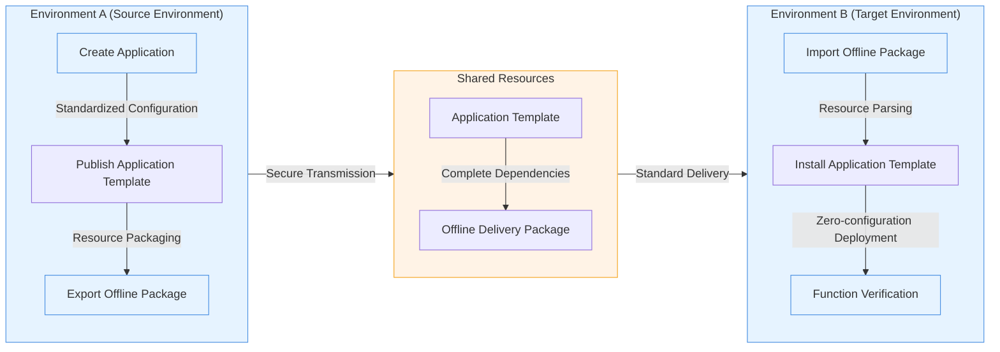

This tutorial will demonstrate some of the core capabilities of Rainbond's offline delivery:

- **Offline application packaging**: Package the application template and its dependent resources, supporting deployment in a completely offline environment.
- **Cross-environment delivery**: Achieve a standardized delivery process from development to testing and production environments.
- **One-click deployment verification**: Quickly deploy and verify application functionality in the target environment.

## Prerequisites

- Prepare two independent environments (marked as Environment A/B)
- Both have completed [Rainbond Quick Installation](/docs/quick-start/quick-install).

## 1. Generate Offline Package (Environment A)

### 🚀 Highlights

- **Standardized Packaging**: Fully package the application and its dependent resources to ensure delivery consistency
- **Image Pre-loading**: Includes all container images, supporting deployment in a completely offline environment
- **Version Management**: Supports parallel maintenance of multiple versions, facilitating gray release and rollback

### 🧩 Operation Process

1. **Deploy Benchmark Application**
    1. Enter the target team view, create a new application named `export-app`.
    2. Select Build from Image ➡️ Container.
        - Name: `app`.
        - Image address: `registry.cn-hangzhou.aliyuncs.com/goodrain/nginx:alpine`
    3. Other configurations remain default.

2. **Publish Application Template**
    1. Enter the application view ➡️ Publish Application ➡️ Publish to Component Library.
    2. Create a new application template:
        - Template name: `app-delivery`.
        - Version number: `1.0`.
    3. Confirm publish.

3. **Package Offline Resources**
    1. Enter the application view ➡️ Publish Application ➡️ Export Application Template, export the application model specification.
    2. Download the generated `app-delivery-1.0.ram.tar.gz` format offline package.

## 2. Implement Cross-Environment Delivery (Environment B)

### 🚀 Highlights

- **Secure Isolated Transmission**: Supports transmission between isolated networks via physical media
- **Integrity Check**: Automatically verifies the integrity of the application package to ensure delivery quality
- **Resource Automatic Parsing**: Intelligently identifies dependencies to simplify the import process

### 🧩 Operation Process

1. **Import Application Template**
    1. Platform Management ➡️ Application Market ➡️ Offline Import.
    2. Upload the obtained offline package file.
    3. The system automatically parses the application template and its dependent resources.

2. **Deployment Verification**
    1. Enter the target team view, create a new `import-app` application.
    2. Select Install from Application Market ➡️ Local Component Library ➡️ Install `app-delivery` application.
    3. Verification result:
        - Successfully deployed `app` component
        - Service status shows as running normally

:::info

1. The offline package contains complete image resources, ensuring the file size is sufficient to accommodate all dependencies
2. It is recommended to perform an integrity check before transmission to avoid import failure due to file corruption
3. For large applications, consider exporting and importing in batches to reduce resource consumption per operation
    :::

## Reference