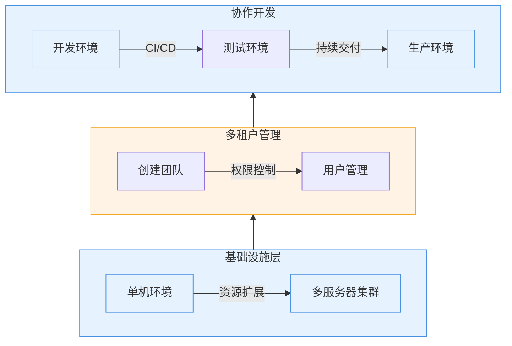

本教程将演示 Rainbond 多租户管理的部分核心能力：

- **资源扩展**：无缝接入已有服务器，快速扩充计算资源池。
- **多租户隔离**：创建独立团队空间，实现资源和应用的安全隔离。
- **权限精细管理**：灵活分配用户角色，满足不同协作场景需求。

## 前提

- 已完成 [Rainbond 快速安装](/docs/quick-start/quick-install)，并体验了单机环境下的应用部署。
- 准备额外的 Linux 服务器（物理机或虚拟机）。

## 一、扩展计算资源

### 亮点

- **零侵入接入**：不改变已有服务器配置，保持原有业务稳定
- **自动化安装**：一键完成节点初始化、组件部署和集群接入
- **异构支持**：兼容不同配置和系统版本的服务器资源

### 操作流程

1. **准备计算节点**
    - 确认目标服务器满足基本要求：
        - 2核4G以上配置
        - 常见的 Linux 系统（如 CentOS/Ubuntu/Debian）
    - 确保服务器网络与现有 Rainbond 节点互通

2. **图形化接入节点**
    
    1. 登录 Rainbond 控制台，进入平台管理 ➡️ 集群 ➡️ 添加节点。
    2. 选择**从主机开始安装**，获取节点接入命令。
    3. 在目标服务器上执行接入命令：

                # 示例命令（实际以控制台显示为准）
                curl -sfL http://<控制台IP>:7070/install-cluster.sh | sh -s - --rbd-url http://<控制台IP>:7070  --etcd --control-plane --worker --token <TOKEN> --mirror cn
    4. 等待 K8S 节点初始化完成，状态变为**Ready**。
    5. 填写安装 Rainbond 的配置信息：
        - **集群入口 IP**：一般为网关节点的内网或外网IP。
        - **网关节点**：选择哪些节点作为网关节点。
        - **构建节点**：选择哪些节点作为构建节点
    6. 等待所有组件安装完成。
    7. 完成对接！\
        

## 二、创建多租户环境

### 亮点

- **资源隔离**：团队间资源互不影响，保障业务安全
- **自助服务**：团队管理员可自主管理团队内应用和成员

### 操作流程

**创建业务团队**

1. 进入平台管理 ➡️ 项目/团队 ➡️ 创建项目/团队。
2. 填写团队名称（如：开发团队、测试团队、生产团队）。

3. 进入团队内 ➡️ 设置 ➡️ 成员，添加其他成员加入团队。

:::info

1. 建议根据实际组织架构创建团队，避免过多团队导致管理复杂
2. 合理分配资源配额，预留20%左右的资源余量应对突发需求
    :::

## Reference