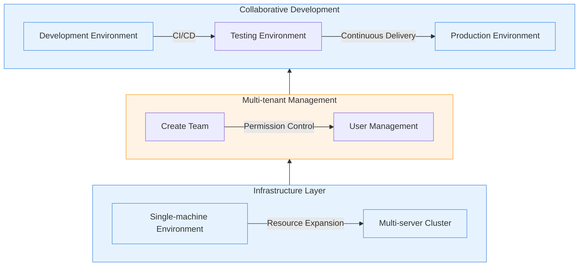

This tutorial will demonstrate some of the core capabilities of Rainbond's multi-tenant management:

- **Resource expansion**: Seamlessly access existing servers to quickly expand the computing resource pool.
- **Multi-tenant isolation**: Create independent team spaces to achieve secure isolation of resources and applications.
- **Fine-grained permission management**: Flexibly assign user roles to meet the needs of different collaboration scenarios.



## Prerequisites

- Completed [Rainbond Quick Installation](/docs/quick-start/quick-install) and experienced application deployment in a single-machine environment.
- Prepare additional Linux servers (physical or virtual machines).

## Expand Computing Resources

### Highlights

- **Zero-intrusion access**: Without changing the existing server configuration, maintain the stability of the original business
- **Automated installation**: Complete node initialization, component deployment, and cluster access with one click
- **Heterogeneous support**: Compatible with server resources of different configurations and system versions

### Operation Process

1. **Prepare Computing Nodes**
    - Confirm the target server meets the basic requirements:
        - Configuration above 2 cores and 4GB
        - Common Linux systems (such as CentOS/Ubuntu/Debian)
    - Ensure the server network is interconnected with existing Rainbond nodes

2. **Graphical Node Access**
    
    1. Log in to the Rainbond console, go to Platform Management ➡️ Cluster ➡️ Add Node.
    2. Select **Start Installation from Host**, and get the node access command.
    3. Execute the access command on the target server:
        ```yaml
        # Example command (actual command is subject to the console display)
        curl -sfL http://<ConsoleIP>:7070/install-cluster.sh | sh -s - --rbd-url http://<ConsoleIP>:7070  --etcd --control-plane --worker --token <TOKEN> --mirror cn
        ```
    4. Wait for the K8S node initialization to complete, and the status changes to **Ready**.
    5. Fill in the configuration information for installing Rainbond:
        - **Cluster Entry IP**: Generally the internal or external IP of the gateway node.
        - **Gateway Node**: Select which nodes to serve as gateway nodes.
        - **Build Node**: Select which nodes to serve as build nodes
    6. Wait for all components to be installed.
    7. Docking completed!\
        

## Create a Multi-tenant Environment

### Highlights

- **Resource isolation**: Resources between teams do not affect each other, ensuring business security
- **Self-service**: Team administrators can independently manage applications and members within the team

### Operation Process

**Create Business Team**

1. Go to Platform Management ➡️ Project/Team ➡️ Create Project/Team.
2. Fill in the team name (e.g., Development Team, Testing Team, Production Team).


3. Go to the team ➡️ Settings ➡️ Members, add other members to join the team.


:::info

1. It is recommended to create teams according to the actual organizational structure to avoid too many teams leading to management complexity
2. Allocate resource quotas reasonably, reserve about 20% of resources to cope with sudden needs
    :::

## Reference