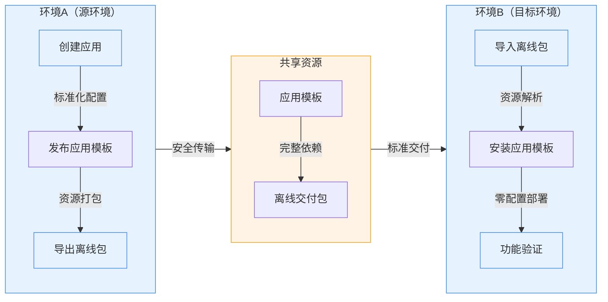

import Head from '@docusaurus/Head';
import CompareEvidenceCards from '@site/src/components/Compare/CompareEvidenceCards';
import TopicActionGrid from '@site/src/components/OfflineAndXinchuang/TopicActionGrid';

<Head>
  <link rel="canonical" href="https://www.rainbond.com/offline-and-xinchuang/offline-delivery" />
  <meta property="og:title" content="离线环境应用交付：Rainbond 怎么做标准化交付、升级和回滚？" />
  <meta
    property="og:description"
    content="如果你在客户现场、内网环境或完全离线环境中交付软件，这一页会帮你判断 Rainbond 怎样把安装、升级、回滚和环境复制做成标准化流程。"
  />
  <meta property="og:type" content="article" />
  <meta property="og:url" content="https://www.rainbond.com/offline-and-xinchuang/offline-delivery" />
</Head>

# 离线环境应用交付：Rainbond 怎么做标准化交付、升级和回滚？

如果你的问题不是“怎么把 Kubernetes 管起来”，而是“怎么把软件稳定交付到离线环境、客户现场和内网环境”，那你更应该先从应用交付链路来看 Rainbond，而不是先去堆环境侧工具。

## 先给结论

- 如果你需要在客户现场、政企内网或完全离线环境里重复交付同一套软件，Rainbond 更适合从应用模板、版本管理、导出导入和升级回滚来解决问题。
- 如果你现在的重点主要是多集群治理、权限控制和资源层纳管，那就不应该把离线交付问题误当成集群治理问题。
- 对交付团队来说，真正贵的不是“把环境装起来”，而是每来一个新客户就重新适配、重新安装、重新回滚、重新验证。

## 适合谁 / 不适合谁

#### 更适合谁

- 面向政企、国央企、传统企业做私有化交付的实施团队
- 经常在内网、离线环境或客户现场部署软件的 ToB 团队
- 需要把安装、升级、回滚沉淀成标准化流程的企业 IT 团队

#### 不太适合谁

- 当前没有离线交付需求，只是想找一个更通用的 Kubernetes 管理面板
- 团队主要痛点不是应用交付，而是多集群治理或底层资源纳管
- 交付物没有版本管理、模板化和持续升级要求的短期演示项目

## 离线交付为什么总是越做越重

离线环境交付的问题，很少只是“没有网络”这么简单，更多时候是下面几类成本叠加在一起：

- 客户基础设施不统一：物理机、虚拟机、公有云、私有云混杂存在
- 操作系统和 CPU 架构不统一：x86、ARM、麒麟、统信等环境差异会放大适配成本
- 版本升级难以复用：每次升级都像重新做一个项目
- 回滚不可控：出了问题只能回到人肉脚本和现场排障

## Rainbond 在离线交付链路里解决什么

Rainbond 在这条链路里的价值，不是再多给你一个“能装软件的平台”，而是把应用交付动作沉淀成可以重复复用的流程。

### 1. 应用模板把交付物标准化

- 把业务系统保存成应用模板，而不是只保存一堆散落的脚本和镜像地址
- 导出后可带到客户现场导入安装，减少环境重搭成本
- 同一套模板可以在多个客户环境里复用

### 2. 升级和回滚更像版本动作，而不是项目动作

- 交付团队可以围绕应用版本来升级，而不是重新拼接环境
- 出现问题时，回滚路径更清晰
- 对企业 IT 团队来说，更容易做“哪个版本在哪个客户环境运行”的管理

### 3. 环境差异尽量被收敛到平台层

- 对 CPU 架构、操作系统和运行环境差异做平台层吸收
- 降低“每到一个新环境都重新适配”的频率
- 让实施团队把更多时间放在业务系统验证，而不是重复性环境劳动

## 为什么这类场景下，Rainbond 往往比 Rancher + Helm 更省

这不是说 Rancher + Helm 不能做离线环境，而是它们解决的重点并不在“应用交付流程标准化”。

| 关注点 | Rainbond | Rancher + Helm |
| --- | --- | --- |
| 问题起点 | 应用交付、版本、升级、回滚 | 集群治理、应用分发、资源管理 |
| 交付物组织方式 | 应用模板和应用级视角 | Chart、镜像、环境侧组合 |
| 交付团队体验 | 更接近交付动作本身 | 更依赖团队理解更多 K8s / Helm 细节 |
| 版本与复制 | 更适合做标准化交付沉淀 | 可以完成，但更偏工程化自组装 |
| 客户现场实施 | 更适合缩短反复安装和升级成本 | 更适合集群和资源层治理视角 |

## 案例区

<CompareEvidenceCards
  items={[
    {
      type: '场景',
      title: '离线环境软件交付场景',
      metric: '交付视角',
      description:
        '从交付部门视角解释为什么环境差异、离线条件和版本升级会把软件交付拖成重项目。',
      href: '/blog/usescene-offline-delivery',
    }
  ]}
/>

## FAQ

#### 1. 离线环境里最难的到底是什么？

不是单次安装，而是反复安装、版本升级、环境复制和问题回滚。  
这些动作如果没有模板和版本能力沉淀，就会不断回到人肉脚本和现场排障。

#### 2. 我是不是必须先会 Kubernetes？

如果你是从离线交付问题出发，通常不应该先把整套 Kubernetes 心智要求压给实施团队。  
更关键的是让团队围绕应用模板、版本和安装动作工作。

#### 3. 适合先试用还是先看案例？

如果你已经有明确环境，先试安装；如果你还在判断这条路是否适合自己的团队，先看案例和场景内容会更快。

<TopicActionGrid
  title="下一步动作"
  description="如果你已经确认自己的问题是离线环境应用交付，不要继续停留在概念判断，直接进入安装、案例或咨询动作。"
  items={[
    {
      label: '查看离线安装',
      note: '直接进入离线环境下的安装路径和前置准备。',
      href: '/docs/installation/offline',
    },
    {
      label: '查看交付场景',
      note: '从交付团队视角继续看为什么要把交付动作标准化。',
      href: '/blog/usescene-offline-delivery',
    },
  ]}
/>

